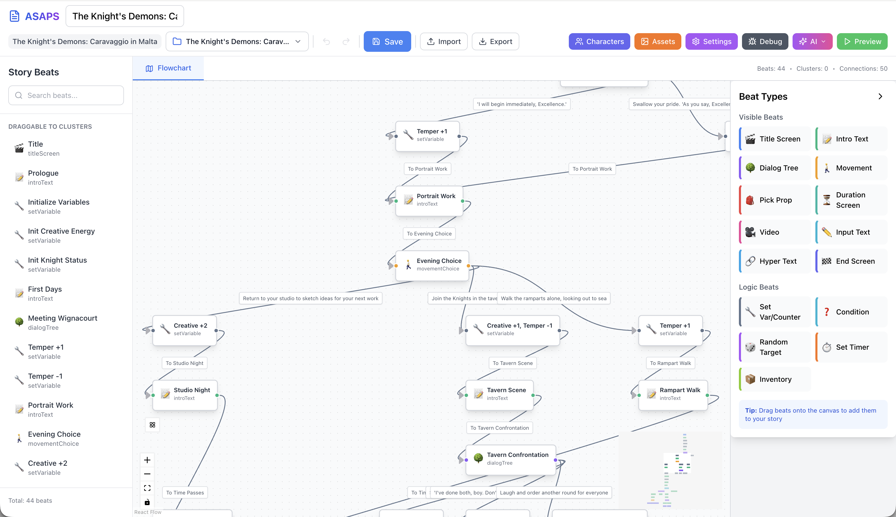

# ASAPS Modern - Advanced Stories Authoring and Presentation System

A modern TypeScript implementation of the Advanced Stories Authoring and Presentation System (ASAPS) by Hartmut Koenitz, based on his original ActionScript version (2005-2017) started at Georgia Tech. This modernization brings the powerful ASML (Advanced Stories Markup Language, also created by Hartmut Koenitz) XML-based narrative system to the web with enhanced features, a visual story builder, and AI-assisted content generation.



## 📖 Documentation

For a comprehensive guide to using ASAPS Modern, including conceptual foundations, interface walkthrough, and beat reference, see the **[User Guide](docs/USER_GUIDE.md)**.

The User Guide covers:
- **Conceptual Framework**: Understanding interactive narratives and ASAPS philosophy
- **Interface Overview**: Workspace layout, graph editor, inspector panels, and visual editor
- **Beat Types Reference**: Complete documentation of all beat types (24+ including AI-runtime beats)
- **Rich Characters**: Mood, sentiments, emotions, traits, goals, variants, and dossier policies
- **Choice Effects & Conditions**: Multi-row effect bundles, affect-aware operators, requirements, baselines, and templates
- **Story Analysis & Debug**: Reachability, path trees, backward analyzer, soft-lock warnings, pop-out debug window
- **Preview Mode**: Testing stories with path-based presets, state simulation, and live flowchart trace
- **Translation & Voice**: Multi-language authoring, AI translation, cloud + local TTS/STT
- **AI Integration**: Story generation, runtime AI beats, conversation steering, MCP server
- **Tips & Best Practices**: Workflow recommendations for efficient story creation

## ⚠️ Development Status

Current release: **v0.9.62** — this is a **beta**. Core functionality works
and new features arrive frequently. **v0.9.62 ships a new beat type —
MultiChoice — and a unified `layoutTemplate` field** that subsumes the
patchwork of presentationMode / hardcoded stacked-by-default / chat-mode
toggles across MultiChoice + DialogTree. Five templates: stacked,
conversation (responsive back-and-forth), chat-scroll, chat-bubble, and
custom (3×3 anchor picker for free placement in the responsive flow).
The renderer's slot-mode routing now treats the project's layoutMode
flag as authoritative, so a responsive project no longer strands beats
on the absolute path because of stale baked locations from a prior
fixed-mode session. Legacy `presentationMode` migrates transparently
(positioned → stacked, chat-* preserved) — existing dialogTrees render
exactly as before.
For what shipped when, see:

- **[VERSION_HISTORY.md](VERSION_HISTORY.md)** — feature matrix and per-version
  highlights (the one-line-per-feature summary that used to live here)
- **[Progress.md](Progress.md)** — detailed, narrative release notes with the
  *why* behind each change
- **[GitHub Releases](https://github.com/sumo961/ASAPS_New/releases)** — pre-built
  desktop installers for macOS and Windows with auto-update support

<!-- Feature matrix and per-version deep-dives live in VERSION_HISTORY.md — please add new entries there. -->

## 🎯 Features

This is a high-level overview, grouped by theme. For per-version details see [VERSION_HISTORY.md](VERSION_HISTORY.md); for the *why* behind each change see [Progress.md](Progress.md).

### Story Authoring
- **Visual Story Builder**: Drag-and-drop graph editor for the story structure, plus a per-beat Visual Editor for in-beat layout (positioned text, dialogs, hotspots, props, characters, meters)
- **24+ Beat Types**: Visible, invisible, and AI-runtime beats (full catalog below)
- **Real-time Preview Window**: Independent window with state-injection presets, InputText pre-fills, and a live red trace painted back onto the flowchart
- **Undo/Redo Everywhere**: Full command history including beat operations, character editor, global settings, and visual editor moves/resizes — with a clickable history panel
- **Asset Manager**: Project-level library with per-element pickers for images, audio, video, and fonts; automatic missing-asset detection and relocation tools
- **Backward Compatible**: Full support for legacy ASML story files (automatic migration of deprecated beat types and attributes)

### Rich Characters & Affect
- **2D Mood Model**: Russell's circumplex (valence × arousal) with editable initial mood, runtime nudges, and an optional on-stage HUD
- **Sentiments**: Directed emotional memories — characters feel `<emotion>` toward other entities with strength clamped to [-1, 1]
- **Emotion Nodes**: Per-character runtime intensity for each emotion, decaying per beat. Author-editable emotion palette (default Ekman 6 + pride/shame/interest)
- **Personality Traits**: Static Big Five trait bag per character that modulates emotion deltas. 10 psychology-grounded archetype presets (narcissist, anxious-introvert, conscientious-leader, free-spirit, recluse, hothead, peacekeeper, stoic, trickster, balanced)
- **Goals + GAMYGDALA**: Authored goals with optional satisfaction predicates; runtime auto-fires pride/joy on `met` and shame/sadness on `failed`, scaled by goal priority and trait modulation
- **Character Variants**: One Character can carry multiple persona overlays (e.g., introvert/extrovert) — same id, same beats, only the affect/portrait/displayName slice swaps
- **Dossier Policies**: Per-character `reAnchor` (rebuild from structured state every turn — no drift) or `reflection` (accumulate per-turn reflections so the character grows) — controls how AI-runtime beats see the character

### Choice Effects & Conditions
- **Multi-Row Effect Bundles**: Each choice (and the standalone Update Affect beat) accepts an ordered list of Effects covering counters, variables, inventory, mood nudges, emotion fires, sentiment changes, reflections, goal-status flips, variant switches, and affect-state bookmarks
- **Affect-Aware Conditions**: ConditionBeat and per-beat Requirements now support six new operators alongside the classic ones (mood, emotion, sentiment, trait, goal, characterVariant)
- **State Requirements**: First-class `requires` annotations on beats with fallback redirects, AND/OR combine modes, and analyzer integration that surfaces unsatisfiable gates
- **Baseline-Relative Comparisons**: "Compared to" switch on mood/emotion/sentiment conditions — literal threshold, delta-from-initial (story-start), or delta-from-named-bookmark — so authoring "X has improved" is a primitive
- **Affect Bookmarks**: `bookmarkAffectState` Effect snapshots affect under an author-named handle; conditions reference the bookmark for delta-vs-bookmark comparisons
- **Templates**: 8 effect templates (Empathetic — full support, Pushy/dismissive, Boundary respecting, etc.) and 28 condition templates across mood/emotion/sentiment/trait/goal/variant — pick one to seed every field at once
- **Live Summary**: Plain-language synopsis under each effect bundle: "Alex feels happier; joy spikes; trust toward the player grows (+0.40)"

### Story Analysis & Debug
- **Reachability Analyzer**: Find unreachable beats (with `requires` and condition awareness)
- **Path Tree Analyzer**: Collapsed tree over simulated paths, hub detection, scope-aware additive state composition, state-aware conditional branches
- **Backward Analyzer**: From any beat, trace back the decision sequence that gets you there; sticky decision-path panel
- **Story Warnings**: Soft-lock detection (keypad codes never set, ungated puzzles, unfulfillable `requires`, paths violating `requires`)
- **Hub Visit Log**: Interactive cards for hub nodes — pick options + items across multiple visits, see accumulated state per visit
- **Pop-out Debug Window**: Story Debug Tools open in a separate browser window (drag to second monitor while editing)
- **Live Trace**: Beats visited during preview painted live on the main flowchart in red, with a thicker pulsing border on the currently-executing beat

### AI-Assisted Authoring
- **Complete Story Generation**: Author entire interactive stories from prompts, both inside the builder and via MCP server. Output respects translation languages, declares `requires` annotations, and follows project conventions
- **AI-Runtime Beats**: Seven AI beat types that call an LLM at playback time — `aiInfoText`, `aiDurScreen`, `aiCondition`, `aiSummary`, `aiDialogTree`, `aiConversation`, `onlineContent` (web fetch into beat content)
- **AI Conversation**: Real-time free-form chat with NPCs steered by author-defined trigger/action rules; supports both text and voice input; auto-exit transitions to other beats based on conversation state
- **AI Prefetching**: Background generation starts while the player reads the previous beat, hiding LLM latency
- **Multiple Providers**: OpenAI, Anthropic Claude (with extended-thinking budget controls), Kimi K2.5, plus any OpenAI-compatible endpoint
- **MCP Server**: Both stdio (for Claude Desktop / Claude Code) and HTTP variants. Lets AI assistants create, read, and modify stories programmatically

### Translation & Voice
- **Multi-Language Authoring**: Manage parallel translations of every authored string — beat content, choice text, characters, items, EndScreen credits — with staleness detection when source content changes
- **AI Translation**: One-click full-story translation, or selective per-string translation with provider choice
- **VCS-Aware Persistence**: Translations survive push/pull and round-trip through git cleanly
- **Text-to-Speech**: Cloud providers (OpenAI, ElevenLabs) plus Web Speech API (browser-native) plus self-hosted (mlx-audio Kokoro for fully offline). Per-speaker voice routing, streaming audio, embedded in HTML exports with language-aware switching
- **Speech-to-Text**: Web Speech API, whisper.cpp, Vosk, or OpenAI Whisper for AI Conversation voice input
- **Language-Aware AI**: AI beats generate content in the active translation language with translated preview UI

### XR & Location-Based Storytelling
- **GpsLocationBeat & IndoorLocationBeat**: Both are multi-location beats — like MovementChoice on a map / floor plan. Each location has its own next-beat target and Effects bundle (counters, mood, sentiment, bookmarks, the full ChoiceEffectsEditor range). The first location the player crosses wins
- **Visual Editors for both XR beats**: drag markers to reposition, click empty map / floor to add a new location, "Fit all" button for overview, selection sync between Visual Editor and Properties tab
- **Per-beat floor plans**: each indoor beat carries its own room/space — floor plan asset + dimensions in metres. Different beats can show different rooms or scales. Locations carry their own (x, y); the same beacon UUID can appear at different positions on different beats
- **Three new Conditions**: `gpsProximity` (within N metres of a target), `indoorProximity` (within N metres of a beacon), `permissionGranted` (sensor permission state) — synchronously evaluable from cached sensor reads, available in ConditionBeat, choice requirements, and MovementChoice gates
- **Directional Sound**: Sounds gain optional `spatialPosition` — geographic mode (lat/lng with bearing recomputed live) or azimuth-only (fixed compass direction). Routes through Web Audio HRTF panning + linear distance falloff. As the player walks, audio rotates and attenuates
- **Location & XR Settings**: Project-level origin coordinates, default proximity radius, on-permission-denied policy (`skip` / `fallback`), mock location for desktop authoring, optional indoor venue floor plan + beacon UUID registry (with Generate button for testing)
- **MockSensorPanel**: Desktop-authoring stand-in for real GPS / orientation / Bluetooth hardware. Walk N/S/E/W in 5m steps, simulate compass + tilt, slide beacon distances per project beacon, drives the runtime state for testing without a phone
- **SensorService Abstraction**: `WebSensorService` (production — `navigator.geolocation`, `DeviceOrientationEvent`, Bluetooth Web API) and `MockSensorService` (authoring) selected automatically by capability detection. HTML exports get the same XR support as the in-app preview

### Collaboration & Distribution
- **Git VCS Integration**: Full Git inside the app — commit, push, pull, branch, merge, clone, history. Force-push option for rejection recovery; advisory beat-level editing locks for collaboration
- **HTML Export**: Standalone playable HTML with splash screen, counter HUD, inventory icons, scrollable credits page, embedded TTS, language switcher
- **Desktop Apps**: Pre-built macOS Universal (Intel + Apple Silicon) and Windows installers via GitHub Releases, with auto-update support
- **ASML XML Format**: Standard format for interchange and version control — see [ASML File Format](#-asml-file-format) below
- **Session Logging**: Exportable play-session traces (beat path, choices, AI outputs, branch decisions) from both the Preview Window and HTML exports

## 📥 Releases

Pre-built desktop applications are available for macOS and Windows on the [GitHub Releases page](https://github.com/sumo961/ASAPS_New/releases).

Each release includes:
- **macOS**: Universal binary (.dmg) supporting both Intel and Apple Silicon
- **Windows**: Installer (.exe) and portable version

Download the latest release to get started without building from source.

## 🚀 Quick Start

### Prerequisites
- Node.js 20+ (22+ recommended for Electron desktop builds)
- npm 9+

### Installation

```bash
# Clone the repository
git clone https://github.com/sumo961/ASAPS_New.git
cd ASAPS_New

# Install dependencies (automatically builds core packages)
npm install

# Start the development server
npm run dev
```

The builder will open at `http://localhost:5173`

> **Note**: The `npm install` command automatically builds the required `@asaps/core` and `@asaps/renderer` packages. This may take a minute on first install.

### Troubleshooting

**Missing packages error** (`Cannot find package '@asaps/core'` or `Failed to resolve entry for package "@asaps/core"`):
```bash
npm run build:deps
npm run dev
```
This manually builds the core dependencies, then starts the dev server.

**Windows Users**: The project fully supports Windows. If you encounter build issues after a fresh clone:
```bash
npm run build:deps
npm run dev
```

For a complete reset:
```powershell
# PowerShell
Remove-Item -Recurse -Force node_modules
npm install
npm run dev
```

## 📦 Project Structure

```
asaps-modern/
├── packages/
│   ├── core/          # Story engine, beat system, ASML XML, analyzers
│   ├── builder/       # React-based visual story builder (the main app)
│   ├── renderer/      # Rendering engines (Canvas + React)
│   ├── player/        # Standalone player runtime
│   └── player-web/    # Browser bundle of the player (for HTML exports)
├── apps/
│   └── builder-desktop/  # Electron wrapper for the builder
├── mcp-server/        # HTTP MCP server for AI tool integration
├── mcp-server-desktop/  # Stdio MCP server for Claude Desktop / Claude Code
├── beat-definitions/  # JSON schema for all beat types (single source of truth)
└── docs/              # User Guide and reference documentation
```

## 🎮 Usage

### Creating a Story

1. **Start with the Title Screen**: Every story begins with a title screen beat
2. **Add Beats**: Drag beat types from the palette onto the canvas
3. **Connect Beats**: Draw connections between beats to create story flow
4. **Configure Properties**: Select beats to edit their properties in the inspector
5. **Test Your Story**: Use the preview mode to play through your narrative
6. **Export**: Save your story as an ASML file

### Beat Types

#### Visible Beats (player-facing)
- **Title Screen**: Opening screen with title and author
- **Info Text**: Display text with continue button (supports rich-text formatting and text variations)
- **Dialog Tree**: Branching conversations with recursive `__self__` targets, NPC auto-exit, per-choice visited tracking, and per-choice Effect bundles
- **Movement Choice**: Location-based navigation between beats
- **Pick Prop**: Interactive object selection
- **Hyper Text**: Clickable hyperlinked text with multiple targets per word
- **Input Text**: User text input with validation, autofocus, and value-leak protection
- **Keypad**: Numeric/phone/PIN entry with code validation and fail-target redirects
- **360° Panorama**: Equirectangular or cylindrical projection with placeable hotspots, zoom controls, and per-element overrides
- **Video Beat**: Video playback with optional controls and skip button
- **Duration Screen**: Timed display screen
- **End Screen**: Story conclusion with optional scrollable credits page and granular reset (variables / inventory / timers independently)

#### Logic Beats (invisible)
- **Set Variable**: Modify story variables and counters (with `${variable}` interpolation in text)
- **Condition Beat**: Conditional branching with classic operators (counter, variable, inventory, visitedBeat, fictionalTime, timer) plus six affect-aware operators (mood, emotion, sentiment, trait, goal, characterVariant). Baseline-relative comparisons supported.
- **Random Target**: Randomly select next beat
- **Set Timer**: Named timers with timeout targets and HUD display options (countdown, fictional time, narrative text)
- **Add/Remove Inventory**: Manage character inventories with quantity support
- **Update Affect**: Apply a multi-row Effect bundle (mood / emotion / sentiment / reflection / goal / variant / bookmark) as a standalone graph node — same editor as choice effects, including templates and live summary

#### AI-Powered Beats (runtime LLM calls)
- **AI Info Text**: Dynamically generated text content from a prompt + story context
- **AI Duration Screen**: Timed dynamic display with generated content
- **AI Dialog Tree**: LLM-generated branching dialog with author-defined NPC routing plans, exit reasons, and personalization
- **AI Conversation**: Real-time free-form chat with steering rules (triggers + actions) and text/voice input
- **AI Condition**: LLM classifies recent state/dialog into one of N author-defined categories and branches accordingly
- **AI Summary**: Generates a story retrospective from accumulated state and choice history (used for tier-specific endings)
- **Online Content**: Fetches web content into beat text (for live data, dynamic context, or web-search-enriched generation)

## 🔄 Importing Legacy Stories

The system fully supports legacy ASML files with automatic migration:

```javascript
// Legacy conversationChoice beats are automatically converted to dialogTree
// SWFBeat (Flash) content is converted to videoBeat
// All deprecated attributes are handled gracefully
```

## 🛠️ Development

### Available Scripts

```bash
# Development
npm run dev              # Start builder dev server
npm run dev:all         # Start all packages in dev mode

# Building
npm run build           # Build all packages
npm run build:core      # Build core package only
npm run build:builder   # Build builder only

# Testing
npm run test            # Run all tests
npm run lint            # Lint all packages
npm run format          # Format code with Prettier

# Utilities
npm run clean           # Clean all build artifacts
```

### Creating Custom Beat Types

1. Create a new beat class extending `Beat`:

```typescript
import { Beat } from '@asaps/core';

export class CustomBeat extends Beat {
  protected async performAction(
    context: StoryContext,
    renderer: IRenderer
  ): Promise<string | null> {
    // Your beat logic here
    return this.getNextBeat(context);
  }
}
```

2. Register it in the BeatTypeRegistry:

```typescript
registry.registerBeatType('customBeat', CustomBeat);
```

3. Add beat definition to `beat-definitions/core-beats.json`

## 📖 ASML File Format

ASML (Advanced Stories Markup Language) is an XML-based format for defining interactive narratives:

```xml
<?xml version="1.0" encoding="UTF-8"?>
<story title="Story Title" author="Author Name">
  <settings>
    <!-- Configuration -->
  </settings>
  <environment>
    <!-- Props and backgrounds -->
  </environment>
  <characters>
    <!-- Character definitions -->
  </characters>
  <plot>
    <beat>
      <id id="0" name="Beat Name" />
      <function kind="beatType" />
      <connection target="1" />
    </beat>
    <!-- More beats -->
  </plot>
</story>
```

## 🎨 Architecture

Modular monorepo (npm workspaces) with the runtime engine, builder UI, and renderers cleanly separated. The builder imports from compiled `dist/` folders of the other packages — see [CLAUDE.md](CLAUDE.md) for the rebuild rules.

### Core Package (`@asaps/core`)
- **Beat System**: Template method pattern; beats extend a base `Beat` class with `performAction`, `getParameters`, `updateParameters`
- **Story Engine**: Event-driven progression with `StoryContext` holding mood/sentiments/emotions/traits/goals/variants/reflections plus baselines and bookmarks
- **Analyzers**: Reachability, PathTree, BackwardAnalyzer, ConstraintPathAnalyzer, StoryWarnings (soft-lock detection)
- **XML Processing**: ASML parsing and generation, with auto-migration for legacy beat shapes
- **Translation**: Per-string translation tracking with staleness detection
- **Persistence**: Save/load with full state round-trip including affect baselines and bookmarks

### Builder Package (`@asaps/builder`)
- **React 18 + TypeScript**: Modern strict-typed UI
- **ReactFlow**: Graph visualization for the story canvas
- **Zustand**: State management with command-pattern undo/redo
- **Tailwind CSS**: Styling
- **Vite**: Build tooling with HMR

### Renderer Package (`@asaps/renderer`)
- **ReactRenderer**: Primary in-app renderer (used by Preview Window and HTML exports)
- **WebRenderer**: Canvas-based renderer (legacy path, still functional)
- **BaseRenderer**: Shared rendering logic

### Desktop App (`apps/builder-desktop`)
- **Electron 40**: Chromium 144, Node 24, supported until June 2026
- **electron-builder**: Universal macOS DMG (Intel + Apple Silicon) and Windows installer with auto-update via GitHub Releases

## 🤖 AI Integration

ASAPS Modern integrates LLMs at three levels: as a **co-author** (generating story structures and translations), as a **runtime engine** (powering AI beats during playback), and as an **external client** (driving the app via MCP).

### Co-Authoring (build-time)
- **Complete Story Generation**: Author entire stories from prompts, both inside the builder and via MCP server. Output respects the active translation language, declares `requires` annotations to avoid soft-locks, and follows project conventions (default beat types, restart edges, cluster organization)
- **Dialog Tree Generation**: Generate branching conversations from a scene description and character context
- **Beat Suggestions**: Mid-story AI assistance to extend or rewrite a section
- **Beat Creator**: Natural-language beat creation via a small command palette
- **AI Translation**: One-click full-story translation, or selective per-string translation
- **Verification Checklist**: AI generation prompts include a structural-integrity / reachability / connection-rules checklist so generated stories don't dead-end

### Runtime AI Beats (play-time)
Seven beat types call an LLM at playback. They share the same provider configuration, support **AI prefetching** (background generation while the player reads the previous beat — hides latency), and integrate with the character dossier system so generated content sees structured character state:
- `aiInfoText`, `aiDurScreen` — dynamically generated text/timed displays
- `aiCondition` — LLM-judged classification + branching
- `aiDialogTree` — generated branching dialogs with author routing plans
- `aiConversation` — real-time free-form chat with author-defined steering rules and exit transitions
- `aiSummary` — story retrospective generation for tier-specific endings
- `onlineContent` — web fetch into beat content

### Provider Support
- **OpenAI** (with web search enable for grounded generation)
- **Anthropic Claude** with extended-thinking budget controls (minimal…xhigh) and Max Tokens visibility
- **Kimi K2.5** (OpenAI-compatible, with reasoning model handling and 10-minute proxy timeouts)
- Any other **OpenAI-compatible** endpoint

### Voice (TTS / STT)
- **Cloud TTS**: OpenAI, ElevenLabs — streaming audio with per-speaker voice routing
- **Browser TTS**: Web Speech API for zero-config setup
- **Local TTS**: Self-hosted mlx-audio (Kokoro) for fully offline stories, no cloud dependency
- **Cloud STT**: OpenAI Whisper (for `aiConversation` voice input)
- **Local STT**: whisper.cpp, Vosk, or Web Speech API
- **HTML export embedding**: TTS works in standalone HTML exports with language-aware voice switching

### MCP Server
Two MCP variants ship with the project — `mcp-server/` (HTTP, for IDE integrations) and `mcp-server-desktop/` (stdio, for Claude Desktop / Claude Code). Both let AI assistants:
- Create complete stories from scratch with full beat structures (including affect annotations and `requires`)
- Read and analyze story structures
- Generate and modify beats, including AI beats and dialog trees
- Translate stories or individual strings
- Export in ASML format

Configure in your AI assistant's MCP settings pointing to either server directory.

## 📋 Version History

See [**VERSION_HISTORY.md**](VERSION_HISTORY.md) for the per-version feature
matrix, highlight summaries, and older bullet-style release notes. See
[**Progress.md**](Progress.md) for the detailed, narrative release notes
covering recent releases.

## 🤝 Contributing

Contributions are welcome! Please follow these guidelines:

1. Fork the repository
2. Create a feature branch
3. Make your changes
4. Add tests for new functionality
5. Ensure all tests pass
6. Submit a pull request

## 📄 License

This project is licensed under the [PolyForm Noncommercial License 1.0.0](LICENSE).

**Free for non-commercial use** - personal projects, research, education, and non-profit organizations.

**Commercial use requires a separate license** - contact for commercial licensing inquiries.

## 🙏 Acknowledgments

- Advanced Stories Group at Georgia Tech
- Dr. Janet Murray for supervision and guidance of the initial project
- All the students using the original ASAPS 2005-2017
- The [COST Action 18230](https://indcor.eu) and the [ARDIN](https://ardin.online) community for continued inspiration
- Made with the help of [Claude](https://claude.ai) and [Kimi](https://kimi.moonshot.cn)

## 📞 Support

For questions and support:
- [Open an issue](https://github.com/sumo961/ASAPS_New/issues) for bug reports

---

Built with ❤️ for interactive storytelling
