# ASAPS Modern User Guide

**Your Complete Guide to Building Interactive Narrative Systems**

*Last revised against v0.9.89*

---

## Welcome, Narrative System Builder!

You're about to embark on a fundamentally different kind of creative practice. If you're coming from traditional storytelling—writing novels, scripts, or even static games—prepare to shift your perspective. You're not here to tell a story. You're here to **build a system** that creates opportunities for others to experience narratives.

This distinction matters. Traditional authors communicate a fixed vision through a finished artifact. You, as a narrative system builder, create **incomplete works**—rich possibility spaces that your audience (we call them **interactors**) will explore and complete through their participation. Your job isn't to control every moment of the experience; it's to design a dynamic system where interesting things can happen.

As the creators of Tale of Tales put it:

> *"We are not story-tellers in the traditional sense of the word. In the sense that we know a story and we want to share it with you. Our work is more about exploring the narrative potential of a situation. We create only the situation. And the actual story emerges from playing, partially in the game, partially in the player's mind."*

Think of this guide as your companion in learning to think like a system builder. We'll start with the basics and work our way up to advanced techniques. No prior experience required—just bring your imagination and a willingness to think differently about narrative.

**What's Inside:**
- [Part 1: Getting Started](#part-1-getting-started) - The paradigm shift and first steps
- [Part 2: The Interface](#part-2-the-interface) - Your creative workspace explained
- [Part 3: Understanding Beats](#part-3-understanding-beats) - The building blocks of your system
- [Part 4: Characters & Assets](#part-4-characters--assets) - Bringing your world to life
- [Part 5: Visual Design](#part-5-visual-design) - Making it look gorgeous
- [Part 6: AI Features](#part-6-ai-features) - AI-assisted system building (including AI Conversation)
- [Part 7: Testing & Publishing](#part-7-testing--publishing) - Sharing your creation
- [Part 8: Advanced Techniques](#part-8-advanced-techniques) - Level up your skills
- [Part 9: Version Control & Collaboration](#part-9-version-control--collaboration) - Git integration and team workflows
- [Part 10: Search, Translation & Productivity](#part-10-search-translation--productivity) - Power-user tools
- [Appendix A: Beat Reference](#appendix-a-beat-reference) - Every beat type explained
- [Appendix B: Keyboard Shortcuts](#appendix-b-keyboard-shortcuts) - Work faster
- [Appendix C: Glossary](#appendix-c-glossary) - Definitions
- [Appendix D: FAQ](#appendix-d-faq) - Common questions answered

---

# Part 1: Getting Started

## What is ASAPS Modern?

ASAPS Modern (Advanced Story Authoring and Presentation System) is a web-based tool for creating **interactive digital narratives** (IDN)—dynamic systems where participants make choices that shape the experience. But let's be clear about what that means.

This is **not** "traditional storytelling with choices added on top." That's like saying film is "theater plus cameras." Interactive digital narrative is a specific form of expression with its own characteristics, opportunities, and design principles.

### The Paradigm Shift

In traditional narrative, you create a fixed artifact—a novel, a film, a script. The audience receives it.

In interactive digital narrative, you create a **dynamic system**. Your audience becomes **interactors** who don't just receive—they participate, plan, execute, and shape what happens. The narrative emerges from their engagement with your system.

This means:
- You're no longer an author—you're a **system builder**
- Your audience aren't passive viewers—they're **interactors**
- You don't create finished stories—you create **protostories** (systems containing potential narratives)
- The experience isn't consumed—it's **instantiated** through participation

### What ASAPS Modern Provides

- **A visual system-building interface** where you design without coding
- **Multimodal capabilities**: images, sounds, video, animations
- **Character systems** with states, meters, and inventories
- **Variables and conditions** to create responsive, dynamic experiences
- **AI assistance** to help generate content and suggestions

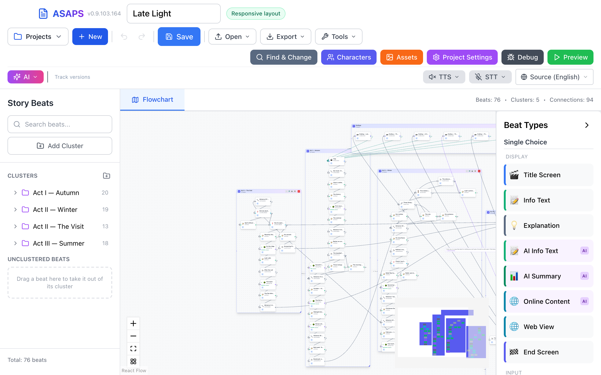
*The ASAPS Modern interface: your system-building workspace*

## Your First 5 Minutes

Let's get you building right away. When you launch ASAPS Modern for the very first time, you'll see a starter system with three connected beats:

```
[Title Screen] → [Introduction] → [The End]
```

This is the skeleton of a simple linear experience. Your job? Transform it into something with possibilities.

### Quick Exercise: Your First Edit

1. **Click the "Introduction" beat** in the flowchart (the center area)
2. **Look right** - the Inspector panel shows the beat's properties
3. **Find the "Text" field** and replace the placeholder with:
   ```
   You wake up in a room you don't recognize.
   The walls are covered in old photographs.
   None of the faces are familiar.

   What do you do?
   ```
4. **Click "Preview"** (top right) to see your change

You just edited your first beat. That's the core workflow: select something, change its properties, preview the result. But notice—right now this is still a linear experience. The real magic happens when you add **choices** and **branches**.

<a id="project-organization"></a>
## Finding Your Way Around Your Projects

ASAPS Modern keeps every project you've ever started in a single, friendly **Project Browser**, and it does its best to drop you back where you left off when you return.

### When you launch ASAPS

The app checks your local browser storage for the last project you had open:

- **In-session reloads** open it straight away — same flowchart, same selection, same place in your work. If you've already used ASAPS at least once during this browser/Electron session, refresh and you land directly back in the editor.
- **On the first cold load of a session** (you just launched the browser, opened a new tab, or re-launched the Electron app), ASAPS still loads your last project so it's ready in the editor underneath, but it *also* pops open the Project Browser on top with a blue **CURRENTLY EDITING** banner offering a one-click **Continue editing →** button. Use it to dive straight back in, switch to a different project, or kick off something new.
- **If no last project is found** (first time opening the app, or you cleared browser storage), ASAPS creates a fresh untitled project so you have somewhere to start.

This is intentional: the first time you sit down at ASAPS each session, we want to surface your full project list — both as a reminder of what you've made and as a quick door into something different. Once you're working, we get out of your way.

> **Under the hood.** The session boundary is tracked by a `sessionStorage` flag (`asaps:session-started`) that lives only as long as the browser session is open. Closing the browser/tab and reopening = fresh session = Browser overlay reappears.

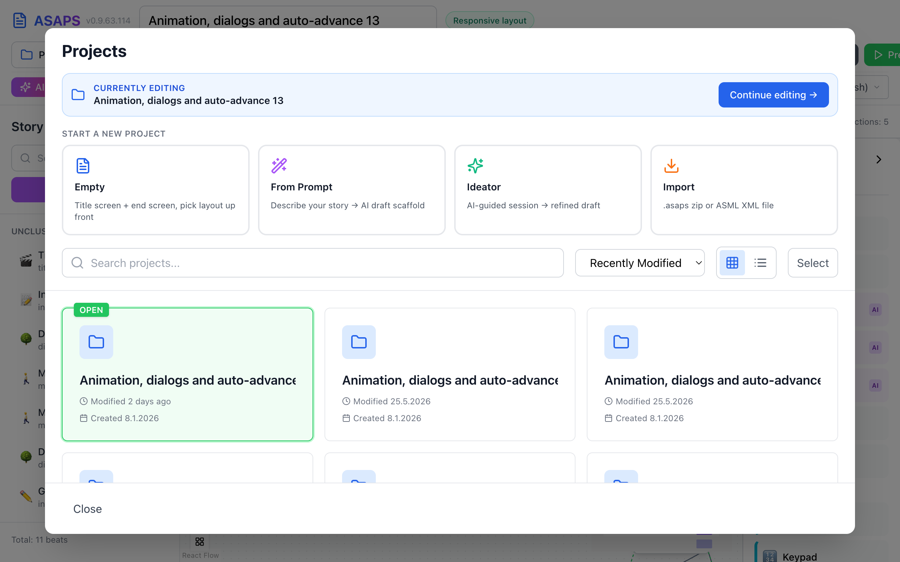
*The Project Browser. The blue **CURRENTLY EDITING** banner at the top shows the project you have loaded; click **Continue editing →** to return to it. Below sits the **START A NEW PROJECT** row with four create paths (Empty project / Build from a prompt / Co-write with AI / Import), then the slim **TEMPLATES** row (expandable via **browse →** — see [Templates](#templates)), and below that the searchable, sortable list of every project saved on this machine. Project cards are compact: a title, a one-line badge row (beat count · layout mode · character count, dot-separated), an optional description, and a modified date — fields drop out gracefully when they're not meaningful (an untouched project just reads "empty project" in italics).*

### Electron start window vs web modal Browser

Depending on how you're running ASAPS, the Project Browser appears in one of two shapes — both surface the same content and create paths.

- **In the web build** (your browser), the Browser is an *in-editor modal*: the editor mounts behind it and the Browser overlays as a centered dialog with a backdrop. Click outside, hit Escape, or pick **Continue editing** to dismiss.
- **In the Electron desktop app**, app launch opens a *dedicated start window* — its own native window (1100×800, with macOS traffic-light buttons) titled **📁 ASAPS Builder** with the tagline *"Start a new project or continue where you left off"*. It's a full-page version of the same Browser, with a **LAST PROJECT** banner pointing at the project from your previous session. When you pick something (open a project, start an empty project, kick off Build from a prompt or Co-write with AI), the main process opens the editor with your intent and closes the start window. **Browse all projects…** inside the editor (Electron) reopens the same start window again — picks apply mid-session via IPC, the editor isn't recreated.

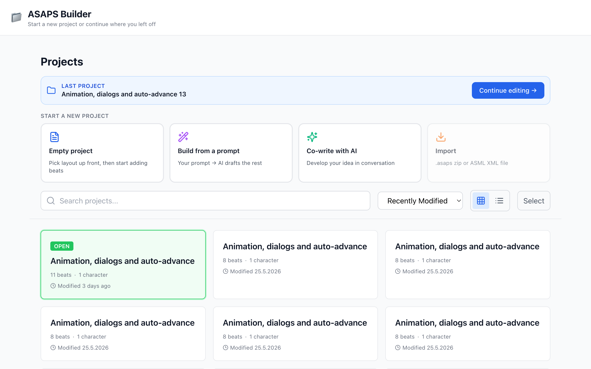
*The Electron start window. Same create paths, template row, and project grid as the in-editor Browser, just full-page in a window of its own. (Web build: this surface is reachable in dev at `/#/start-window` for visual reference, but the production web flow keeps the modal Browser.)*

### The 📁 Projects button

At any point, click the **📁 Projects** button in the top toolbar to open a quick dropdown showing the current project, your most recent projects (up to 5), and **Browse all projects…** (which opens the full Project Browser shown above — in Electron, the start window; in web, the modal).

The Projects button always reads "Projects" — your project's own name lives in the title field one row above, where you can also edit it directly. This separation keeps the toolbar predictable: the button is a *navigation* affordance, not a *naming* one.

> **No "+ New Project" entry in the dropdown anymore.** That used to live here; it's been promoted to a dedicated **+ New** button in the toolbar (right next to Projects) so a brand-new project is one click away regardless of where you are. The Projects dropdown is now purely for switching.

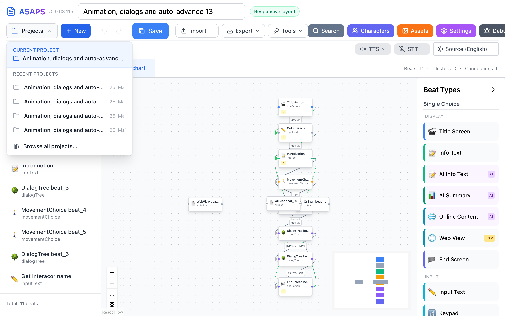
*The 📁 Projects dropdown. Current project, your most recent projects, and "Browse all projects…" — no creation actions, those live on the **+ New** toolbar button and inside the Browser itself.*

### The + New toolbar button

The blue **+ New** button sits between **📁 Projects** and **Undo/Redo** in the top toolbar. Click it to open a compact picker titled *"Start a new project"* with four cards:

- **📝 Empty project** — *"Pick layout up front, then start adding beats."* Opens the New Project dialog where you choose layout mode (Responsive / Static) and orientation, then drops you into a genuinely empty project ready for you to add beats from the palette.
- **⚡ Build from a prompt** — *"Your prompt → AI drafts the rest."* Opens the Story Generator dialog. Disabled with a SOON badge when no AI provider is wired — set one up under **AI → Configure AI**.
- **✨ Co-write with AI** — *"Develop your idea in conversation."* Opens the Ideator pop-out so you can talk through your idea before the AI drafts anything. Also gated on having an AI provider configured.
- **🗂 Start from a template** — *"Worked examples you adapt."* Opens the template gallery. Using a template **always creates your own copy** as a new project — the template itself is never edited. See [Templates](#templates) below.

The picker deliberately does *not* include an Import card — importing a zip isn't a "new project" flow conceptually; it lives on the Browser and in the toolbar's **Import** dropdown.

If the current project has unsaved changes when you click **+ New** (or any create-path in the Browser, or any project-load from the dropdown), ASAPS pauses and asks: *"You have unsaved changes in the current project. Save them before continuing?"* — OK saves and continues, Cancel keeps you where you are.

### Starting a new project — five ways in

The full Project Browser opens with a **START A NEW PROJECT** row offering four cards, each tuned to a different starting point — plus a template row just below them:

| Card | When to pick it |
|------|-----------------|
| 📝 **Empty project** | You want a clean slate. Opens the New Project dialog where you pick layout mode (Responsive / Static) and orientation up front, then drops you into a brand-new empty project. Add beats from the palette to start building. |
| ⚡ **Build from a prompt** | You have a one-line idea and want the AI to draft a scaffold. Opens the Story Generator dialog. (Disabled with a SOON badge if no AI provider is configured — set one up under **AI → Configure AI**.) |
| ✨ **Co-write with AI** | You want a thoughtful conversation about the issue you're trying to explore before generating. Opens the Ideator pop-out; the session-end handoff feeds the Story Generator and the result lands as a new project. |
| 📥 **Open a file** | You have an existing `.asaps`, `.asapst`, or project zip. Pick it and it's added to your projects and opened — no separate "import" step to think about. Converting from other formats (ASML XML, Twine HTML) lives in the header's **Open** menu under *Import from other formats*. (Browser-only — the **+ New** toolbar button picker omits this card by design.) |

If any of the AI-powered cards reads SOON, that just means no AI provider is configured yet — open **AI → Configure AI** to set one up and the cards light up.

Directly **below the create cards** sits a fifth way in: the **template row** (see next section).

<a id="templates"></a>
### Templates — worked examples you adapt

Sometimes the fastest way to learn a technique is to open a project where it's already working. **Templates** are exactly that: complete, working example projects you instantiate and make your own.

You'll find them in two places:

- **The template row in the Project Browser**, right under the create cards. While your project library is small, templates show as full cards — title, description, a *"What this shows"* note, and tags. Once your library grows past a few projects, the row collapses to a slim one-liner (**TEMPLATES** · template names · **browse →**) so it stays out of your way; click **browse →** to expand it again.
- **The "Start from a template" card** in the **+ New** picker, which opens the same gallery as a dialog.

Either way, clicking **Use template** creates *your own copy* of the template as a brand-new project in your library. This is the golden rule of templates: **the template itself is never edited.** Experiment freely, gut it, rebuild it — the original stays pristine, and you can instantiate a fresh copy any time.

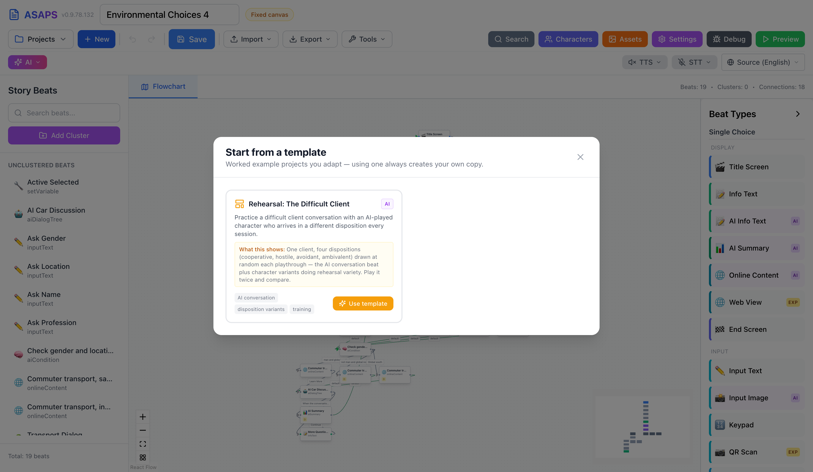
*The template gallery. Each entry carries a description, a "What this shows" note explaining the techniques it demonstrates, and feature tags; the purple **AI** badge marks templates that need an AI provider to play. **Use template** always creates your own copy.*

**The `.asapst` file format.** Under the hood a template is a normal `.asaps` project zip flagged as a template — think of Word's `.dotx` document templates. Importing or double-clicking a `.asapst` file never opens it directly; it always instantiates a fresh copy as a new project. That makes templates safe to distribute: a lecturer can export a rehearsal scenario as a `.asapst`, share it with a class, and every student who imports it gets their own independent copy to work in.

**Make your own templates.** Use **Export → Export as Template (.asapst)** to turn any project into a distributable template. See [Export Options](#part-7-testing--publishing) in Part 7.

**Bundled templates.** ASAPS ships with two:

- **Rehearsal: The Difficult Client** — one client character with four dispositions (cooperative, hostile, avoidant, ambivalent) drawn at random each playthrough, built on the AI Conversation beat plus character variants. Play it twice and compare. It carries a purple **AI** badge in the gallery because it needs an AI provider configured to play (see [Setting Up AI](#part-6-ai-features)).
- **Counters that read affect** *(new in v0.9.89)* — a character called Ada carrying four meters in one HUD frame: *Gold* (an ordinary counter you set by hand) beside *Trust*, *Fear* and *Spirits*, which are wired to her actual feelings. Three choices move her sentiment, her fear and her mood — and **none of them names a counter**. The meters simply report. It needs no AI provider, and the result beat loops back to the choice so you can push Trust below zero and watch the bar grow the other way from the centre. This is the working companion to [Counters that read affect](#counter-binding) in Part 4.

### Drag-drop import

The Project Browser is also a giant drop target. Drag a `.asaps` zip from your desktop or downloads folder onto the Browser window — anywhere inside the modal works — and a blue dashed overlay reading *"Drop to open · .asaps · .asapst · zip — added to your projects and opened"* confirms you've hit the right place. Release to import. Same conflict resolution flow as the toolbar Import button or the Import card. Once the import succeeds, the Browser dismisses itself so you can dive straight into the imported project. Dropping a `.asapst` template file works too — following template rules, it instantiates a fresh copy rather than importing the file in place.

This is the fastest way to bring in a backup, a project a collaborator emailed you, or one of the sample projects shipped with ASAPS.

## The Big Picture: Systems, Not Scripts

Before we dive deeper, let's establish the mental models that will serve you well.

### You're Building Possibility Spaces

Traditional narratives are like rivers—they flow from beginning to end along a predetermined path. Interactive digital narratives are more like deltas, forests, or even ecosystems—they contain many possible paths, and the interactor determines which one gets traversed.

```
         [Choice A] → [Outcome A]
        /                        \
[Start] → [Choice B] → [Outcome B] → [Ending]
        \                        /
         [Choice C] → [Outcome C]
```

In ASAPS Modern, you see this structure in the **Flowchart view**. Each box is a "beat" (a potential moment in the experience), and the lines between them are "connections" (possible transitions).

Key insight: **You're not scripting what happens. You're defining what CAN happen.** The interactor's choices determine what actually occurs in any given session.

### Beats: The Building Blocks of Your System

Every potential moment in your experience is a **beat**. Beats come in two flavors:

**Visible Beats** - What the interactor encounters:
- Text screens, dialog choices, videos, title cards, etc.
- These are the "surface" of your system

**Logic Beats** - The machinery beneath:
- Setting variables, checking conditions, randomizing outcomes, etc.
- These create the dynamic, responsive behavior

The interactor never sees logic beats directly, but they're what make your system intelligent. They let you track whether the interactor found the key before trying the locked door, or whether their relationship with a character has deteriorated.

### State: Your System's Memory

Your system has memory, called **state**. This includes:

- **Variables** - True/false flags (hasKey, metWizard, doorUnlocked)
- **Counters** - Numbers (gold, health, reputation)
- **Inventory** - Items characters carry
- **History** - Which beats have been visited

Logic beats read and write state. Visible beats can respond to state, customizing what they show. This is how a character might say "Good to see you again!" if you've met before, or "Who are you?" if you haven't.

**This is the heart of system building**: creating responsive structures where actions have consequences and the experience adapts to what the interactor does.

---

# Part 2: The Interface

Let's take a tour of your system-building workspace. Don't worry about memorizing everything—you'll learn by doing. This is just a map so you don't get lost.

## The Header Bar

The header spans the top of the screen in three rows:

**Row 1 -- Branding and Title:**
The ASAPS logo, version number (displayed as `v{version}.{buildNumber}`, e.g., v0.9.64.115), and a large text field where you can type or edit your project's title directly. Next to the title you'll see a small **layout-mode pill** — green *Responsive layout* or amber *Fixed canvas* — that reflects the project's authoring contract. Click it to jump to **Settings → Project → Layout Mode**, where you can switch (with a one-shot migrator preview). See [Responsive vs Fixed Layout](#responsive-vs-fixed-layout) for what the two modes actually mean.

When you've made changes that haven't been saved yet, an amber **● Unsaved** pill appears immediately to the right of the layout pill — a friendly nudge so you don't have to glance down at the Save button to know where you stand.

**Row 2 -- Main Controls:**

| Left Side | What it Does |
|-----------|--------------|
| **📁 Projects** | Single button (folder icon). Click to drop down the current project, your most recent projects, and **Browse all projects…** (which opens the full Project Browser). Dropdown is for *switching* — creation lives on the + New button next door. |
| **+ New** | Direct create-project entry. Opens a compact picker with four cards (Empty project / Build from a prompt / Co-write with AI / Start from a template). Guarded by an unsaved-changes prompt so you don't lose work in flight. |
| **Undo/Redo** | Fix mistakes (Ctrl/Cmd+Z works too!) |
| **Save** | Save your project (green button) |
| **Open** | Dropdown: open ASAPS project files (`.asaps` / `.asapst` / zip — added to your projects and opened), merge a story into the current project, or *import from other formats* (ASML XML, Twine HTML — genuine conversions) |
| **Export** | Dropdown: export as Project ZIP (ASML 2.0 — JSON, complete and native), template (.asapst), standalone HTML — or legacy ASML 1.0 XML (frozen serialization; a confirm explains what it can't carry) |
| **Tools** | Dropdown: Transformations, Merge DialogTrees |

| Right Side | What it Does |
|------------|--------------|
| **Characters** | Create and manage your cast (blue button) |
| **Assets** | Manage images, sounds, videos, fonts (orange button) |
| **Settings** | Global configuration (purple button) |
| **Debug** | Testing and troubleshooting tools (gray button) |
| **Preview** | Test your system (green button) |

**Row 3 -- AI, TTS/STT, and Language:**

| Button | What it Does |
|--------|--------------|
| **AI** | Dropdown: Generate Story, Create Beat from Description, Configure AI |
| **VCS Status** | Git status (only visible for directory projects under version control) |
| **TTS** | Text-to-Speech toggle and configuration (speaker icon, right side) |
| **STT** | Speech-to-Text toggle and configuration (microphone icon, right side) |
| **Source (English)** | Language selector for translations (far right) |

## The Left Sidebar: Beat List

This is your system's table of contents. Every beat you create appears here.

**Key Features:**
- **Search Box** - Filter beats by name (useful when you have dozens!)
- **Add Cluster** - Organize related beats into folders
- **Beat List** - All your beats, draggable for reordering

**Pro Tip:** Drag beats into clusters to keep things organized. A mystery might have clusters for "Act 1," "Investigation Scenes," "Suspect Interrogations," and "Endings."

## The Center: Canvas Views

This is where system building happens. Toggle between two views:

### Flowchart View (The Bird's Eye)

See your entire system structure as a graph. Beats appear as boxes, connections as arrows. This view is great for:
- Understanding overall structure
- Spotting dead ends and unreachable beats
- Reorganizing the possibility space
- Dragging in new beats from the palette


*The Flowchart view shows your system's structure*

### Visual Editor (The Close-Up)

Design what a specific beat looks like on screen. Position characters, add backgrounds, place text boxes. This view is for:
- Setting backgrounds
- Positioning characters
- Creating hotspots (clickable areas)
- Designing UI elements

When a **translation language** is active, the Visual Editor overlays translated text on top of the source text, so you can see how your layout looks in different languages without leaving the editor.

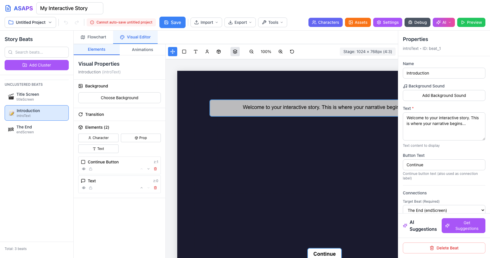
*The Visual Editor lets you design how beats appear*

## The Right Sidebar: Inspector

When you select a beat, the Inspector shows everything about it:

- **Name & Type** - What this beat is called and what kind it is
- **Speaker** - For beats with dialog or narration, the [Character combobox](#character-combobox) lets you pick a defined Character, type a free-text name, or leave it blank for the narrator
- **Content** - The beat's main content (text, choices, etc.)
- **Connections** - Where the experience can go next
- **Advanced Settings** - Sounds, conditions, special behaviors

The Inspector changes based on what you've selected. Select a Dialog Tree and you'll see choice options. Select a Video Beat and you'll see playback settings.

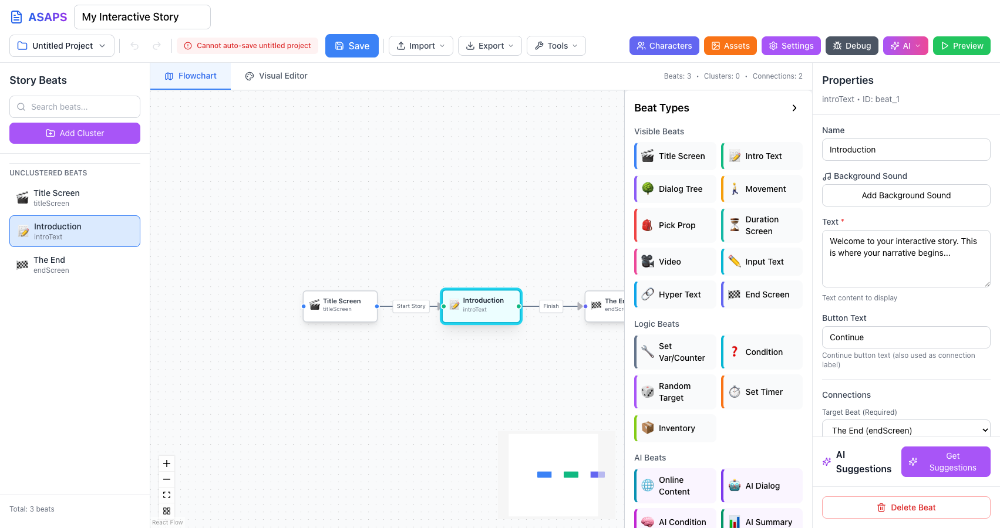
*The Inspector panel shows properties of the selected beat. The Speaker section uses a unified [Character combobox](#character-combobox) — pick a defined Character, type a free-text name, or leave blank for the narrator. The Dialog Tree Editor opens inline on dialog beats; click it to author choices, per-node speakers, and choice effects.*

## The Beat Palette (Right Side)

Your beat shopping catalog, docked to the right edge of the flowchart. Drag any beat type onto the canvas to add it to your system. Click the collapse arrow to hide it when you need more canvas space.

The palette is organized into four top-level groups, each split into smaller sub-groups so you can scan for what you need:

- **Single Choice** — beats where the interactor reads, watches, or inputs something and then continues forward on a single path. Includes a **Display** sub-group (Title Screen, Info Text, AI Info Text, AI Summary, Online Content, **Web View**, End Screen) and an **Input** sub-group (Input Text, **Input Image**, Keypad, **QR Scan**, **AR Scene**).
- **Multi Choice** — beats where the interactor picks one of several paths. Includes **Buttons** (Multi Choice, Dialog Tree, AI Dialog Tree, Pick Prop), **Input** (AI Conversation), **Spatial** (Movement Choice, 360 Panorama, GPS Location, Indoor Location), and **In-text** (Hyper Text).
- **Timed** — beats that auto-advance after a duration with no user input required (Duration Screen, AI Duration Screen, Video Beat).
- **Logic** — invisible beats that branch or mutate state behind the scenes (Condition Check, AI Condition, Set Variable/Counter, Inventory Management, Random Target, **Set GPS Location**, Set Timer, Update Affect).

AI-powered variants sit immediately after their non-AI sibling so they're easy to find. The device-aware beats — **QR Scan**, **AR Scene**, and **Web View** — are regular, fully supported beats: each one has been through a full hands-on verification round on real hardware (they graduated from their earlier experimental phase in v0.9.84–v0.9.85, and no beat on the palette carries an experimental flag anymore). They're documented in detail in [Part 3](#part-3-understanding-beats).

We'll explore every beat type in detail in [Part 3](#part-3-understanding-beats).

---

# Part 3: Understanding Beats

Beats are the atoms of your narrative system. Master them, and you can build anything.

## Visible Beats: What the Interactor Encounters

These are the beats the interactor sees and engages with directly.

### Title Screen

**Purpose:** The entrance to your experience.

Every IDN needs a title card. This beat displays:
- Title (big and bold)
- Subtitle (optional)
- Creator credit
- A "Start" button to begin

**When to Use:** Start your experience with a Title Screen. It sets the mood and gives interactors a moment to prepare.

**Pro Tip:** The title screen uses your visual editor settings—add a background image that captures your experience's essence!

---

### Info Text

**Purpose:** Deliver narrative text with a simple continue option.

This is your workhorse for narration. Write descriptive text, the interactor reads it, clicks "Continue," and moves on.

**Key Settings:**
- **Text** - Your narrative content
- **Button Text** - What the continue button says ("Continue...", "What next?", "Onward!")

**Formatting your text:** Narrative text fields support a small set of
formatting marks — write them inline or select text and use the **B** / *I* /
~~S~~ buttons above the field:

| You type | The player sees |
|----------|-----------------|
| `**text**` | **bold** |
| `*text*` | *italic* |
| `~~text~~` | ~~strikethrough~~ |

This works in body text, end-screen messages, input prompts, and chat
bubbles — everywhere prose renders. Button labels stay plain (they're UI,
not prose), and Hyper Text bodies stay plain so link words always match
exactly. If you translate your story, the markers carry over — the words
inside them get translated, the marks stay.

**When to Use:** Scene descriptions, internal monologue, time jumps, exposition.

**Example:**
```
The forest grew darker with each step.
Elena pulled her cloak tighter, wishing she'd
listened to the old woman's warning.
[Button: "Press deeper into the woods"]
```

### Explanation

**Purpose:** Teach the interactor what the readouts on screen actually mean.

A story with a timer, a countdown, character meters and an inventory panel is showing the interactor four things they've never seen before. This beat labels them — drawing a short caption beside each HUD that's *currently on screen*, then waiting for a "Got it".

The captions are drawn over the **real** HUD positions, worked out at that moment. Move a HUD to a different corner, add a second character's meters so the stack re-packs, and the callouts follow. This is the reason to use the beat rather than writing "your trust meter is in the top left" into an Info Text — that sentence goes stale the first time you rearrange anything, and silently.

**Key Settings:**
- **Text** - Intro line in the beat's own text box (default: *"Here's what you'll see on screen."*)
- **Button Text** - The acknowledge button (default: *"Got it"*)
- **Callout captions** - One optional field per HUD kind: **Timer**, **Countdown**, **Counters**, **Inventory**, **Mood**. Leave any blank and a sensible built-in caption is used — *"How long you have left"*, *"A character's values as they change"*, and so on. Write your own when the story's language matters ("Hours until the tide turns").

**Only HUDs that are actually visible get a callout.** You don't need to prune the captions to match a given beat — a caption for a HUD that isn't on screen is simply not drawn. The same beat can therefore sit in several stories, or early and late in one story, and explain whatever happens to be showing.

**When to Use:** Right after the first beat that turns a HUD on. Not the title screen — screen HUDs are hidden there by default, so there'd be nothing to point at.

#### Explaining without a separate beat

Every visible beat also carries an **Explain HUDs on entry** checkbox (Inspector → *Explanation*). Tick it and the callouts appear over that beat when it's first reached, with the beat held inert until the interactor acknowledges — they can't click a choice past the explanation. It's remembered for the playthrough, so revisiting the beat doesn't re-explain.

Use the checkbox when the explanation belongs *on* a real story beat — the first scene where trust starts to matter. Use the standalone beat when you want a deliberate pause with its own wording.

> **A note on scope.** This system explains **HUDs** — the ambient readouts round the edge of the screen that carry no label of their own. It deliberately doesn't annotate buttons, choices or input fields: those already say what they are, and you can explain them far better in the story's own voice than a floating callout can.

---

### Dialog Tree

**Purpose:** Branching conversations and multiple-choice decisions. This is where your system becomes truly interactive.

This is where interactivity shines. Present text and multiple choices, each potentially leading to different outcomes.

**Key Settings:**
- **Main Text** - The prompt or situation
- **Dialog Elements** - The choices (add as many as needed)
- **Presentation Mode** - How the dialog appears:
  - *Positioned* - Traditional visual novel style
  - *Chat Scroll* - Messaging app style
  - *Chat Bubble* - Speech bubbles

**Each Choice Can Have:**
- **Text** - What the option says
- **Target** - Which beat to go to
- **Condition** - Only show this choice if a condition is met

**When to Use:** Conversations, decision points, anywhere the interactor needs options.

**Pro Tip:** Use conditions to hide choices the player hasn't unlocked. Found a secret note? Show the "Ask about the mysterious symbol" option.

**Per-Node Speakers (Multi-Character Conversations):** Every NPC node in a Dialog Tree has its own **NPC Speaker** field — a [Character combobox](#character-combobox) that lets each line of dialog come from a different character. A wolf-and-grandmother scene can flow Granny → Wolf → Granny just by setting different linked characters per node. When a node's speaker is linked to a defined Character, the speaker label and portrait update everywhere automatically — no need to keep the names in sync by hand.

**NPC Auto-Exit:** Dialog nodes can have an **NPC Auto-Exit** target set. When a node has an auto-exit target, the NPC delivers their line and then automatically advances to the target beat without showing any choices. In the Dialog Tree Editor, nodes with an auto-exit show a green badge with the target beat name, and the choices list is hidden (since they are unreachable). Use this for NPC-initiated dismissals, forced exits, or transitions where the player has no say.

- Set auto-exit to a beat to advance there after the NPC speaks
- Set auto-exit to **Return to initial choices** (`__self__`) to loop back to the root of the dialog tree

**Recursive Dialogs:** Set a choice's target to `__self__` to loop back to the root of the dialog tree. This is powerful for "hub" conversations where the interactor can ask multiple questions before leaving. Combined with **per-choice visited tracking** (`markVisited`), choices the interactor has already picked can be visually dimmed or hidden.

**Seeing the depth from the flowchart:** A dialog with nested exchanges — choices that open deeper dialog nodes inside the same beat — used to look identical to a one-liner on the graph. Now a multi-phase Dialog Tree node draws with a **stacked-card edge** and a row of **green dots** (one per exchange, capped at six); hover the dots for the count. The same count appears as a green **N phases** chip on the Dialog Tree Editor's header in the Inspector, where the actual structure lives. The node itself stays the same size no matter how deep the dialog goes.

**Choice Effects:** Each choice can trigger immediate side effects—set variables, modify counters, add/remove inventory, **nudge a character's mood**, **fire an emotion**, **add a sentiment**, **set a goal's status**, **switch a character's active variant**, or **append a reflection** to a Mode B character's memory. Open the **Effects** section on any choice and pick **+ Add Effect** (or **+ apply template…** for a preset bundle of affect-stack effects). The full list of affect-aware effects, the character-target dropdown that backs them, the inline labels and palette-backed comboboxes, the eight starter templates, and the live "what does this choice do?" summary are documented in [Affect-Aware Choice Effects](#choice-effects-affect) and [Easier authoring](#effects-easier-authoring).

---

### Movement Choice

**Purpose:** Location-based navigation.

Perfect for exploration! Display a scene and let interactors choose where to go. Each destination can have a name and optional image.

**Key Settings:**
- **Main Text** - Description of current location
- **Destinations** - Places the interactor can go, each with a target beat

**When to Use:** Exploration games, room-by-room adventures, maps.

**Example:**
```
You stand in the castle's great hall.
Three doorways beckon.

[North: The Tower Stairs]
[East: The Kitchen]
[West: The Dungeon]
```

---

### Pick Prop

**Purpose:** Select an item from the scene.

Present objects the interactor can interact with. Great for investigation scenes or collecting items.

**Key Settings:**
- **Main Text** - Description of what they're looking at
- **Props** - Items to choose from
- **Display Mode** - Text list or graphical icons

**When to Use:** Investigation scenes, inventory puzzles, examining objects.

---

### Duration Screen

**Purpose:** Timed text display.

Like Info Text, but advances automatically after a set time. Useful for dramatic pauses, cutscene-style moments, or keeping the pace moving.

**Key Settings:**
- **Text** - Content to display
- **Duration** - How long before auto-advancing (in seconds)
- **Show Timer** - Whether to display a countdown bar

**When to Use:** Tension building, dream sequences, "Meanwhile..." transitions.

---

### Video Beat

**Purpose:** Play video content.

Embed videos in your story—cutscenes, tutorials, animations, or any video content.

**Key Settings:**
- **Video Asset** - Which video to play
- **Autoplay** - Start immediately or wait for click
- **Controls** - Show playback controls
- **Skip Button** - Let interactors skip the video

**Captions (v0.9.83).** Open the beat in the Visual Editor and find the **Captions** section in the video settings (left properties panel). Each caption is a cue row — start time, end time, text — added with **+ Add caption**. You author the cues once, in your source language; the cue text rides through the standard translation pipeline like any other story text, and at play time the captions render as subtitles in whatever language the interactor has active, in the Preview Window and in HTML exports alike. A checkbox on the section turns captions off without deleting the cues.

**A different video per language (v0.9.83).** When your project has translation languages configured, the same video settings panel shows a **Language versions** section with one row per target language. Pick an alternate video asset for any language — say, a version with burned-in German narration — and that video plays when the interactor switches to that language. *"Languages without one use the video above"* — the default video is always the fallback, so you only override where you have localized footage. Language overrides ship in HTML exports and survive project import/export.

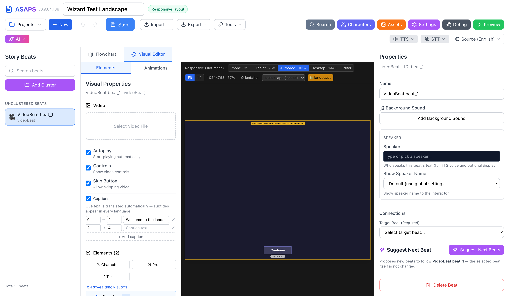

<!-- TODO screenshot: the "Language versions" rows additionally appear here in projects with target languages configured (Settings → Translation) -->

**When to Use:** Cutscenes, intro sequences, tutorial segments.

---

### Input Text

**Purpose:** Free-form text entry from the interactor.

Let interactors type something—their character's name, a password, an answer to a riddle.

**Key Settings:**
- **Prompt** - What to ask
- **Placeholder** - Example text in the input field
- **Validation** - Require specific formats (email, numeric, alphanumeric)
- **Save To** - Store the input in a variable

**When to Use:** Character naming, puzzles, personalization.

---

### Input Image

**Purpose:** The player submits a photo, an AI vision model looks at it, and the AI's answer lands in a story variable.

This is the visual sibling of Input Text — same "collect input → store it in a variable" contract, with AI perception in the middle. The player takes a photo (the OS camera opens on phones) or picks an image file (on desktop), the configured AI provider analyzes it against your **AI Analysis Prompt**, and whatever the AI answers is stored in the variable you name. Ask the AI to describe the scene, verify the player really photographed something red, read text off a sign — the answer text becomes story state you can weave into later beats.

Input Image carries the purple **AI pill** on the palette (Single Choice → Input group) because it needs a vision-capable AI provider at runtime.

**Key Settings:**
- **Prompt** — Question or instruction shown to the player ("Take or choose a photo:")
- **AI Analysis Prompt** — Instruction for the AI describing what to extract from the image ("Describe what is shown in this image in one or two sentences."). Never shown to the player — and when your story is translated, this field intentionally stays in the source language, because it's an instruction to the AI, not player-facing text. (In the Preview Window, the language-aware AI adapter asks the model to *answer* in the active story language.)
- **Save To** — Variable name that receives the AI's answer text (default: `imageAnalysis`)
- **Image Source** — *Camera or upload* (default), *Camera (mobile)*, or *Upload only*
- **Button Text / Cancel Button Text** — Labels for the submit and skip buttons (defaults: *"Analyze"* / *"Skip"*)
- **Fallback Value** — Stored in the variable when AI is unavailable, fails, or the player skips
- **Timeout** — Maximum AI response time in ms before falling back (default: 30000)
- **Speaker / Show Speaker Name** — Standard speaker controls (the prompt can be read aloud via TTS)

**Your story never stalls.** Every failure mode — the player skips, no vision-capable provider is configured, the analysis times out, the API errors — resolves the same way: the **Fallback Value** is stored in the variable and the story advances to the connected beat. Design your fallback accordingly (an empty string, or a sentinel like `"no photo"` you can branch on).

**Branching on the result.** V1 deliberately keeps the beat single-path and free-text: it stores whatever the AI said and moves on. To branch on the answer, follow it with an **AI Condition** beat — "if the photo shows something red, go here; otherwise, go there" is an Input Image feeding an AI Condition.

**Provider support.** All current Claude models and recent OpenAI models (GPT-4o and later) are vision-capable out of the box. Local/Ollama setups work with vision models such as `llava`, `qwen2.5-vl`, or `gemma3`; if the configured local model is text-only, the beat falls back cleanly with the Fallback Value. You don't need to worry about phone photos being huge — the image is automatically downscaled before it's sent, so a 12 MB camera shot fits every provider's request limits.

**When to Use:** Scavenger hunts ("photograph something red" — the AI verifies it), personalization (the story weaves a description of the player's surroundings into the narration), photo puzzles (the AI reads text or symbols off the photographed object), classroom activities that send interactors into the real world.

---

### Keypad

**Purpose:** Numeric input via phone-style keypad or combination lock.

Present a keypad interface where interactors enter a code—a phone number, safe combination, PIN, or access code.

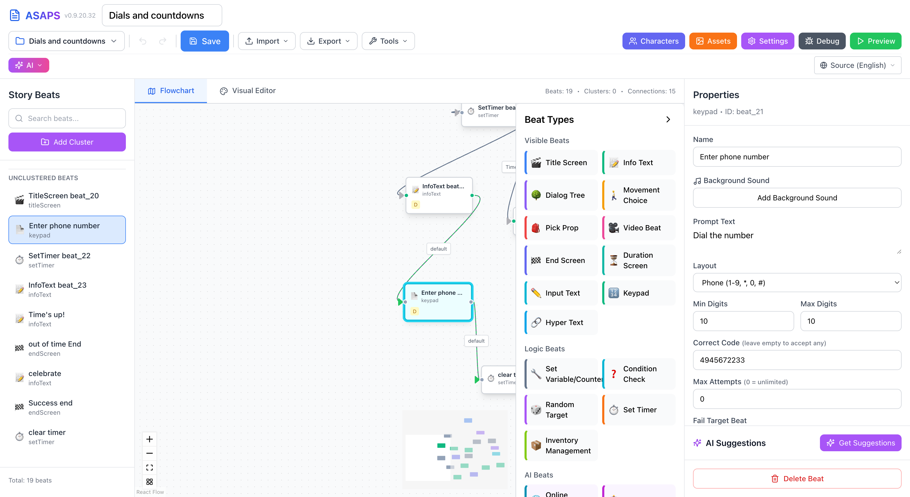
*The Keypad beat configured as a phone dialer*

**Key Settings:**
- **Prompt Text** - Instruction shown above the keypad ("Dial the number", "Enter the code")
- **Layout** - Phone (1-9, *, 0, #), Numeric (1-9, ←, 0, ✓), or PIN (1-9, C, 0, ✓)
- **Min/Max Digits** - How many digits are required
- **Correct Code** - The code that triggers success (leave empty to accept any input)
- **Max Attempts** - How many tries before failure (0 = unlimited)
- **Mask Input** - Show `*` instead of digits (for PIN/password entry)
- **Save To** - Store the entered code in a variable or counter
- **Fail Target Beat** - Where to go when max attempts are exceeded

**When to Use:** Phone dialing puzzles, safe cracking, PIN entry, code doors, any numeric input scenario.

**Example:**
```
Prompt: "Enter the vault combination"
Layout: Simple (1-9, 0)
Correct Code: 4815162342
Max Attempts: 3
Fail: "Alarm Triggered" beat
```

---

<a id="qr-scan-beat"></a>
### QR Scan

> **Fully verified (v0.9.84).** QR Scan has been through the complete manual verification protocol on desktop and iOS and is a regular, fully supported beat — the old experimental badge is gone. If you want to smoke-test scanning on your own hardware, a ready-to-import kit (`qr-scan-verification.asaps.zip` plus a printable code sheet) ships with ASAPS — see [Verification example kits](#verification-kits).

**Purpose:** Scan a real-world QR code and either route the story based on what's encoded, or store the decoded value in a variable.

This is your bridge into the physical world. Print stickers, hide codes around a room, scatter them across a museum — when the interactor scans one, the story responds. The beat opens the device camera, watches for a code, and then does one of two things depending on what's encoded:

- If the code is a valid **`asaps://` URI** (see [The asaps:// URI Scheme](#asaps-uri-scheme) below) and *Interpret asaps:// URIs* is on (it is, by default), the URI is applied directly: jump to a beat, set a variable, add an inventory item, or fire an event.
- Otherwise, the decoded value is saved into the variable you specified (default: `scannedCode`) and the beat advances to its connected target. Useful for capturing arbitrary codes — barcodes, ticket numbers, anything QR-encoded.

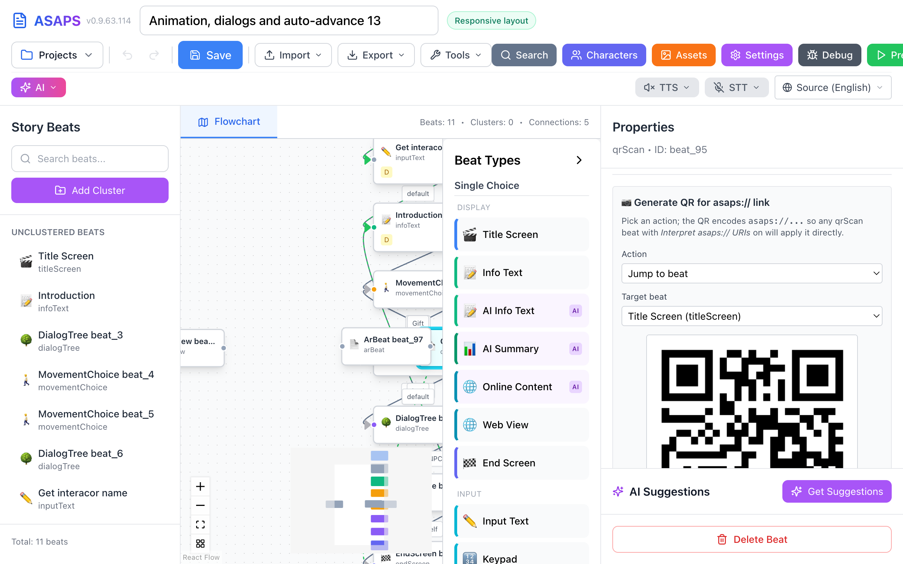
*A QR Scan beat in the Inspector. Below the standard fields is the **📷 Generate QR for asaps:// link** panel — pick an action kind (jump-to-beat / set variable / inventory / event), choose a target, and a live QR code renders. Copy the URI or download a printable PNG without leaving the editor.*

**Key Settings:**
- **Prompt** — Instruction shown above the camera preview (default: *"Point your camera at the QR code"*)
- **Save To** — Variable that receives the decoded value when the code isn't an `asaps://` URI (default: `scannedCode`)
- **Interpret asaps:// URIs** — When on, ASAPS URI codes are applied directly; non-ASAPS codes still save to the variable above (default: on)
- **Camera** — Rear (environment) or Front (selfie)
- **Accept patterns (regex)** — Optional regex patterns; only codes matching at least one pattern resolve. Leave empty to accept any code.
- **Helper Text** — Small caption near the scan target (default: *"Align the code inside the frame"*)
- **Cancel button text** — Label for the skip / cancel button
- **Speaker / Show Speaker Name** — Standard speaker controls (the prompt can be read aloud via TTS)

**The built-in QR generator.** The QR Scan inspector includes a **📷 Generate QR for asaps:// link** panel that turns the editor into a printable-code maker. Pick an action (jump to beat, set variable, inventory add/remove, fire event), fill in the target, and a live QR code renders on the right with **Copy URI** and **Download PNG** buttons. The downloaded PNG is high-resolution — print it on a sticker, paste it on a museum label, or include it in a worksheet. Any QR Scan beat with *Interpret asaps:// URIs* on will respond to it.

**Permissions:** Camera access. If the interactor denies camera permission, the beat falls through to its connected target with a brief message ("Camera access is required to scan QR codes."). The preview window cannot exercise the camera fully — desktop/laptop browsers without a rear camera are a limited test environment — but you can verify the inspector and routing behaviour there, then preview on a real phone via HTML export.

**When to Use:** Scavenger hunts, escape rooms, museum installations, classroom worksheets, partnered installations where two devices coordinate, any moment your story wants to acknowledge a real-world object.

---

<a id="web-view-beat"></a>
### Web View

> **Fully verified (v0.9.84).** Web View has been through the complete manual verification protocol in both the browser and the desktop app and is a regular, fully supported beat — the old experimental badge is gone. Specific host sites can still refuse to be embedded (see the iframe-restrictions note below), so it's still smart to test your exact target page on the platform you plan to ship to. A ready-to-import kit (`web-view-verification.asaps.zip` plus deployable test pages) ships with ASAPS — see [Verification example kits](#verification-kits).

**Purpose:** Embed a live external web page inside your story.

Drop a real website into your narrative — a news article, a research paper, an interactive simulation, an external form. The interactor browses the page, then continues via a Done button, an auto-exit URL pattern, or a `postMessage` from the page itself.

**Key Settings:**
- **URL** — The page to embed (e.g., `https://example.com`)
- **Prompt** — Optional instruction shown above the embedded page
- **Auto-exit URL pattern (regex)** — When the embedded page navigates to a URL matching this pattern, the beat advances automatically. Useful for "the player must navigate to the contact form" flows. Heads-up: for cross-origin pages this only works in the **desktop app** (its native webview reports navigation events; browser iframes hide cross-origin navigation for security reasons — there, the player exits via the Done button instead).
- **Pass variables** — A list of story variable names; their current values are injected into the URL as a hash fragment (e.g., `#userName=Alice&playerAge=16`), so the embedded page can read story state without an API call.
- **Save To** — Variable that receives a value the embedded page sends back via `postMessage({ asaps: 'result', value: ... })`. Leave empty to ignore postMessage. Since v0.9.84 this one page protocol works everywhere — in browser iframes *and* in the desktop app's native webview — so a page you instrument once exits correctly on both platforms.
- **Done button text** — Label for the manual exit button (default: *"Done"*)
- **Speaker / Show Speaker Name** — Standard speaker controls

**A note on iframe restrictions.** Many public websites (Google, Facebook, banks, anything security-sensitive) refuse to be embedded in iframes via `X-Frame-Options` or CSP `frame-ancestors` headers. In the web Preview and the player runtime, those pages will refuse to load. The **Electron desktop build** uses a native `<webview>` element which bypasses these restrictions, so when you ship to desktop it just works — but it's a real difference between web and desktop preview, so test on the platform you plan to ship to. For pages you control (your own forms, your own dashboards), iframe-embedding works everywhere.

**Permissions:** Network access. The browser may also block cross-origin URLs in some hosting setups; if a hosted HTML export refuses to load the embedded page, check whether the host adds `Content-Security-Policy: frame-ancestors` headers.

**When to Use:** Citing real sources mid-story, embedded research material, real surveys, integrations with external tools (a calendar booking page, a payment flow, a research consent form), educational stories that incorporate live websites.

**Authoring in the Visual Editor (v0.9.84).** Web View is a first-class Visual Editor citizen: select the beat in the flowchart and open the **Visual Editor** tab to see the prompt and the page frame laid out exactly as the runtime will render them. In Responsive projects, the left panel's slot rows include a **"Web page frame"** row with a **Height** slider (20–95% of the stage in 5% steps, or **auto** — the default, where the prompt hugs its natural height and the frame takes the rest of the stage). While authoring, the frame shows a placeholder rather than loading the live URL.

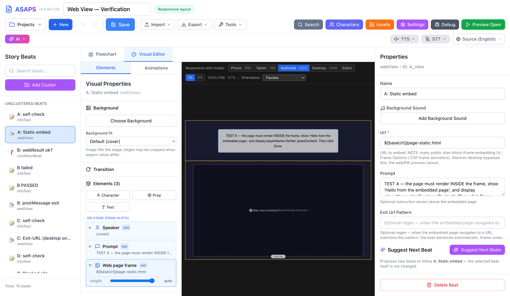

**Responsive and Fixed both supported.** Web View renders through ASAPS's slot system in Responsive projects (the iframe fills a dedicated `webview` slot) and respects baked pixel locations in Fixed-canvas projects — since v0.9.84 the fixed-canvas authoring chain is complete too: adding a Web View beat to a fixed project bakes a prompt plus a 900×480 page frame you can reposition and resize like any other element, and the layout migrator converts Web View beats when you switch modes. Either way, the Done button sits with the other action buttons at the bottom of the stage.

---

<a id="ar-scene-beat"></a>
### AR Scene

> **Fully verified (v0.9.85).** AR Scene has been through three field-verification rounds on real phone hardware and is a regular, fully supported beat — the old experimental badge is gone. As noted further down, world-tracking and face-tracking remain placeholder Phase 2 dropdown entries: author marker-based scenes today and treat the rest as roadmap. A ready-to-import kit (`ar-scene-verification.asaps.zip` with a printable marker and the compiled tracker already bundled) ships with ASAPS — see [Verification example kits](#verification-kits).

**Purpose:** An augmented-reality scene with image-marker tracking. The interactor aims their device camera at a printed marker; tappable anchors anchored to that marker appear when it's in view.

This is the closest ASAPS gets to physical-world storytelling. Print a marker image (a museum label, a flyer, a sticker on an object), compile it into a `.mind` file, upload it as an ASSET, and attach anchors — labelled cards or images — that route to different beats when tapped. Treasure hunts, museum installations, illustrated children's books where each page summons different content: AR Scene is the building block.

**Key Settings:**
- **Prompt** — Optional instruction shown above the AR view (default: *"Aim your camera at the marker"*)
- **Tracking Mode** — Currently only **Image marker (.mind target)** is implemented. *World tracking* and *Face tracking* are reserved for Phase 2 and appear in the dropdown but aren't yet functional — leave Tracking Mode on *marker* for now.
- **Marker (.mind file)** — Asset picker pointing to a pre-compiled `.mind` file (see *Creating a marker* below)
- **Anchors** — An array of overlay anchors attached to the marker. Each anchor carries:
  - **ID** — Stable identifier
  - **Label** — Text shown on the anchor card / tooltip
  - **Image** — Optional asset shown as a billboard at the anchor's position
  - **Anchored to** — Currently `marker:default` (pinned to the tracked marker)
  - **X / Y offset** — Local-space offset from the marker center (-1 to 1)
  - **Scale** — Size multiplier
  - **onTap** — Where to go when the interactor taps this anchor. Accepts a bare beat id OR an `asaps://` URI (see [The asaps:// URI Scheme](#asaps-uri-scheme)). The schema validator catches dangling references — if an `onTap` points at a beat that no longer exists, you'll see a warning at lint time.
- **Cancel button text** — Label for the skip button
- **Fallback target** — Where to go when the interactor skips, the camera permission is denied, or no anchor is tapped before they leave
- **Speaker / Show Speaker Name** — Standard speaker controls

**Creating a marker.** ASAPS uses the MindAR image-tracking library. To prepare a marker:

1. Pick or create a marker image — high-contrast, asymmetric photos or illustrations work best (logos with a lot of repeated structure are weaker matches).
2. Compile it into a `.mind` file using MindAR's free web tool: https://hiukim.github.io/mind-ar-js-doc/tools/compile/
3. Upload the resulting `.mind` file as an asset in the Asset Manager.
4. Point the AR Scene beat's **Marker** field at the uploaded `.mind` asset.

The MindAR library itself is lazy-loaded from a CDN at runtime — there's no build-time dependency, so projects without AR Scene beats don't pay for the AR tooling.

**Permissions:** Camera access. Falls through to **Fallback target** (or shows a brief message) if denied.

**When to Use:** Treasure hunts where marker stickers hide around a venue, museum installations where each label is a marker that summons related content, illustrated print materials where pointing the device at a page reveals dialogue or 3D models, classroom "scan-the-poster" experiences.

> **Heads-up — AR Scene is Phase 1.** Marker tracking works end-to-end; world-tracking and face-tracking dropdown options are placeholders for upcoming phases. The implementation also uses screen-space anchor cards while waiting for a marker to lock — pinch-zoom and 3D billboarding are coming later. For Phase 1, design your scenes around tappable cards rather than 3D models in space.

---

<a id="asaps-uri-scheme"></a>
### The asaps:// URI Scheme

QR codes, AR anchors, and (eventually) deep links all need a way to encode story-level intent into a string. ASAPS uses the **`asaps://` URI scheme** for this: a small grammar that says "jump to this beat", "set this variable", "add this to inventory", or "fire this event". One parser, one set of semantics, used everywhere a string can travel.

**The grammar:**

| URI | What it does |
|-----|--------------|
| `asaps://beat/<beatId>` | Jump directly to the named beat |
| `asaps://variable/<name>/<value>` | Set the variable `<name>` to `<value>`, then continue to the connected target |
| `asaps://inventory/add/<item>` | Add `<item>` to the player's inventory |
| `asaps://inventory/remove/<item>` | Remove `<item>` from the player's inventory |
| `asaps://event/<eventName>` | Record an event in the session timeline (useful for analytics-style traces) |

All segments are URL-encoded, so names containing spaces, slashes, or unusual characters are safe. Unknown verbs are ignored — if a QR code reads `asaps://something_we_dont_know`, the QR Scan beat falls back to saving the raw string to its variable.

**Where the URI scheme is used:**

- **QR Scan beats** — When *Interpret asaps:// URIs* is on, scanning a code containing an `asaps://` URI applies it directly. Non-ASAPS codes still save to the variable.
- **AR Scene anchor onTap** — Anchor onTap fields accept either a bare beat id (e.g. `beat_42`) or a full `asaps://` URI. Use the full form when you want side effects (e.g. *"tapping this anchor adds the clue to inventory AND jumps to the explanation beat"* — though for that you'd actually chain two beats; one URI does one action).
- **The QR generator panel** in the QR Scan inspector composes URIs for you — pick action kind + target + value, and the editor renders a live QR code with Copy URI and Download PNG buttons.

The scheme is designed to ride through any string-carrying channel — including future support for deep links on native iOS / Android, postMessage from embedded WebView pages, or anything else that can carry a string from the real world into your story.

---

### Hyper Text

**Purpose:** Clickable words within text.

Create text where specific words are clickable, each leading to different paths. Like a webpage, but for stories.

**Key Settings:**
- **Text** - Full text with clickable sections marked
- **Links** - What each clickable word connects to

**When to Use:** Subtle choices, exploration of details, non-linear reading.

**Example:**
```
On the desk sat a [letter], a [photograph], and a [strange key].
```

Each bracketed word can lead to a different beat.

---

### 360 Panorama

**Purpose:** Immersive panoramic exploration.

Drop the interactor into a 360-degree scene they can look around in. Place interactive hotspots at specific positions within the panorama for navigation or interaction.

**Key Settings:**
- **Panorama Image** - An equirectangular image for the 360-degree view
- **Hotspots** - Clickable points placed at pitch/yaw coordinates
- **Starting Orientation** - Where the camera faces initially
- **Field of View** - How wide the view is

**When to Use:** Virtual tours, immersive environments, location-based exploration, escape rooms.

---

### End Screen

**Purpose:** Story conclusion.

The final beat. Display an ending message with options to restart or view a dedicated credits page.

**Key Settings:**
- **Message** - Your ending message (defaults to "The End")
- **Show Restart** - Display a "Play Again" button. You can customize the button label with the **Restart Text** field.
- **Show Credits** - Display a "Credits" button that opens a scrollable credits page. Customize the button label with the **Credits Text** field.
- **Reset on Restart** - When enabled, clears story state when the interactor clicks "Play Again" (not when the End Screen first appears). You can choose exactly what gets reset (see below).

**Granular Reset Options:**

When the **Reset** toggle is turned on, a set of sub-options appears letting you control exactly which parts of the story state are cleared on restart. All are enabled by default, but you can uncheck any you want to preserve:

| Option | What It Clears |
|--------|---------------|
| **Variables** | All true/false story variables |
| **Counters** | All numeric counters (gold, health, etc.) |
| **Inventory** | All items held by all characters |
| **Timers** | All active timers |
| **Fictional Time** | The in-story date and time |
| **Visited Tracking** | Record of which beats and choices have been seen |
| **History** | The ordered log of beats visited during play |

This is especially useful for "New Game+" experiences where you want interactors to keep some progress. For example, you might reset variables and history but preserve inventory so the interactor carries their collected items into a second playthrough.

**Customizable Credits Page:**

When **Show Credits** is enabled, the interactor sees a "Credits" button on the end screen. Clicking it opens a dedicated credits page with its own title, body text, and close button. You can configure:

- **Credits Page Title** - The heading at the top of the credits page (defaults to "Credits")
- **Credits Page Body** - The main content of your credits page. This is a multi-line text area where you can write anything you like -- team members, acknowledgments, tools used, special thanks, licensing info, etc. If you leave it empty, ASAPS automatically populates it with your project's title and author from the project metadata.
- **Credits Close Text** - The label on the button that returns to the end screen (defaults to "Close")

All three credits fields support **variable interpolation**, so you can include dynamic content like `${playerName}` in your credits text.

**When to Use:** Every ending your story has. Good stories often have multiple endings, and each one can have its own unique message, reset behavior, and credits content.

---

### Online Content

**Purpose:** Pull live content from the web.

Fetch real-time data from APIs or AI web searches, then display it. Make stories that react to the real world.

**Key Settings:**
- **Mode** - Direct API call or AI-powered search
- **Query/URL** - What to fetch
- **Display Template** - How to show the results

**When to Use:** Current events integration, dynamic content, web-aware narratives.

---

## Logic Beats: The Invisible Machinery

These beats work behind the scenes. Readers never see them directly, but they make your story smart.

### Set Variable/Counter

**Purpose:** Change story state.

Set a variable to true/false or modify a counter value. This is how your story remembers things.

**Examples:**
- Set `hasKey` to `true` when the player finds a key
- Add 10 to `gold` when they find treasure
- Set `reputation` to 50 at story start

**Calculations (v0.9.71+).** Start the value with `=` (spreadsheet convention) and it's evaluated as an arithmetic expression at runtime:

```
= (var1 + var2) / 100
= score * 2 - penalty
= alice.trust + 5
```

- Supports `+ - * /`, parentheses, and unary minus
- Reference variables and counters by plain name (`score`) or any of the usual syntaxes (`${name}`, `$name$`, `{name}`); names resolve against variables first, then counters
- Character-scoped counters work as `owner.counter` — e.g. `alice.trust`
- Works for both variables and counters, on every operation (set, add, subtract, multiply, divide)

If evaluation fails (unknown name, division by zero, syntax error), the raw string is stored unchanged and a warning appears in the console — never a `NaN` in your story state. And it's fully opt-in: without the leading `=`, nothing is evaluated (`5+3` stays the literal text `5+3`), so existing stories behave exactly as before.

**Counters bound to affect state can't be assigned (v0.9.89).** If a counter has been wired to read a character's feelings (see [Counters that read affect](#counter-binding)), it still appears in the counter picker — labelled *"(mirrors affect state)"* — but greyed out, with the reason and the right substitute on hover: *"trust mirrors affect state — change it with an Add Sentiment effect."* Writing to one would simply be overwritten the next time the character reacts to something. Reading it in a Condition Check is untouched and works exactly as before.

**Flow:** Executes instantly, then moves to the target beat.

---

### Condition Beat

**Purpose:** Branch based on conditions.

Check something and go different directions based on the result. "If this, go here. Otherwise, go there."

**Can Check:**
- Variable values (is `hasKey` true?)
- Counter comparisons (is `gold > 100`?)
- Inventory contents (does player have "Sword"?)
- Timer status (is the countdown active?)
- Fictional time (is it past midnight in the story?)
- **Character affect** (added in v0.9.43): mood, emotion intensity, trait value, sentiment toward another character, goal status, or which variant of a character is currently active

**Example Logic:**
```
IF hasKey = true
  → Go to "Enter the Tower"
ELSE
  → Go to "Locked Door"
```

The full set of checks and their per-form fields is documented in [Condition Beats](#condition-beats) further down.

> **Looking for "has the player visited beat X?"** That check lives on a beat's [Requirements section](#condition-beats), not in the standalone Condition Beat dropdown. Open the Requirements panel, click **Add requirement**, and pick *Visited beat*.

---

### Random Target

**Purpose:** Add unpredictability.

Connect multiple target beats, and the story randomly chooses one. Good for variety on replay.

**Key Settings:**
- **Targets** - Possible destinations (add several)
- **Weights** - Optional, make some outcomes more likely

**When to Use:** Random encounters, varied responses, games of chance.

---

### Set Timer

**Purpose:** Create timed events.

Start a countdown. When it expires, the story can jump to a specific beat.

**Key Settings:**
- **Timer Name** - Identifier for this timer
- **Duration** - How long until it triggers
- **Target Beat** - Where to go when time's up

**When to Use:** Time pressure, deadlines, real-time elements.

---

<a id="set-gps-location-beat"></a>
### Set GPS Location

**Purpose:** Write a named set of GPS points into story state — the foundation of dynamic, location-based storytelling.

This invisible beat (📍, Logic group, added in v0.9.83) stores geographic points under a **point set name**. On its own it changes nothing on screen; its power comes from binding: a **GPS Location** beat (the map beat in the Multi Choice → Spatial palette group) can reference the same name from one of its location entries (the entry's `pointName` property), and that single entry expands at play time into one geofence per stored point — each inheriting the entry's target beat, radius, and effects. Scatter points around the player, geofence them, react on arrival: that's the geocaching mechanic in three beats.

**Binding a GPS Location entry to a point set:** in the GPS Location beat's Inspector, each location entry has a **position source** toggle — **Fixed coordinates** (the usual latitude/longitude fields) or **Point set (dynamic)**. Choose *Point set (dynamic)* and enter the point set name; names written by the story's Set GPS Location beats are suggested as you type. The entry then expands at play time as described above. (Bound entries have no fixed coordinate, so they don't show a marker on the authoring map — the points only exist at play time.)

**Mode** (dropdown) — four ways to produce the points:

- **Capture current position** — pins the player's live GPS position when the beat runs. Set a **Fallback latitude / longitude** for when the sensor is unavailable or permission is denied.
- **Set explicit coordinates** — stores author-entered **Latitude** / **Longitude** (WGS84).
- **Randomly scatter points (at play time)** — generates **Number of points** points within **Scatter radius (m)** of a center. **Scatter around** picks the center: *The player's current position*, *Another point set*, or *Explicit coordinates*. The **Placement** dropdown decides where points may land:
  - *Uniform (offline, anywhere)* — pure math; works offline but points may land inside buildings or water.
  - *Walkable (streets & parks, via OpenStreetMap)* — snaps points onto real streets, footpaths, and parks using OpenStreetMap data (no API key). Needs a network connection at play time; falls back to uniform placement when coverage is thin or the lookup fails.
- **Place points on a map (authoring)** — preset mode. The **Points** editor in the Inspector is an embedded map (OpenStreetMap tiles): drag the blue center marker, set the radius, click **📍 Generate on streets & parks** to auto-place points on walkable ground, then curate by hand — drag a pin to nudge it, click a pin to remove it, click the map to add one. The curated points are baked into the beat and written verbatim at play time — no network or sensor needed, and you (a human) have reviewed every spot. *Walkable isn't automatically safe — that final check is yours.*

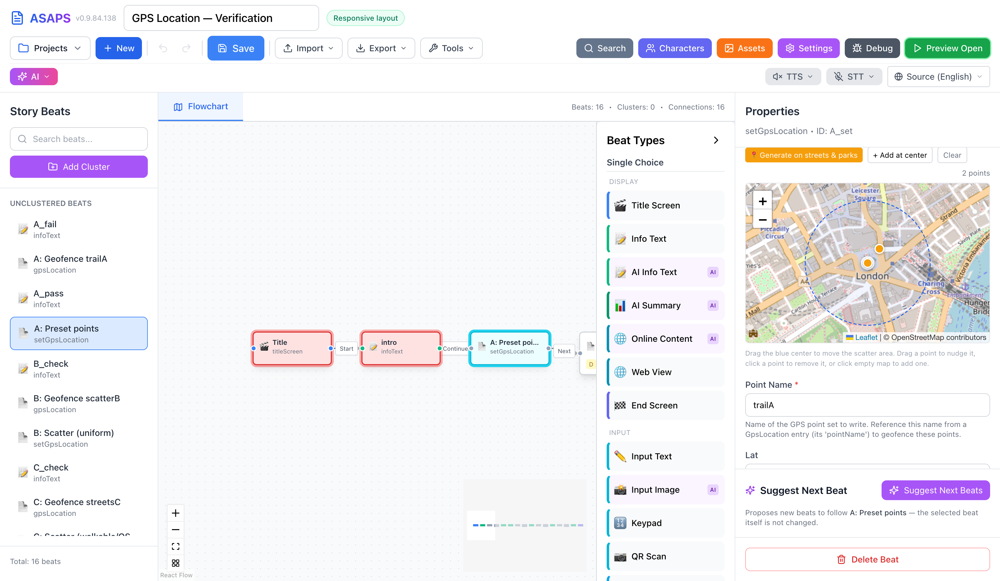

**Other Key Settings:**
- **Point set name** — The name a GPS Location entry references (its *pointName*) to geofence these points
- **Point radius (m)** — Optional geofence radius stamped on each stored point; falls back to the GPS Location beat's radius when omitted

**Flow:** Executes instantly (capture and walkable-scatter may take a moment for the sensor/network), stores the points, then moves to the target beat. Point sets live in story state and ride through save/resume; any GPS Location beat later in the flow can geofence them by name.

**When to Use:** Geocaching-style hunts ("three clues are hidden on streets near you — find one"), stories anchored to wherever the player happens to be standing, museum or campus routes you curate on a map in advance, dynamic meeting points.

**Testing without leaving your desk:** the Preview window's [Mock Sensors panel](#mock-sensors) lets you type or nudge a simulated player position and watch the geofences fire.

---

### Inventory Management

**Purpose:** Manage items.

Give characters items or take them away. Items can be transferred between characters too.

**Actions:**
- Add item to character's inventory
- Remove item from character
- Transfer item from one character to another

**Character fields:** All three character slots (`Character`, `From character`, `To character`) use the [Character combobox](#character-combobox). **Player** is pinned at the top of the dropdown — picking it routes to the player's inventory and preserves the global single-inventory shortcut some authors rely on. Picking any defined Character stores a stable id link, so renaming a character later updates these references automatically.

**When to Use:** Finding loot, using consumables, trading, losing items.

---

### Update Affect

**Purpose:** Drift a character's mood, fire an emotion, strengthen a sentiment, flip a goal, switch a variant, append a reflection, or snapshot an affect bookmark — from a beat in the flow rather than from a player choice.

This is the logic-beat counterpart to the [affect-aware choice effects](#choice-effects-affect). Use it when the affect change isn't triggered by a player choice — e.g. *"on entering the haunted house, every NPC's fear rises"*, or *"at the end of Act 1, the player feels pride."*

**Authoring surface (v0.9.45+).** The Update Affect inspector renders the **same Effects editor as a player choice** — so everything you already know about choice effects works here unchanged: stack as many rows as you like, mix mood nudges with emotion fires and sentiment adds, drop in a `Bookmark Affect State` row to mark an act-break baseline future conditions can compare against, seed a coherent bundle from the **+ apply template…** dropdown, and watch the live "what does this beat do?" summary update under the rows as you tweak. See [Easier authoring: labels, palette suggestions, templates, and a live summary](#effects-easier-authoring) for the full walk-through — there's only one editor and one set of conventions to learn.

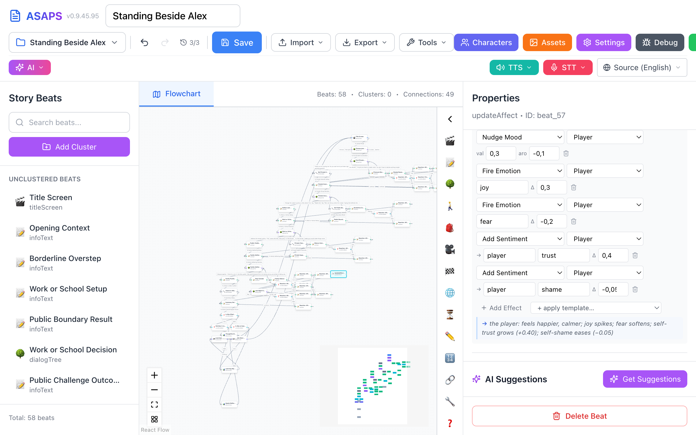
*An Update Affect beat populated by the **Empathetic — full support** template: a mood nudge, two `Fire Emotion` rows (joy, fear), and two `Add Sentiment` rows (trust, self-shame). The italic teal block at the bottom — `→ the player: feels happier, calmer; joy spikes; fear softens; self-trust grows (+0.40); self-shame eases (−0.05)` — is the live plain-language summary, the same one you see on choice effects.*

**When to Use:** Atmosphere shifts, story-beat-level emotional pivots, the moment the player crosses a narrative threshold and *every* NPC reacts, an act-break "snapshot the world right now" so later acts can compare against the baseline. Also useful as a one-stop place to bundle several affect changes that are *consequences of* a setVariable or condition the engine just evaluated, rather than of any player choice.

> **Project-file note for v0.9.45.** The on-disk shape changed: new Update Affect beats save with an `<effects>` block (one `<effect>` element per row), matching how a choice's effects are serialised. Older projects that used the legacy single-row attributes (`moodValenceDelta="..."`, `sentimentTarget="..."`, `emotion="..."`, etc.) still load and run unchanged — the runtime falls back to the legacy fields when no `effects` array is present. The first time you open a legacy beat in the editor, its existing values are surfaced as Effect rows so you can see them in the new shape; saving the beat then persists the migrated form. Old projects you never re-touch keep their legacy `<UpdateAffect>` element verbatim.

---

### AI Condition

**Purpose:** AI-powered branching.

Let AI analyze the player's current state (variables, inventory, history) and choose the best next path. More flexible than fixed conditions.

**Key Settings:**
- **Evaluation Prompt** - What to consider
- **Categories** - Possible paths
- **Fallback** - Where to go if AI is uncertain

**When to Use:** Complex state evaluation, narrative judgment calls.

---

### AI Dialog Tree

**Purpose:** AI-generated conversations with pre-built branching.

Instead of scripting every possible response, let AI generate a contextually appropriate dialog tree at runtime. The AI produces a complete branching conversation with multiple choices, tailored to the player's current state.

**Key Settings:**
- **Scenario** - Scene description providing context
- **NPC Name** - Who the player is talking to. Uses the [Character combobox](#character-combobox) — pick a defined Character to link this beat to that character's identity. When you link a Character that has a description set, the description is auto-filled into **NPC Personality** below (only if that field is empty), so you don't have to rewrite the persona on every AI beat that uses the same NPC. Free-text names still work.
- **NPC Personality** - How the AI should "act"
- **Exit Targets** - Named exits with descriptions telling the AI when to use each one
- **Max Turns** - Limit conversation length
- **Presentation Mode** - Positioned, chat scroll, or chat bubble
- **Context Toggles** - Include variables, inventory, visited beats, choice history

**Exit Target Features:**
- **NPC Exit Message** - Each exit target can have an optional `npcExitMessage` prompt. When set, the AI generates a farewell line that directly acknowledges the player's last choice before transitioning. This makes exits feel natural rather than abrupt.
- **Exit Reason Tracking** - The AI includes an `exitReason` for each exit choice, explaining what the player said or expressed to satisfy the exit condition. This helps authors debug conversation flow.
- **Routing Plan** - The AI generates a `routingPlan` explaining its reasoning: how it mapped exit conditions to conversation branches and what player signals it looks for. This is logged in the session timeline for debugging.

**AI Prefetching:** The AI DialogTree supports background prefetching. When the story engine knows this beat is coming next, it generates the dialog tree in the background before the beat executes. This eliminates the loading delay the player would otherwise see, making AI conversations feel instantaneous.

**When to Use:** NPCs that feel alive, unlimited dialog, personalized responses.

---

### AI Conversation

**Purpose:** Real-time, free-form AI conversations with author-defined steering rules.

Unlike AI Dialog Tree (which pre-generates a branching tree), AI Conversation generates each NPC response live based on what the player actually types. The author controls the conversation through **directions** -- rules that steer the AI based on what the player says.

**Key Settings:**
- **Scenario** - Scene description
- **NPC Name** - The NPC the player is conversing with. Same [Character combobox](#character-combobox) as AI Dialog Tree — link to a defined Character to keep the identity stable, or type a free-text name. Linking a Character with a description auto-fills **NPC Personality** when that field is empty. Right under the field sits **✨ Develop character with AI…** — a shortcut that drafts a full character profile (personality, mood, speaking style, optional disposition variants) from this beat's scenario and personality text, then links the accepted character back to the beat. See [AI Character Development](#ai-character-development).
- **NPC Personality** - Character traits and behaviour the AI should embody
- **Opening Line** - Fixed first line (if empty, the AI generates one)
- **Max Turns** - Conversation length before fallback exit
- **Fallback Exit Target** - Where to go when max turns are reached
- **Enable Voice Input** - Show a microphone button for speech-to-text input
- **Context Toggles** - Include variables, inventory, visited beats, choice history
- **System Instructions** - Additional rules for the AI

**Presentation: Chat vs Dialog (v0.9.82).** AI Conversation can look like a messaging app *or* like a classic dialog scene — your pick, per beat. Select the beat in the flowchart and open its **Visual Editor** tab; the choice lives in the left panel's **Conversation Settings** section (deliberately *not* in the Inspector, because it's a visual-presentation decision):

- **Chat (scrolling panel)** — the default. A responsive, messaging-style scrolling conversation panel. Existing conversations keep this look unchanged.
- **Dialog (back-and-forth, positionable)** — a positioned NPC dialog box plus a free-text reply field (with the same microphone button when voice input is on), styled like a Dialog Tree. Because the dialog box and input are positioned elements, this mode is fully at home in **Fixed-canvas** projects — place them exactly where you want on the stage, with your theme's text-box styling and the beat's background behind them.

The Visual Editor preview is faithful in both modes: chat mode shows the real scrolling panel seeded with your opening line, dialog mode shows the positioned boxes, and switching between the two re-bakes or clears the positioned elements live.

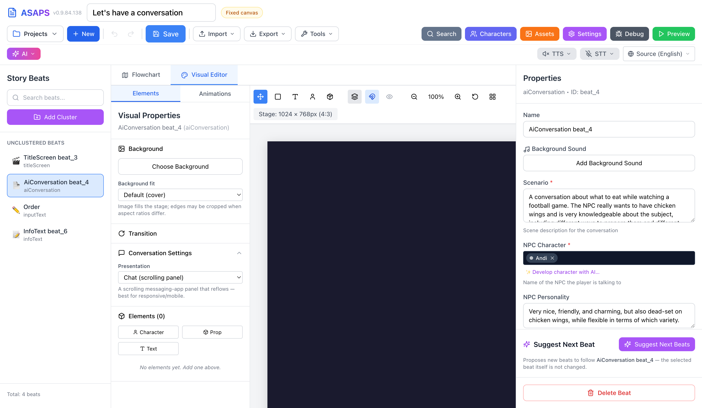

**Conversation Directions:**

Directions are the heart of AI Conversation. Each direction has a **trigger** and an **action**:

**Trigger Types:**
| Trigger | What It Detects |
|---------|----------------|
| **Topic Mention** | Player mentions specific keywords |
| **Sentiment** | Player's emotional tone (positive, negative, angry, curious) |
| **Turn Count** | Conversation reaches a certain number of turns |
| **Variable** | A story variable has a specific value |
| **Custom** | Free-text description evaluated by AI |

**Action Types:**
| Action | What Happens |
|--------|-------------|
| **Steer** | Give the AI a steering instruction (e.g., "mention the hidden passage") |
| **Exit** | End the conversation and go to a target beat |
| **Set Variable** | Set a story variable based on the conversation |
| **Multi-Action** | Combine actions (e.g., steer + set variable, or exit + set variable) |

**Advanced Direction Features:**
- **Variable Guards** - Directions can require a specific variable value before they activate (e.g., only trigger the "secret info" direction if `hasKey` is true)
- **Once-Only** - Mark a direction to fire at most once per conversation
- **Negate Triggers** - Invert a trigger (fires when the condition is NOT met)
- **AI Value Extraction** - Instead of setting a static variable value, provide an extraction prompt and let the AI determine the value from the conversation context
- **Exit Messages** - When an exit direction fires, the NPC can deliver a farewell line that acknowledges what the player just said

**When to Use:** Open-ended conversations, investigation scenes where the player can ask anything, therapy/counseling simulations, NPC shopkeepers, any scenario where pre-scripted branches feel too limiting.

**Example Setup:**
```
Scenario: "The player meets a merchant in a bazaar"
NPC: "Fatima", personality: "shrewd but fair, loves haggling"

Directions:
  1. Topic "price, cost, expensive" → Steer: "offer a 10% discount"
  2. Sentiment "angry" → Steer: "apologize and offer a gift"
  3. Topic "secret, hidden, special" + requires secretContact=true
     → Exit to "Back Room" beat + set variable visitedBackRoom=true
  4. Turn count >= 5 → Exit to "Market Square" beat
```

---

### AI Summary

**Purpose:** Generate a story recap.

AI creates a personalized summary of the player's journey—their choices, discoveries, and path through the story.

**Styles:**
- **Narrative** - Prose summary
- **Bullet Points** - List of key events
- **Reflection** - Thoughtful commentary

**When to Use:** End-of-chapter recaps, endings that reference your journey, "Previously on..." moments.

---

# Part 4: Characters & Assets

A great experience needs a great cast and a rich world. Let's populate yours.

## Characters

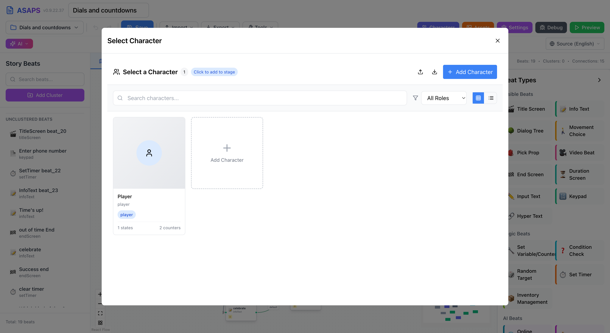
*The Character Manager panel*

### Why Characters Matter

Characters aren't just pretty faces. They're miniature systems in their own right:
- Multiple visual appearances (happy, sad, angry)
- Their own counters (health, trust, energy) — which you can either move by hand *or* bind to what the character actually feels
- Inventory they carry from beat to beat
- A personality (Big Five traits and an archetype) that quietly modulates how they react
- A 2D mood (valence × arousal) that can drift over the session
- Directed feelings — sentiments — toward the player and other characters
- Goals that the runtime tracks and that fire pride/joy or shame/sadness when met or failed
- Optional **variants** — alternate persona overlays sharing one stable id (introvert/extrovert Alex, masculine/feminine Sam) that the player can switch between

You can ignore all of this and ship a perfectly good story with just names and pictures. But if your AI-driven characters need to *feel like someone* — and especially if you want them to react differently depending on what the player has done — these are the dials.

### Creating a Character

1. Click **Characters** in the header
2. Click **Add Character**
3. Fill in the basics:
   - **Name** - Internal identifier (e.g., "elena")
   - **Display Name** - What interactors see (e.g., "Elena Blackwood")
   - **Role** - Player, NPC, or Companion
   - **Description** - Notes for yourself

Prefer to *describe* the person instead of filling in fields? The template picker that opens on **Add Character** includes a **✨ Generate with AI** card — write a plain-language brief and the AI drafts the whole profile for you. See [AI Character Development](#ai-character-development).

### Character Appearances

Characters can have multiple visual states:

1. In the character editor, find **Appearances**
2. Click **Add Appearance**
3. Name it (e.g., "happy", "angry", "wounded")
4. Upload or select an image

In your story, you can then show the character in different states. Elena can look happy when things go well and worried when they don't.

### Character Counters (Stats)

Track numeric values for each character:

1. Open a character in the Character Editor and click the **Counters** tab
2. Click **+ Add Counter**
3. Configure:
   - **Name** and **Display Name** — the internal key ("trust") and the label the interactor sees ("Trust"). The editor shows you the reference you'll use in conditions and calculations underneath, e.g. `ada.trust`.
   - **Initial** — the value the counter starts at
   - **Min / Max** — the range the meter spans (more on this below — it matters more than you'd think)
   - **Colour** and the **eye** toggle — how it looks, and whether it's visible at all
   - **Show Level Meter** — tick this to unfold the display controls: a horizontal/vertical **Orientation**, and **Show Value** with a format: `75`, `75/100`, `75%`, or *words* (see [Words instead of numbers](#counter-bands))

Counters are **scoped to the character**, so two characters can each have a `trust` without colliding. To change one during play, use a **Set Variable/Counter** beat with **Owner** set to that character, or a **Change Counter** / **Set Counter** effect on a choice.

<a id="meter-frame"></a>
#### Showing counters on stage — the Meter Frame

A counter that's only in the data does nothing for your interactor. The **Meter Frame** is the little panel that puts them on screen. Scroll to the bottom of the **Counters** tab, tick **Enable**, and choose:

- **Dock To** — *Character* (the frame floats beside the character's sprite, positioned by **Anchor Position**) or *Screen* (pinned to one of the four corners, with a small **HUD layout preview** showing how it will stack alongside any other overlays in that corner).
- **Offset X / Y**, and a **Style** block: background, border colour and width, corner radius, padding, opacity.
- **Show Labels**, plus **Meter Width**, **Meter Height** and **Spacing** for the bars themselves.

The frame draws every counter whose eye toggle is on, in the order they're listed, and it carries a **header with the character's name and their colour dot** *(new in v0.9.89)*. That header matters as soon as you have two characters with meters: two frames docked in the same screen corner used to look like one character's counters duplicated, and since only one set responded to anything, the other looked broken. Now the HUD says whose meters it is.

> **Will your interactor know what it is?** A bar labelled *Trust* in the corner is still a bar they've never seen before. The [Explanation beat](#explanation) labels the HUDs that are actually on screen, and every beat carries an *Explain HUDs on entry* checkbox that does the same thing in place — worth one beat early on.

<a id="counter-binding"></a>
#### Counters that read affect — "a display, not a mechanic"

Here's the idea, and it's a genuinely useful one: **a counter doesn't have to be something you move. It can be a window onto something the character actually feels.**

Say you want a trust bar. Traditionally you'd hand-author every trust change: *this choice +10, that one −15*. That's honest work and sometimes exactly right — you know precisely what the number does. But ASAPS also models feelings properly: characters carry **sentiments** toward people, **emotion levels**, and a **mood** that drifts (see [The Affect Tab](#character-affect)). Until v0.9.89 those two systems couldn't meet. You could have a trust *bar* or modelled *trust*, never both.

Now you can **bind** a counter to affect state. The meter renders exactly as before — same bar, same colours, same frame — but its value is read live from the character's feelings instead of stored. You stop writing to it, and it starts reporting.

**Setting it up.** Every counter in the Counters tab has a **How does this change?** picker with four options, phrased about your fiction rather than the machinery:

| Option | What it gives you |
|---|---|
| **You set it at specific moments** | An ordinary counter. You decide exactly when it changes and by how much, using effects. This is the default and nothing about it has changed. |
| **It responds — a feeling toward someone** | Reads a **sentiment**. Pick the **Feeling** (free text — "trust", "respect", "fear"), who it's **Toward**, and optionally who it's **Held by**. Directed and two-sided: negative trust is distrust. |
| **It responds — an emotion they feel** | Reads an **emotion level** — an intensity from none to overwhelming. Fear has no opposite, so this one is always one-sided. The **Emotion** field auto-completes from the built-in emotion names (fear, anger, joy, shame…), and accepts anything else you type. |
| **It responds — their overall mood** | Reads one **Axis** of the character's mood: *Valence — unpleasant … pleasant* or *Arousal — calm … excited*. |

**Held by** is the quietly powerful one. Leave it as *(this character)* and the meter shows how *they* feel. Point it at someone else and you get the player-facing bar every social scene wants: *does the caseworker trust me?* — a meter that lives on the player but reads the caseworker's sentiment.

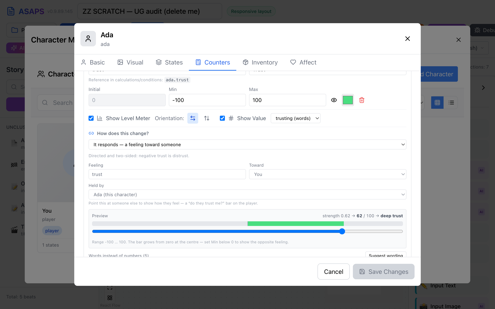
*The Counters tab with Trust bound to a sentiment. Note that **Initial** greys out — a bound counter has no stored value to seed. The preview underneath answers the only question that matters: what will this bar actually do?*

<a id="counter-projection"></a>
#### The one rule: the bar starts at zero

This is the part worth reading twice, because it's the thing that surprises new authors.

Feelings inside ASAPS are signed and small: a sentiment runs from **−1 to +1**, a mood axis likewise. Counters are usually **0 to 100**. So something has to translate, and ASAPS uses exactly one rule, with no setting to get wrong:

> **The bar starts at zero — wherever zero happens to fall in your Min…Max — and grows toward the value.**

Which means your **Min** is not just a display bound. It's you telling ASAPS whether this feeling has an opposite:

- **`Min: 0, Max: 100`** — zero is the left edge, so the bar fills rightward from it. The familiar gauge. Negative feeling clamps to an empty bar, which is the honest reading of *"I'm not modelling distrust"*: nothing yet.
- **`Min: -100, Max: 100`** — zero is the **centre**, so the bar grows *outward* from the middle. Distrust now reads as distrust rather than as "a bit less trust". This is almost always what you want for a two-sided feeling like trust or respect.

Asymmetric ranges work too, and fall out of the same rule — `Min: -50, Max: 100` puts zero a third of the way in.

What ASAPS deliberately does *not* do is squash −1…+1 onto 0…100 so that neutral sits half-full. That would show a character who feels nothing as a half-filled bar, which reads as a partial score. Zero means empty, or centre. Always.

**The preview shows you all of this.** Under the source fields there's a live **Preview**: drag the strength slider and watch the readout — *strength −0.45 → **−45** / 100 → **wary*** — with the bar rendering the real geometry, growing leftward from the centre and turning red for the negative direction. It's interactive rather than live because at authoring time there's no running story to read a real sentiment from; dragging the slider is the honest equivalent, and it answers your actual question. If the bar surprises you here, it will surprise you in play — fix it now.

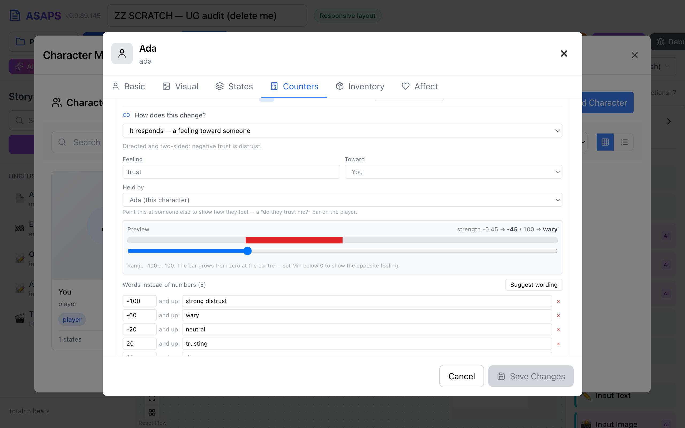
*Strength −0.45 projects to −45 on a −100…100 range, the bar grows leftward from the centre, and the readout says "wary". The band ladder that produced that word is directly underneath.*

**A gentle nudge about polarity.** If you name a sentiment after one of the built-in emotion names — *fear*, *anger*, *shame* — while Min is still below zero, an amber hint appears: *"fear usually has no opposite — 'negative fear' isn't a state. Set **Min** to 0 unless you really do mean the reverse feeling."* It's a suggestion, not a rule. Sentiments genuinely vary: *trust* is two-sided, *fear of the wolf* is not, and only you know which you meant. ASAPS never silently clamps a value you deliberately authored — the help belongs here, at authoring time, where you can see it and overrule it.

<a id="counter-bands"></a>
#### Words instead of numbers

A number is precise. A word is readable. Bands let you have the second without teaching your interactor the first.

Under the preview, a **Words instead of numbers** block lets you give the counter a ladder of thresholds — each one a value and a phrase. Set **Show Value** to the *words* format and the readout shows the phrase covering the current value instead of the digits: **−100** *strong distrust* · **−60** *wary* · **−20** *neutral* · **20** *trusting* · **60** *deep trust*.

Click **Suggest wording** and ASAPS seeds a ladder appropriate to the source *and* switches the value format to words for you. (If nothing changes on screen, check that **Show Value** is ticked — the format picker only shows when it is, and the *words* option stays greyed out, reading *"words — add them below"*, until at least one band exists.) Every row is editable and deletable; delete them all and you're back to a bare number. The suggestions are:

| Source | Suggested ladder |
|---|---|
| Two-sided sentiment (Min below 0) | strong distrust · wary · neutral · trusting · deep trust |
| One-sided — an emotion level, or any counter with Min 0 | none · slight · moderate · strong |
| Mood axis (Min below 0) | unpleasant · flat · pleasant |

Thresholds don't have to be written in order, and a value below every threshold falls back to the lowest phrase — the readout is never blank.

Nothing about bands is affect-specific — the runtime resolves them on any counter — but the band editor currently lives inside the binding block, so in practice you'll be adding them to bound counters. (A ladder you've already created survives if you switch that counter back to *You set it at specific moments*.)

**Why the suggested ladders include a "neutral" band.** Every point on the range always resolves to *some* word, so there's never a blank readout. The thing to watch is subtler: a ladder with no neutral band puts a judgemental word on the opening value, and that word is the first characterisation your interactor ever receives. Since sentiments start at exactly zero unless you seed them, "wary" at the top of the story asserts a suspicion nobody has earned yet. If you *have* seeded an opening stance — a guarded character who genuinely opens wary — delete the neutral band without a second thought. That's characterisation, and a useful one.

> **Band phrases translate.** Both the counter's display name and its band phrases are picked up by [translation](#multi-language-translation), so a meter reading *"wary"* in English reads *"misstänksam"* in a Swedish export. The thresholds themselves are numbers and stay as they are.

**Turning the label off.** With **Show Labels** on (the Meter Frame default), each meter shows its name on the left and the readout on the right above the bar. Turn Show Labels off and the name disappears while the readout moves inline, right beside the bar — so a compact frame can read simply `▓▓▓░░ wary`.

**Words with no bar at all.** Untick **Show Level Meter** while leaving **Show Value** on with the *words* format, and the meter drops the bar entirely — the frame shows just the name and the phrase, `Trust  wary`. Useful when the exact quantity is none of the interactor's business and only the shift in wording should register.

<a id="derived-counters-readonly"></a>
#### Bound counters are read-only

Once a counter reads affect state, assigning to it stops making sense: the next time the character appraises something, your written value is gone. You'd have found a bug, not a feature. So ASAPS refuses the write, visibly rather than silently:

- In **Set Variable/Counter** and in the **Change Counter** / **Set Counter** choice effects, a bound counter still appears in the picker — labelled *"Trust — Ada (mirrors affect state)"* — but greyed out and unselectable, with the reason on hover: *"trust mirrors affect state — change it with an Add Sentiment effect."* It names the substitute, too: an **Add Sentiment** effect for a sentiment binding, **Fire Emotion** for an emotion level, **Nudge Mood** for a mood axis.
- The **Input Text** beat's *save to counter* field drops bound counters from its suggestions, and warns you if you type one by hand.

They're shown disabled rather than hidden on purpose: an author who has just defined a counter and then can't find it in the picker would reasonably conclude the picker is broken.

**Reading them is completely fine.** A Condition Check can test a bound counter exactly like any other — `ada.trust > 40` works, and resolves to the live derived value. Only writing is blocked.

**And if you want direct control, you already have it.** Leave the source on *You set it at specific moments*. Authored and bound counters are equal citizens, they can sit side by side in the same frame — *Gold: 42* next to *Trust: ▓▓▓░░* — and a story that never touches affect is entirely unaffected by any of this.

<a id="counter-binding-in-play"></a>
#### Seeing it work

Open the Preview Window and play a beat or two. Bound meters resolve live, so they move as the character's feelings move — in the Preview Window and in an exported HTML story alike.

The **Visual Editor** shows the frame too, so you can see where it sits and how big it is, but bound counters read **zero** there. That's deliberate rather than a bug: no story is running, so there is no sentiment to read, and showing an invented number would be worse than showing none. Use the Preview Window whenever you want to see real values.

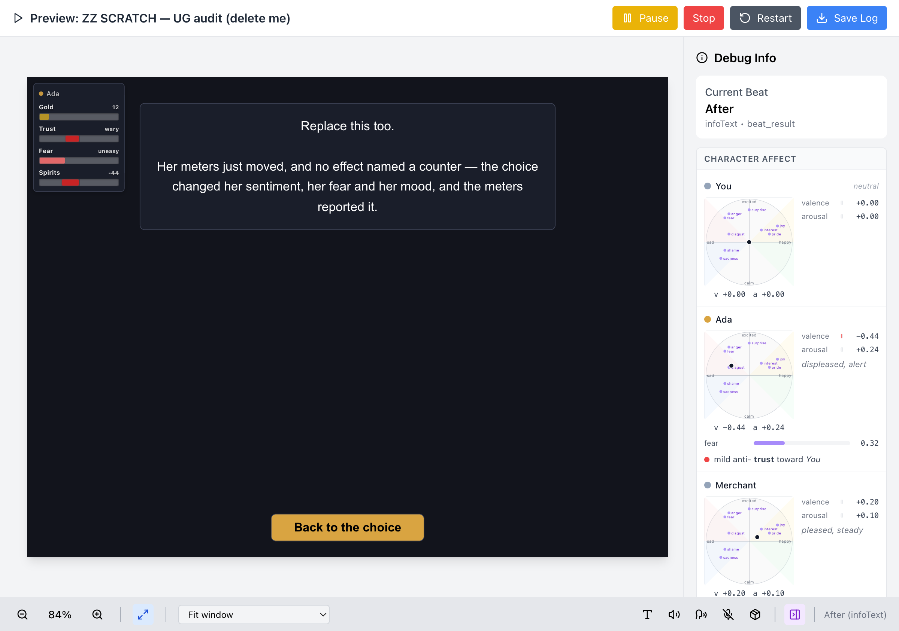
*Ada's frame after a harsh choice. Gold hasn't budged — nothing wrote to it. Trust has grown leftward from the centre and reads "wary", Fear has filled from the left edge and reads "uneasy", and Spirits has dropped to −44. The choice fired affect effects; the meters simply reported. The Debug panel on the right shows the same state underneath — mood, fear level, and "mild anti-trust toward You".*

**Try this first.** Start a project from the **Counters that read affect** template ([Templates](#templates)), play it, then go and read the character's Counters tab with the running behaviour fresh in your mind. The wiring makes far more sense once you've watched a bar do the thing.

> **A note on paradigm.** This is the systems-not-scripts idea in miniature. A hand-authored trust counter is a script: you decide, in advance, what every choice is worth. A bound meter is a system: you describe how the character *reacts*, their personality shapes how strongly, and the display reports whatever the interaction produced — including combinations you never explicitly wrote down. Neither is better. But if your story is about a relationship rather than a resource, the second one usually surprises you in the right way.

### Character Inventory

What can this character carry?

1. Find **Inventory** in the character editor
2. Configure inventory display (grid size, item sizing)
3. Add starting items if any

During the story, use Inventory beats to give or take items.

### Speaker Portraits

Give your characters a face that appears alongside their dialog. Speaker portraits are small images (typically a face or headshot) that display inside or above the text box whenever that character speaks.

1. Open a character in the Character Editor
2. Switch to the **Visual** tab
3. Scroll down to **Speaker Portrait**
4. Upload a portrait image (square or near-square works best)

To enable portraits globally, go to **Settings → Effects → Speaker Display** and check **Show speaker portraits**. You can also choose where portraits appear and how large they are — see [Speaker Display Settings](#speaker-display) for details.

**Tip:** Portraits are different from character appearances. Appearances are the full-body images placed on the visual stage; portraits are small face images shown in the text box during dialog.

### Character Name Translations

When your project has translation languages configured, the Character Editor gains a **Translations** tab (marked with a globe icon). This lets you enter translated display names for each character, per language.

1. Make sure you have at least one translation language configured (see [Multi-Language Translation](#multi-language-translation))
2. Open a character in the Character Editor
3. Click the **Translations** tab
4. Enter the translated display name for each language

When AI translation runs on your project, character name translations are auto-populated and kept in sync with translation resource files. During playback with a translation active, the translated name appears as the speaker label in text boxes.

<a id="character-combobox"></a>
### The Character Combobox — One Field for Every Character Reference

Anywhere in the Inspector that asks for a character — a beat's speaker, an inventory recipient, an AI NPC name, a per-node speaker inside a Dialog Tree — you'll see the same control: a **Character combobox**. Click into it (or start typing) and a dropdown opens with everything you might want to pick:

- **Pinned options** at the top — context-specific shortcuts. For a beat speaker the pins are *(Default — Narrator)*, *Narrator*, and your Player character (shown as e.g. *"Red (Player)"*). For inventory beats and the player-side fields the pin is *Player*.
- **Characters** — every Character you've defined in the Character Manager, each with its color dot and display name.
- **Used names** — every free-text speaker / character name used elsewhere in your project, with a usage count next to each (e.g. *"Mysterious Stranger 3×"*). Picking one stores it as free text — handy for keeping ad-hoc names consistent without committing to a full Character record.
- **+ Define "<typed name>" as a Character** — appears at the bottom of the dropdown when whatever you've typed isn't yet a defined Character. Click it to open the Character Manager pre-filled with that name, ready for you to add details.

**Where you'll see it.** The same combobox appears everywhere a character is referenced — five distinct sites in total:

1. The **Speaker** field on every beat type (used for TTS voice routing and speaker labels).
2. The **NPC Speaker** field on each individual node inside a **Dialog Tree** — so a single Dialog Tree can naturally flow Granny → Wolf → Granny by giving each node a different linked speaker.
3. The **Character**, **From character**, and **To character** fields on **AddRemoveInventory** beats. *Player* is pinned at the top of these dropdowns and preserves the global single-inventory routing some authors rely on.
4. The **NPC Name** field on **AI Dialog Tree** beats.
5. The **NPC Name** field on **AI Conversation** beats.

In the two AI cases the dropdown is filtered to non-player Characters — the player is never the NPC.

**What "linking" means.** When you pick a defined Character, the field shows a colored chip with the character's name and a small **✕** unlink button. The chip is a stable link to that character's identity — not just a string copy — so:

- Renaming the Character in the Character Manager updates **every** linked field across your project automatically.
- TTS voice routing, speaker portraits, and other character-aware features look up the linked record once and stay in sync.
- For AI Dialog Tree and AI Conversation, linking the NPC field to a Character that has a **description** auto-fills the **NPC Personality** slot from that description (only if the slot is currently empty). This means you can write the persona once on the Character record and have it reused on every AI beat that uses the same NPC.
- If you ever delete a Character that's still linked somewhere, those fields show a small *(deleted)* indicator so you can see what needs cleanup.

To go back to plain text, click the **✕** on the chip and type whatever you like.

**Define-as-Character with one-click bulk re-link.** Authoring stories often starts with free-text names — you scribble *"Town Crier"* into a few beats while drafting, then later decide the Town Crier deserves a real Character with a portrait and a personality. Clicking **+ Define "Town Crier" as a Character** opens the Character Manager pre-filled with that name. Once you fill in details and save, ASAPS asks:

> *"Link N references to Town Crier?"*

…and lists every beat field across your project that uses *"Town Crier"* as free text — speaker fields, dialog node speakers, AI NPC fields, inventory characters. One click links them all to the new Character and they start following renames automatically. References already linked to **other** Characters are never silently overwritten — the dialog skips them. If you'd rather leave the old refs as free text, click **Keep as free text** instead.

**Why this matters.** ASAPS treats characters as identities, not strings. When you link a field to a defined Character, the runtime resolves that link to a single canonical record — no matter how the character is referenced (id, name, or display name). That stable identity is what makes character-aware features such as per-character mood, sentiment-over-time, goals, variants, and dossier building work — see [The Affect Tab](#character-affect) for the full picture. Everything still works if you stick with free-text names; linking just unlocks more.

### The Player Character as Speaker

Your player character (the character with the "Player" role) automatically appears as a built-in option in beat speaker dropdowns. You'll see it listed by its display name with "(Player)" appended — for example, **Red (Player)**.

When you assign the player character as a beat's speaker, the character's actual display name is stored (not the generic "Interactor"). This means speaker labels and portraits work naturally for the player character, just like any other character.

**TTS behavior:** The player character is silent by default in text-to-speech mode. If you assign a TTS voice to the player character, their text will be spoken — and in multi-choice beats (like Dialog Trees), clicked choices are spoken aloud in the player character's voice.

### Character Templates

Clicking **Add Character** opens a **Choose a Template** picker rather than dropping you into an empty form. Pick a starting point and customise from there:

| Template | What it carries |
|---|---|
| **Player** | Standard protagonist setup · *balanced* personality |
| **Merchant** | Gold counter and inventory · *conscientious leader* personality |
| **Old Wizard** | Magic-focused stats · *stoic* personality |
| **Animated Character** | A sprite-sheet visual with idle/talk/react animations · *free spirit* personality |
| **Character with affect meters** | Four pre-wired meters in a docked HUD frame — Gold, Trust, Fear, Spirits — plus traits and a seeded opening sentiment |
| **Blank Character** | Start from scratch — **no personality** |

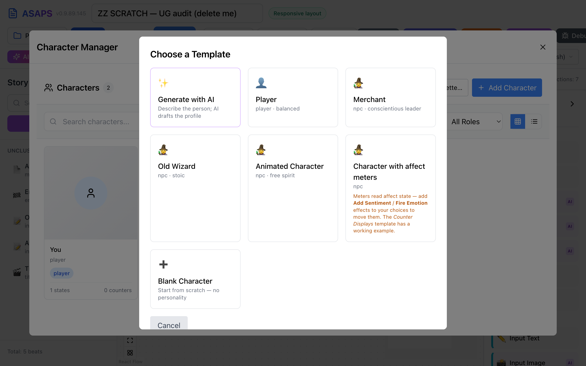
*Each card names the personality it carries, so a template never hands you a disposition you didn't choose. "Blank Character" says outright that it carries none.*

**Templates say what they seed.** Personality traits are not cosmetic — they feed the character dossier and shape how the character behaves in AI conversations. So each card discloses the personality underneath it (*"npc · conscientious leader"*), and **Blank Character** promises the opposite: *"Start from scratch — no personality."* Picking a template for its inventory or its sprite sheet should never quietly hand you a disposition.

**About "Character with affect meters."** Its card carries an extra amber note, and it's worth heeding: *"Meters read affect state — add **Add Sentiment** / **Fire Emotion** effects to your choices to move them."* The template can only carry half the mechanic. Meters read a character's feelings, and feelings change because *choices* fire affect effects — which live on beats, not on characters. Add this character to a story with no such effects and you get four perfectly configured meters that never move. The **Counters that read affect** starter template has the working other half; see [Counters that read affect](#counter-binding).

The same picker also offers **✨ Generate with AI** — describe the person in a sentence or two and the AI drafts the whole profile, optionally with disposition variants. See [AI Character Development](#ai-character-development).

<a id="character-affect"></a>
### The Affect Tab — Personality, Mood, Sentiments, Goals & Variants

Open any character in the Character Editor and click the **Affect** tab (heart icon). This is where the character's inner life lives. None of these fields are required — leave the tab untouched and the character behaves as a pleasant blank slate. Fill them in when you want richer, more reactive behavior in AI beats and emotion-aware logic.

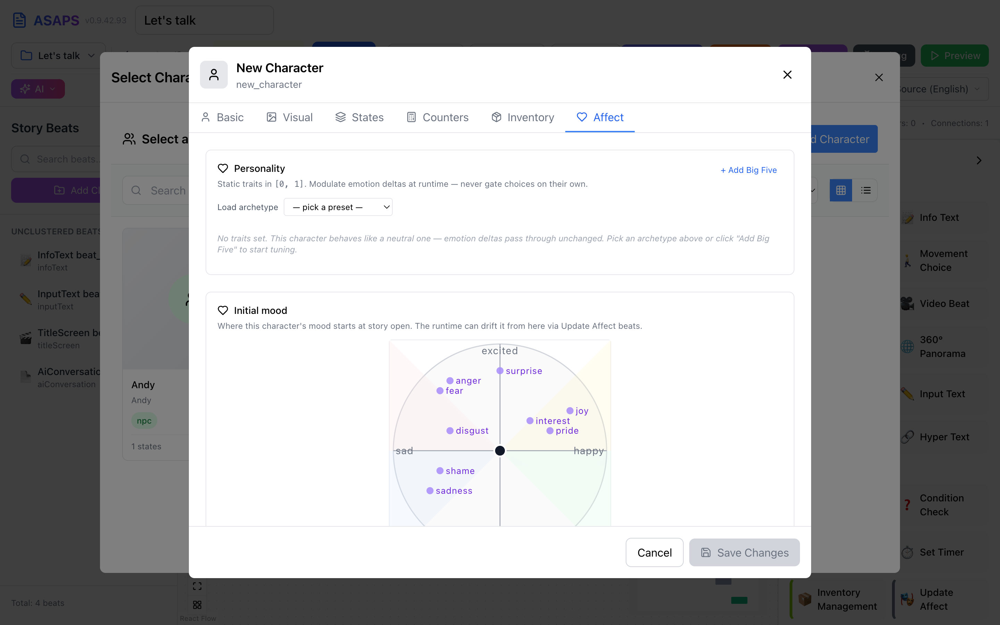
*The Affect tab on a fresh character — everything starts neutral / empty so authors only see what they care about.*

The tab is organized as a stack of cards, top to bottom: **Personality**, **Initial mood**, **Initial sentiments**, **Dossier policy**, **Goals**, **Variants**, **Mood HUD**. Take them one at a time — most stories only need two or three.

#### Personality — Big Five traits and archetype presets

Personality traits are static numbers in `[0, 1]` that scale how strongly a character's emotions react to events. They never gate choices on their own — they're a quiet multiplier on emotion deltas at runtime.

You have two ways to fill in this card:

**1. Pick an archetype.** The **Load archetype** dropdown ships with ten research-grounded presets — *Balanced, Narcissist, Anxious introvert, Conscientious leader, Free spirit, Recluse, Hothead, Peacekeeper, Stoic, Trickster*. Pick one and ASAPS replaces the Big Five sliders with that profile and shows a description plus any **Seeded toward self:** sentiments the preset implies (the Anxious introvert, for example, seeds a mild self-shame; the Stoic seeds nothing because the research doesn't ground a specific self-feeling for that profile).

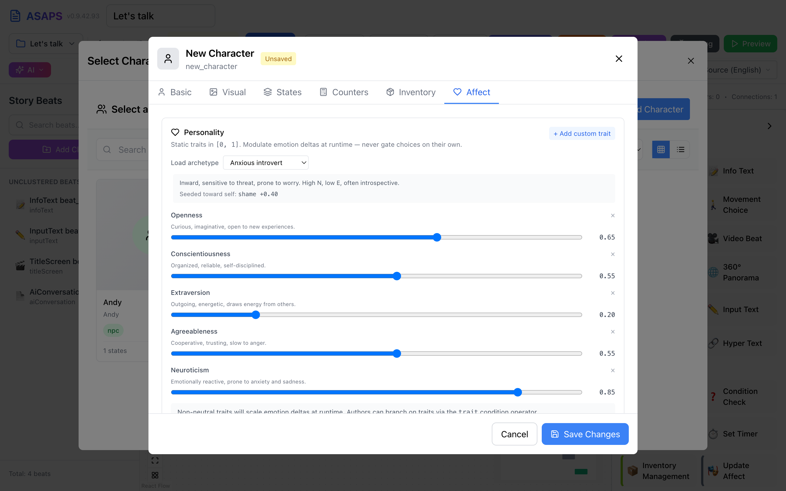
*Picking "Anxious introvert" replaces the Big Five sliders, surfaces the description, and seeds a self-directed sentiment — all visible at a glance.*

**2. Tune by hand.** Click **+ Add Big Five** to seed Openness, Conscientiousness, Extraversion, Agreeableness, and Neuroticism at neutral 0.5. Each trait has its own slider and a one-line description so you don't need to remember which way the axis points. Click **+ Add custom trait** to invent your own (e.g. *bravery*, *curiosity_about_tech*) for story-specific use.

You can mix the two — pick an archetype to get 80% of the way there, then nudge individual sliders to taste. Custom (author-named) traits are preserved when you switch archetypes.

**3. Drag the interpersonal stance pad.** Once the character has traits (from an archetype or **+ Add Big Five**), a small square pad appears below the sliders — a "Leary's Rose" plotting **warmth** (cold ↔ warm, left to right) against **dominance** (submissive ↔ dominant, bottom to top), with the four classic corner labels *hostile*, *leading*, *withdrawn*, and *cooperative*. It's a lens on the same personality you're already editing: the dot mirrors where the character's extraversion and agreeableness sit, and **dragging the dot sets both sliders at once**. If "how does this person meet other people?" is a more natural question for you than "how extraverted are they, 0 to 1?", author from the pad and let the sliders follow. (Curious about the psychology behind the pad? See `docs/Interpersonal-Stance-Model.md` in the repository.)

> **Why traits don't gate choices.** Locking a choice behind *"requires Extraversion ≥ 0.7"* would make the character feel deterministic in a way real personalities aren't. Traits modulate; they don't decide. If you want to branch on personality, branch on what the personality has *led the character to do* (mood, sentiment, visited beats) — that's more reactive and more readable.

#### Initial mood — the 2D Mood Pad

Mood is two numbers — **valence** (sad ↔ happy) and **arousal** (calm ↔ excited) — that together place the character on Russell's circumplex of affect. The pad in the editor is a 320-pixel interactive disc:

- Click or drag inside the disc to set both axes at once.
- Tiny **valence** and **arousal** sliders below the pad are for numeric fine-tune.
- If a project emotion palette is defined (see [Emotion Palette](#emotion-palette) below), faint purple markers show where each emotion sits in mood-space — *joy* up-and-right, *sadness* down-and-left, *surprise* almost pure-arousal, etc. Picking a mood near *fear* will literally drop the dot near the *fear* marker.
- A small subtitle under the pad describes the mood in plain language ("happy, alert" / "sad, calm" / "neutral").
- A **Reset to neutral** link appears whenever the mood isn't already at the origin.

Mood drifts at runtime via `nudgeMood` and `fireEmotion` effects, the **Update Affect** logic beat, and emotion decay (each emotion in the palette has its own decay rate). The Initial mood you set here is just the seed.

#### Initial sentiments — directed feelings at story start

A sentiment is a (target, emotion, strength) tuple: *fear toward wolf +0.7*, *trust toward player +0.5*. Click **Add sentiment**, type or pick the target, the emotion name, and slide the strength between -1 and +1. Each row is one feeling.

Sentiments can target other characters, the player, items, or any string you want to use as a key — but linking to a defined Character via id is what gives you stable references that survive renames.

When the sentiment's holder and target are the same character (a self-shame, self-pride etc.), ASAPS renders it with the *self-* prefix — e.g. **mild self-shame** instead of *mild shame toward Alex*. The same convention is used in the LLM dossier, which splits affect into "Feels toward themselves:" and "Feels toward others:" so prompts don't sound recursive.

**Opening stance — a suggested starting point (v0.9.89).** Sentiments start at exactly zero unless you write them down, which means even a fully specified personality meets your whole cast perfectly neutral. That's rarely what you meant: a warm character and a prickly one should not open on the same blank.

So when a character has an **agreeableness** trait and there's somebody in the cast to point at, an amber prompt appears at the top of the Initial sentiments card:

> *Merchant has **high agreeableness** — start them **mildly trusting** (+0.11) toward someone?*

Pick the target from the little dropdown and click **Add it**, and ASAPS writes an ordinary `trust` sentiment row — indistinguishable from one you typed yourself, and just as editable. Or ignore it entirely: *"Or set your own below — this only fills in a starting point."*

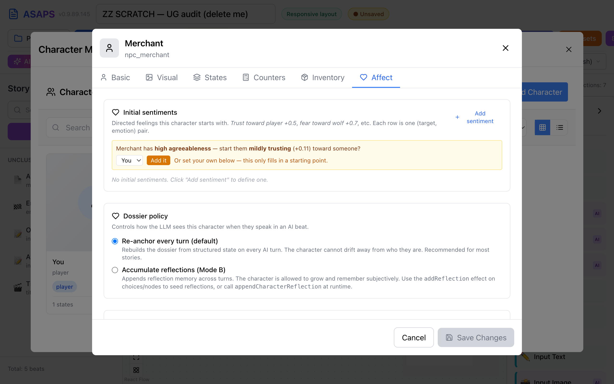
*The suggestion reads the character's agreeableness and proposes an opening trust. It is offered, never applied — an opening stance toward another character is an authorial decision.*

Three things worth knowing about it:

- **It's grounded, not invented.** Agreeableness is the trait whose research literature puts *trust* squarely inside it, so it's the honest source for this particular quantity. Extraversion is deliberately left out — a shy character can be perfectly trusting.
- **It's modest on purpose.** The suggestion is capped well short of the extremes (roughly ±0.35), because an opening disposition should leave your story room to earn the rest.
- **It never appears for a character with no personality.** A **Blank Character** has no traits, so there's nothing to derive from and nothing is proposed. The affect opt-out survives this feature intact. The prompt also withdraws once you've authored trust toward that target yourself.

If you've bound a meter to that sentiment (see [Counters that read affect](#counter-binding)), an opening stance is what stops every bar in your story from starting pinned at dead centre.

#### Dossier policy — how the LLM sees this character

The dossier is the structured summary of the character that ASAPS injects into AI beats (AI Conversation, AI Dialog Tree, etc.) so the LLM knows who's speaking. The dossier policy radio controls how that summary is built each turn:

- **Re-anchor every turn (default — Mode A)** — Rebuilds the dossier from the character's structured state on every AI turn. The character cannot drift away from who they are. Recommended for almost every story.
- **Accumulate reflections (Mode B)** — Appends short author-or-runtime-seeded *reflections* across turns. The character is allowed to grow and remember subjectively. Choose this for protagonists or NPCs who should change over the session.

Mode B is paired with the new **`addReflection`** effect (see [Choice Effects](#choice-effects-affect) below) — a short narrative note in the character's voice plus a salience score in [0, 1]. Reflections survive longest when salience is high and oldest-low-salience entries are evicted first when the per-character cap fills up. Mode A characters silently ignore reflections in their dossier.

#### Goals — authored objectives with auto-fired emotions

Goals are simple authored objectives: an id, a name, an optional description, and an optional priority slider. The runtime tracks each goal's status (`open`, `met`, `failed`, `abandoned`); when a goal flips to `met` it auto-fires pride and joy on its owner, and when it flips to `failed` it auto-fires shame and sadness — both scaled by priority. The mechanism follows the GAMYGDALA model from the affective-computing literature.

You change a goal's status from a player choice via the new **`setGoalStatus`** effect, which exposes a target dropdown (the character whose goal it is), a `goal-id` field, and a status dropdown (`met`/`failed`/`abandoned`/`open`). For quiet goal updates you don't want to fire emotions on, the runtime supports a `suppressEmotion` flag on the effect.

> **Mode A vs Mode B for goals.** Mode A characters can leave Goals empty — they don't need them. Mode B / agentic stories generally want at least one or two goals to drive emergent behavior; goals are what give a Mode B character forward motion between scenes.

#### Variants — alternate persona overlays for one character

A variant is an alternate persona slice that shares the same character id. Use them when you want:

- *"Play as introvert Alex / extrovert Alex"* (player-picked persona)
- *"Play as a man / a woman / non-binary"* (gender-flexible protagonist)
- A single NPC who comes in two flavors and the runtime picks one

Click **+ Add variant** in the Variants section. The first time you add one, ASAPS migrates the base character's personality, mood, sentiments, and dossier policy onto the new variant so you don't lose work — and the parent's Personality / Initial mood / Initial sentiments / Dossier policy cards collapse into a banner reading *"This character has N variants. Personality, initial mood, and sentiments are authored per variant below…"* Subsequent variants clone from the first variant so you can copy-and-tweak.

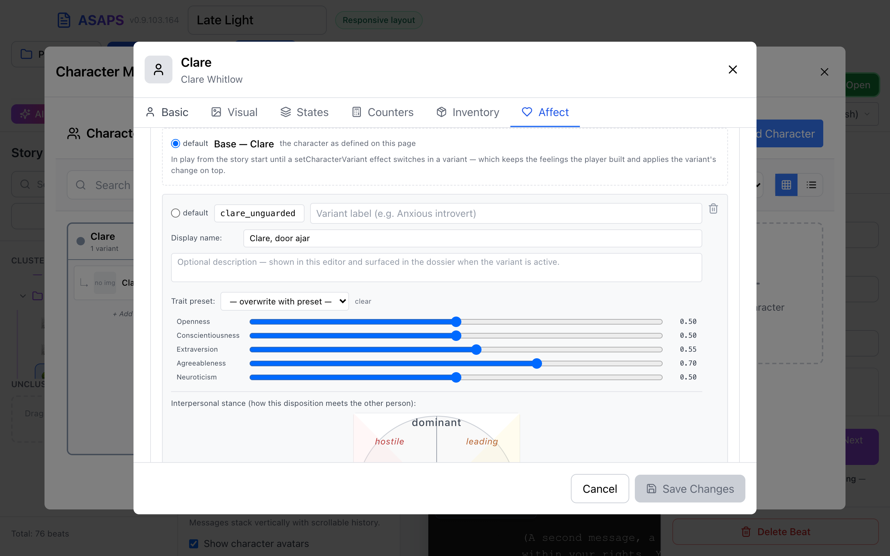
*Once a character has variants, each variant card carries its own complete persona slice — Big Five sliders, archetype shortcut, MoodPad, sentiments, portrait override, displayName override. The "default" radio picks which variant auto-applies at story start. (This overview screenshot predates the interpersonal stance pad and the "At story start" policy dropdown — both are shown in the next figure and described below.)*

Each variant card carries:

- A **default** radio (one variant per character can be marked default — that one auto-applies at story start when no `setCharacterVariant` effect has fired yet).
- A **variant id** (stable identifier used by the `setCharacterVariant` effect and `characterVariant` condition).
- A **variant label** (e.g. *Anxious introvert*) and an optional **display name** override (the user-facing name when this variant is active).
- An optional description, surfaced in the dossier when the variant is active.
- A **trait preset** dropdown — the same ten archetypes as the base, but applied to *this variant only*. Variant traits can be cleared to fall back to base character traits.
- An **interpersonal stance pad** — the same Leary's Rose as the base Personality card, here answering *"how does this disposition meet the other person?"* Dragging the dot writes the variant's stance **and** re-derives its extraversion and agreeableness from the base character's traits plus the stance — so a shy character turned hostile stays recognizably shy. When the variant's hand-tuned trait sliders drift away from the authored stance, a small hollow *traits* marker appears on the pad so the drift is visible instead of silent.

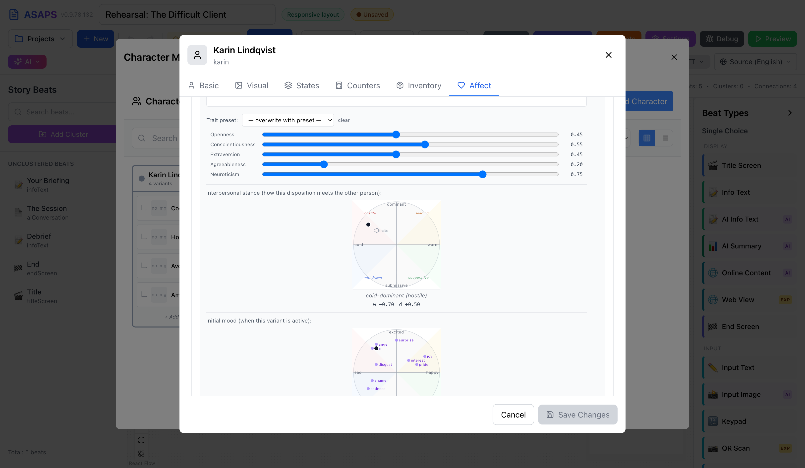
*A variant's stance pad in action: the hostile disposition sits cold-dominant on the rose (readout "cold-dominant (hostile)", w −0.70 · d +0.50), the hollow "traits" marker shows where the current sliders sit, and the agreeableness slider above reflects the stance-derived value. The variant's MoodPad follows below — two circumplexes, one for how the character meets people, one for how they feel.*
- A 2D MoodPad and sentiment list specific to this variant.
- A **portrait override** (optional) — leave empty to inherit the base portrait. Variants share the base character's sprite sheet, states, and animations; only the affect/persona slice and the portrait swap.

**Choosing the variant at story start.** Once a character has two or more variants, an **"At story start"** dropdown appears at the top of the Variants section with two policies:

- **Use default variant** — the variant marked with the *default* radio auto-applies, same as before.
- **Pick randomly each playthrough** — every story start (and every preview restart) draws one of the character's variants at random. This is the "I never know how the client will show up today" switch: the same rehearsal scenario plays differently every session. With this policy active the *default* radio is ignored — a small note in the editor reminds you.

Either way, an authored **`setCharacterVariant`** effect still overrides the policy — so an instructor can pin a specific disposition for a controlled session ("today we practice hostile") while self-directed practice stays unpredictable.

To switch variants at runtime, drop a **`setCharacterVariant`** effect on a player choice (target = the character, value = the variant id). To branch on the active variant, drop a Condition Check beat and pick **Active variant** from the **Character affect** group in the Condition Type dropdown — the editor will then ask you for the character and the variant id to compare against (cascading from the character's authored variants, with a free-text fallback when none have been authored yet). The runtime evaluates this branch the same way it evaluates "player has lantern" — it just checks a different slice of state.

In the Character Manager the grid changes shape for characters with variants: instead of a single card you get a **grouped card** with a colored border (the parent's color), a parent header showing the display name and variant count, and one inner sub-card per variant.

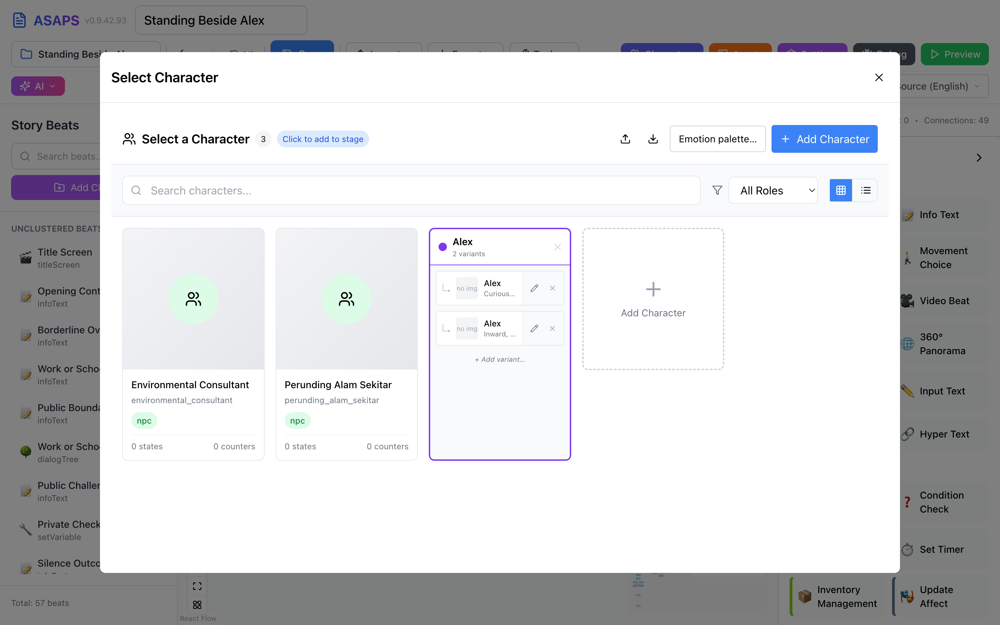
*A character with two variants in the Character Manager. The colored border is the parent's color; clicking the parent header opens the editor on the base character; clicking a variant sub-card opens the editor focused on that variant (Affect tab pre-selected, scrolled to and briefly outlined). The pencil and X buttons on each sub-card edit and remove that variant.*

#### Mood HUD — show a character's mood on stage

Each character can carry an optional **Mood HUD** — a small 2D mood-pad card that mounts on the running stage and shows the character's mood updating in real time during preview and exported web play.

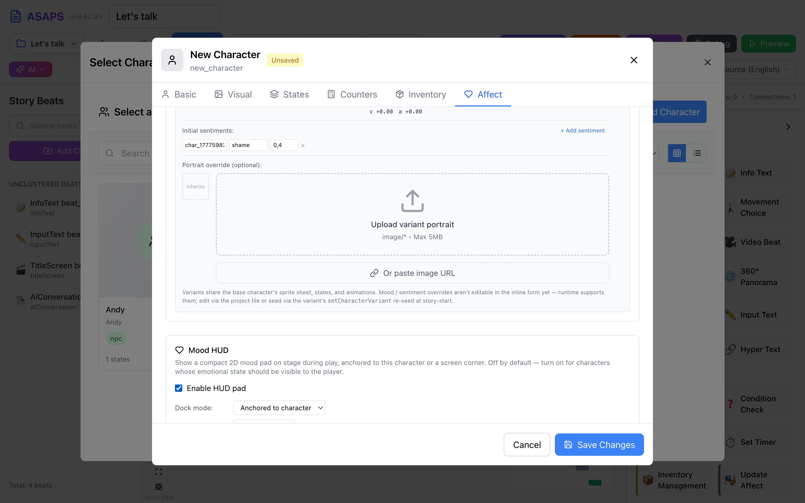
*The Mood HUD card. Off by default — turn it on for characters whose emotional state should be visible to the player.*

In the **Mood HUD** card on the Affect tab:

- **Enable HUD pad** — master on/off switch. Off by default.
- **Dock mode** — *Anchored to character* (HUD floats next to the character's sprite on stage) or *Fixed to screen corner* (HUD pinned to one of the four screen corners).
- **Anchor / Corner** — eight character-relative positions (top, bottom, left, right, top-left, top-right, bottom-left, bottom-right) when docked to a character; four screen corners when fixed.
- **Size (px)** — between 48 and 320; defaults to ~140.
- **Opacity** — 0.2 to 1.0.
- **Show emotion-palette markers** — overlays the project's emotion palette on the disc.
- **Show axis labels** — the *sad / happy / calm / excited* corner labels.
- **Show qualitative mood label** — a one-line plain-English description below the disc (e.g. *"sad, alert"*).

If a character has variants, the HUD hides until the player picks a variant — so you don't end up showing a HUD for a character who hasn't been instantiated yet.

<a id="emotion-palette"></a>
### Emotion Palette — Names, Mood-Axis Weights, Decay Rates

Mood and emotions are project-wide. ASAPS ships with the **Ekman 6** (joy, anger, fear, sadness, surprise, disgust) plus *pride*, *shame*, and *interest* — nine emotions out of the box, each tuned to a position in mood-space and a decay rate.

To edit the palette, click **Emotion palette…** in the Character Manager toolbar (next to **Add Character**).

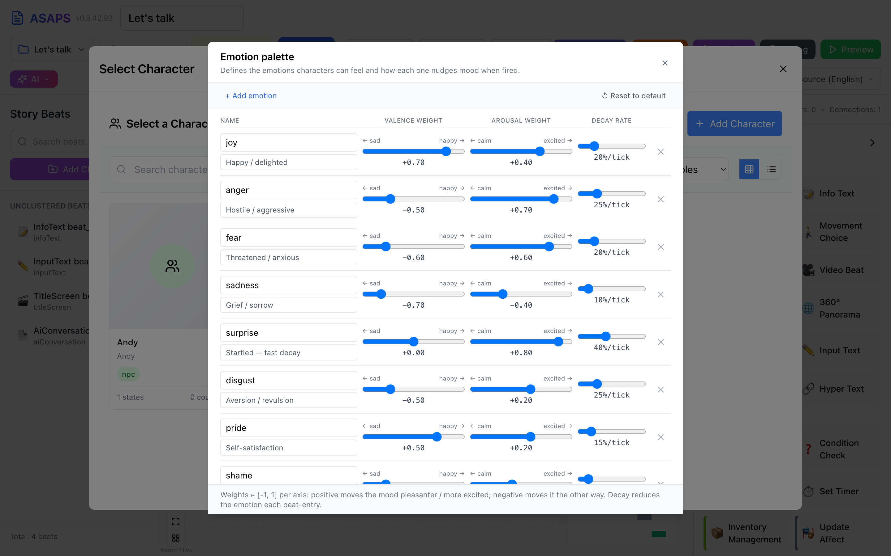
*The Emotion Palette editor. Each row is one emotion: name, valence weight, arousal weight, and decay rate per beat-entry tick.*

For each emotion you can set:

- **Name** — what the runtime resolves against (case-sensitive).
- **Description** (optional) — purely for the author's reference.
- **Valence weight** in `[-1, 1]` — how strongly firing this emotion nudges the character's mood toward happy / sad.
- **Arousal weight** in `[-1, 1]` — how strongly it nudges toward excited / calm.
- **Decay rate** in `[0, 1]` — what fraction of the emotion's intensity bleeds off each beat-entry tick.

Click **Add emotion** to invent a new one, or **Reset to default** to wipe the palette back to the Ekman 6 + pride/shame/interest. The palette persists with the project.

When you fire an emotion via the `fireEmotion` effect or an Update Affect beat, the runtime auto-nudges the target's mood by the emotion's valence and arousal weights, scaled by the firing intensity and the target's neuroticism trait. That's why the palette weights matter: they wire the discrete *"the character felt fear"* event into the continuous mood space the HUD displays.

<a id="choice-effects-affect"></a>
### Affect-Aware Choice Effects

Anywhere ASAPS lets you attach **Effects** to a player choice — Dialog Tree choices, Movement Choice destinations, dialog node entries — the dropdown now includes seven affect-aware effect types alongside the classic counter / variable / inventory ones:

| Effect | What it does | Extra fields |
|--------|--------------|--------------|
| **Nudge Mood** | Shifts the target's mood by a (valence, arousal) delta. Runtime clamps to `[-1, 1]`. | ±valence, ±arousal |
| **Add Sentiment** | Adds or strengthens a directed feeling (e.g. *trust toward player +0.3*). | sentimentTarget, sentimentEmotion, strengthDelta |
| **Fire Emotion** | Bumps an emotion intensity; the runtime auto-nudges mood per palette weights. | emotion name, ±intensity |
| **Add Reflection** | Appends a short narrative note (text + salience) to a Mode B character's reflection memory. Mode A characters ignore it. | reflectionText, reflectionSalience |
| **Set Goal Status** | Flips a goal to `met` / `failed` / `abandoned` / `open`. `met` and `failed` auto-fire pride/joy and shame/sadness scaled by priority. | goalId, goalStatus |
| **Set Character Variant** | Switches which variant of a character is active. Empty value clears the active variant. | variantId |
| **Bookmark Affect State** | Snapshots the current mood / emotion / sentiment state under an author-named handle. Conditions can later reference the bookmark via the **Compared to: bookmark** picker to ask "has trust grown *since the reunion scene*?". See [Baseline-relative comparisons](#baseline-relative-comparisons). | bookmarkName, scope (`all characters` / `target only`) |

The **target** field for all of these effect types is a **dropdown of the project's characters** (display name shown, stable id stored under the hood) plus a sentinel **Player** entry pinned at the top. No more typing `char_alex` by hand and hoping you spelled it right. If the editor isn't given a project character roster (some compact sub-editors don't have one in scope), the field falls back to a free-text input. The one quirk: when *Bookmark Affect State* is set to scope `all characters`, the target field hides itself entirely — the snapshot covers everyone, so a target would only confuse the read.

> **Where to find Effects.** Effects sit on Dialog Tree choices, Dialog Tree nodes, Multi Choice and Movement Choice destinations, Pick Prop choices, and Panorama / AR hotspots. Open the **Effects** section on any of these and click **+ Add Effect**. On some beat types — Multi Choice, Movement Choice, and hotspots among them — the Effects block only appears once you click **Show Advanced Options** near the bottom of the Inspector. If you're looking for Effects and can't see them, that's usually why.

> **Effects are also how you move a bound meter.** If a counter has been wired to read a character's feelings ([Counters that read affect](#counter-binding)), you don't write to the counter — you use **Add Sentiment**, **Fire Emotion** or **Nudge Mood** here, and the meter reports the result. This is the whole idea: the choice changes how someone *feels*, and the display follows.

<a id="effects-easier-authoring"></a>
### Easier authoring: labels, palette suggestions, templates, and a live summary

Affect effects are powerful — a single choice can stack five, six, or nine rows of mood, emotion, sentiment, and reflection changes — but a wall of anonymous numeric inputs is hard to read at a glance, and the right shape of a "supportive" or "dismissive" choice is something authors tend to learn the hard way. The choice editor now does four things to take that pain off your back.

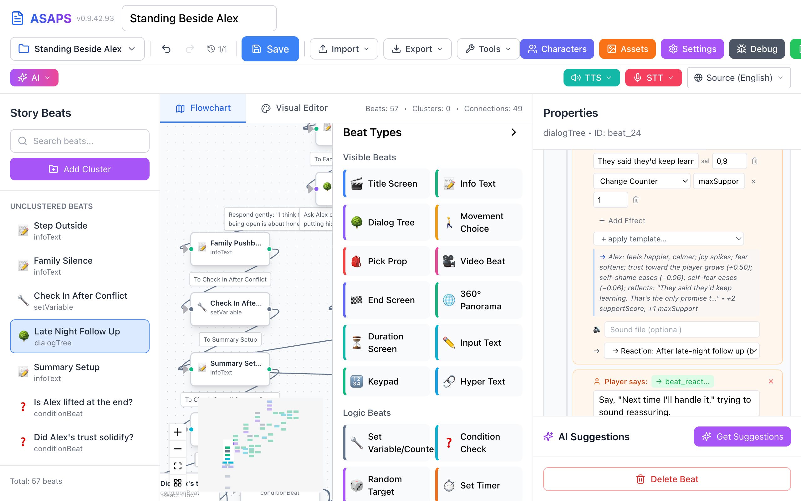
*A Late Night Follow Up choice in the **Standing Beside Alex** sample project. The Effects section stacks several affect rows; the small italic blue-tinted block at the bottom (`→ Alex: feels happier, calmer; joy spikes; …`) is the live "what does this choice do?" summary, updating every time you nudge a value.*

#### A walk-through

1. **Open a Dialog Tree beat** in the Flowchart and pick a player choice — for example, the third option ("You don't have to teach me perfectly, but I want to keep learning what helps you.") on the *Late Night Follow Up* beat in the Standing Beside Alex sample. The Inspector on the right shows the choice's text, its target, and an **Effects:** section directly below the text.
2. **If the choice is empty, pick a starting shape.** For a brand-new choice with no effects yet, you'll see two side-by-side controls: **+ Add Effect** (the manual route) and **+ apply template…** (the preset route). Pick a template from the dropdown — say, *Empathetic — full support* — and the editor appends a coherent multi-row bundle of mood, emotion, sentiment, and counter changes ready for fine-tuning.
3. **Tweak any value** — drop the trust delta from `0.4` to `0.3`, add an extra reflection — and watch the live summary at the bottom of the effects list update on every keystroke. If the summary still sounds right, the numbers are right.
4. **Use the emotion combobox** when adding `Fire Emotion` or `Add Sentiment` rows. Click into the **emotion** field and the dropdown surfaces every emotion from the project's palette (joy, fear, trust, gratitude, …) — you don't have to remember whether you spelled it `mistrust` or `anti-trust`. Free text still works for custom story emotions.

#### 1. Inline labels on the numeric inputs

Numbers without labels are riddles. Every affect row now wears a small label in front of each delta input, plus a hover tooltip explaining direction:

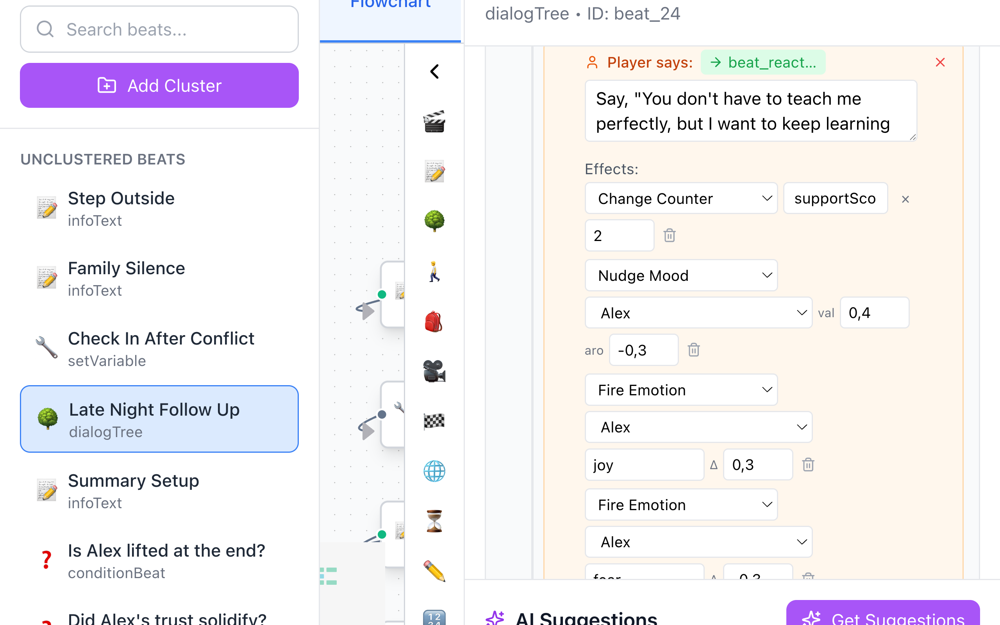
*Nudge Mood rows show **val** (valence — sad ↔ happy) and **aro** (arousal — calm ↔ excited). Fire Emotion rows show **Δ** (intensity delta).*

| Row type | Inline label(s) | What it means |
|----------|-----------------|---------------|
| Nudge Mood | **val**, **aro** | Valence delta (positive = happier, negative = sadder) and arousal delta (positive = more activated, negative = calmer). Runtime clamps to `[-1, 1]`. |
| Fire Emotion | **Δ** | Intensity delta. Positive bumps the emotion; mood is auto-nudged via the palette's authored weights. |
| Add Sentiment | **→**, **Δ** | The arrow precedes the *toward* (target) field — "this character feels *something* toward *that*". The Δ marks the strength delta. Trust and mistrust live on the same axis with opposite signs. |
| Add Reflection | **sal** | Salience in `[0, 1]`. Reserve `> 0.7` for moments the character will never forget — high-salience entries survive eviction longest when the per-character reflection cap (32 entries) fills up. |

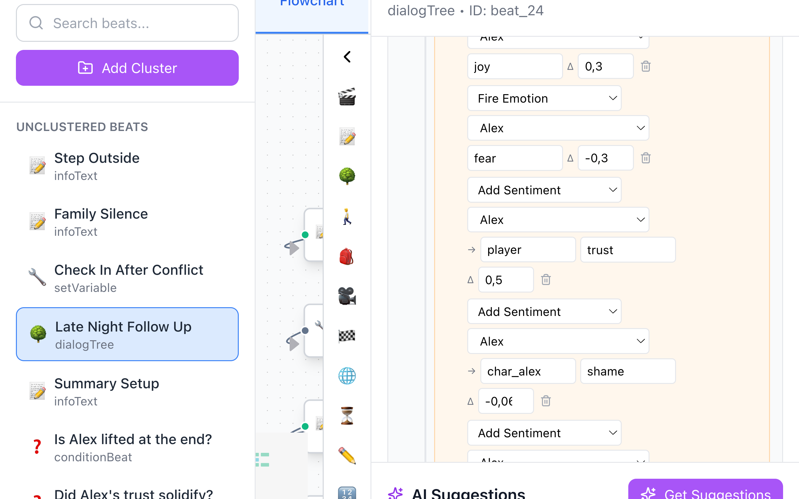
*Two Add Sentiment rows from the same choice: `→ player trust Δ +0.5` (Alex's trust toward the player grows) and `→ char_alex shame Δ -0.06` (Alex's self-shame eases — pointing the sentiment at the holding character is the convention for self-directed feelings).*

Hover any label or input to see the full tooltip. The conventions documented in the tooltips match the runtime — there's only one source of truth.

#### 2. Emotion-name auto-complete from the project palette

The **emotion** field on `Fire Emotion` rows, and both the **toward** and **emotion** fields on `Add Sentiment` rows, are now combobox inputs backed by the project's [Emotion Palette](#emotion-palette). Click the field and pick from the suggestions, or keep typing — free text still works for custom story emotions that aren't in the palette. The **toward** field on sentiments additionally suggests every defined character plus the `player` sentinel, so you don't have to remember a character id by hand.

This is purely about discoverability — there's no validation barrier. The runtime accepts whatever you type. The combobox just keeps you from misremembering whether the palette uses `joy` or `happiness`, or whether you wrote `mistrust` or `anti-trust` last time.

#### 3. The effect-templates library

Eight intent-shaped presets cover the common shapes of player intent in support-and-care narrative — heavily inspired by, but not specific to, the Standing Beside Alex sample.

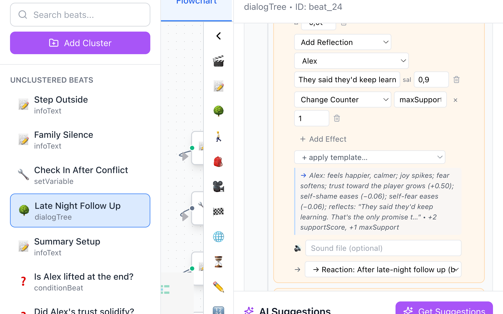
*Bottom of a populated effects list. **+ Add Effect** appends a single empty row; **+ apply template…** appends a coherent bundle of 5–9 rows in one click. The italic blue-tinted block underneath is the live summary, reading the cumulative effect back to you in plain language.*

| Template | Player intent it shapes | Roughly what it bundles |
|----------|------------------------|-------------------------|
| **Empathetic — full support** | Full support landed exactly the way the character needed. | Mood lifts, joy fires, fear drops, trust grows, self-shame eases. |
| **Empathetic — partial / well-meaning** | Kind intent that doesn't quite land. | Smaller mood lift, gentle joy, gratitude grows, trust doesn't fully form. |
| **Pushy / dismissive** | Player overrides what the character needs. | Mood drops, fear and shame spike, trust erodes, self-doubt deepens. |
| **Silent / felt-abandoned** | Player doesn't step up; the absence registers as harm. | Mood drops, sadness fires, trust erodes. |
| **Boundary respecting** | Player names the overstep without making it about themselves. | Mood lifts, pride fires, fear softens, deep trust forms. |
| **Validating / "I see you"** | Player witnesses the feeling without trying to fix it. | Quiet positive shift, gentle joy, gratitude grows. |
| **Defensive overreach** | Well-meaning but speaks-for the character. | Ambivalent — fear ticks up, mood lifts slightly, trust mixed. |
| **Quiet recovery** | Small, non-demanding presence. | Mood eases toward neutral, fear softens, no sentiment shift. |

Picking a template **appends** to the existing rows — it never overwrites — so you can stack a template on top of a few hand-crafted effects, or layer two templates if a choice has two distinct shapes (rarely a good idea; usually the second template is a sign the first wasn't quite right).

A few things templates do quietly so you don't have to:

- **They infer the active character target** from any existing affect effect in the choice's list. Add a `Nudge Mood` row pointed at *Alex* first, then apply a template, and every row the template emits will target Alex too. If there's no existing affect row to read from, the template falls back to the first non-player character in the project, then to `player`.
- **They're project-aware about counters.** The bundles emit `incrementCounter` rows for `supportScore`, `maxSupport`, and `failedSupport` — but only when those counters actually exist in your project. A story without a `supportScore` counter won't have stray support-counter rows seeded.
- **They're starting points, not contracts.** Tweak the deltas, swap an emotion, drop the reflection — the templates exist to spare you the cold-start, not to lock you in.

#### 4. The live "what does this choice do?" summary

Below the effect rows there's now a small italic blue-tinted block prefixed with `→` that synthesises the cumulative effect in plain language. It reads every row, aggregates them by character, and tells you what the choice will *feel like* when the player picks it. It updates on every value change.

Two real examples from the Standing Beside Alex sample:

> → *Alex: feels happier, calmer; joy spikes; fear softens; trust toward the player grows (+0.50); self-shame eases (−0.06); self-fear eases (−0.06); reflects: "They said they'd keep learning. That's the only promise t…" • +2 supportScore, +1 maxSupport*

> → *Alex: feels sadder, calmer; sadness spikes; trust toward the player eases (−0.20); self-shame grows (+0.05); self-fear grows (+0.04); reflects: "They said they didn't know what to do. So we both don't k…" • -1 supportScore, +1 failedSupport*

How it reads things:

- **Multiple `nudgeMood` rows** are aggregated into a single net qualitative descriptor — *feels happier* / *feels sadder* / *more activated* / *calmer* — dropping deltas below ±0.05 as noise.
- **Fire Emotion rows** read as *<name> spikes* (positive) or *<name> softens* (negative), with a magnitude qualifier — *sharply* when |Δ| ≥ 0.4, *a little* when |Δ| < 0.2, and unqualified in between.
- **Sentiments toward someone else** read as *<emotion> toward <character> grows / eases (±0.NN)*; **self-directed sentiments** (where the sentiment target is the holder character) read as *self-<emotion>*, matching the affect panel and dossier conventions.
- **Goal-status changes** read as *goal '<id>' marked <status>*. **Variant changes** read as *switches to variant '<id>'*. **Reflections** are quoted with a soft truncation around 60 characters.
- **Counter, variable, and inventory effects** roll into a separate compact tally clause after the bullet (`+2 supportScore, +1 maxSupport`).
- **Bookmark Affect State** rows show up in the same tally clause as `+ bookmark "reunion-scene"` (or `+ bookmark "alex-arc" (Alex only)` when scoped to a single character) — so the summary makes it obvious when a choice is recording a baseline future conditions can compare against.
- **The block hides itself entirely** when there's nothing meaningful to say — no clutter on choices that don't move affect.

If the summary doesn't read the way you intended the choice to feel, the numbers are off — that's the test. Tweak until the prose matches your intent.

> **Why this exists.** Authoring affect-rich narrative is hard because the consequences of a single choice ripple across many small dimensions, and "did I get it right?" is hard to verify without playing the whole story. The summary closes that loop at edit time. It's not a substitute for testing the runtime — but it catches the easy mistakes (a sign flip, a forgotten row) before they reach the player.

---

## Assets

Assets are your media files—the images, sounds, and videos that bring your experience to life.

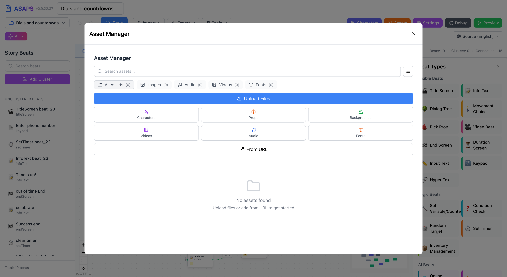
*The Asset Manager panel*

### Managing Assets

1. Click **Assets** in the header
2. The Asset Manager opens with filter tabs across the top:
   - **All Assets** — every asset in the project
   - **Images** — backgrounds, characters, props, UI
   - **Audio** — music, sound effects, voice-over
   - **Videos** — cutscenes, animations
   - **Fonts** — custom typography
3. Below the tabs, an **Upload Files** button and a row of category shortcuts (Characters, Props, Backgrounds, Videos, Audio, Fonts) make it easy to drop files directly into the right bucket. **From URL** lets you reference web-hosted assets.

### Uploading Assets

- **Drag and drop** files directly into the panel
- **Click Upload** and select files
- **Add by URL** for web-hosted files

### Supported Formats

| Type | Formats |
|------|---------|
| Images | PNG, JPG, GIF, SVG, WebP |
| Audio | MP3, OGG, WAV, M4A |
| Video | MP4, WebM, MOV |
| Fonts | TTF, OTF, WOFF, WOFF2 |

### Asset Organization Tips

- Use clear, descriptive names ("forest_background.png" not "img_027.png")
- Organize by purpose: backgrounds, characters, props, UI elements
- Delete unused assets to keep projects lean
- Keep source files backed up outside ASAPS

<a id="asset-variants"></a>
### Image Asset Variants — Orientation and Device Class (v0.9.59)

Image assets can carry **variants** — alternate images the runtime swaps in when the player's viewport matches certain constraints. This is the iOS-style asset-catalog mechanic: you ship one "base" image and pair it with portrait-only, phone-only, or "phone + portrait" overrides for situations where the base composition doesn't read well.

To author variants:

1. Open the **Asset Manager** (header) and select an image asset. The details panel on the right opens.
2. Scroll down to the **Variants** section.
3. Click **+ Add** to pair another image as a variant. The dropdown lists every other image in your project; the variant cannot point at itself.
4. For each variant row, optionally set:
   - **Orientation** — *Any orient.* (default), *Portrait*, or *Landscape*.
   - **Device class** — *Any device* (default), *Phone*, *Tablet*, or *Desktop*.
5. Add as many variants as you need; remove one with the trash icon.

At render time the runtime picks the **most-specific variant whose constraints all match** the current container (iOS asset-catalog scoring — exact orientation +2 points, exact device class +1 point; contradictions disqualify). If no variant matches, the runtime falls back to the base image. This is currently used by `SpatialFlowView` for spatial backgrounds, which read container dimensions at render time and resolve the best-matching variant URL.

Typical use cases:

- A landscape composition that needs to crop differently in portrait: ship the landscape base, add a portrait-specific variant that recomposes the framing.
- A high-detail background that's wasteful on phone: ship the high-res base, add a phone variant pointing at a lighter image.
- Device-class tone shifts (a denser composition for desktop's bigger canvas vs. a simpler one for phone).

> **Variant ≠ thumbnail.** ASAPS doesn't resize variants for you — each variant points at a separate, fully-authored image asset. If the variant images don't exist yet, upload them first; the dropdown only lists images already in the project.

---

# Part 5: Visual Design

Your story shouldn't just read well—it should look amazing. The Visual Editor is your canvas.

## Accessing the Visual Editor

1. Select a beat in the Flowchart
2. Click the **Visual Editor** tab

You'll see a stage representing what interactors see—default size is 1024×768 pixels (customizable in Settings).

<a id="responsive-vs-fixed-layout"></a>
## Responsive vs Fixed Layout (v0.9.59)

Every project carries a **layout mode** — either *Responsive* or *Fixed canvas* — that decides how the Visual Editor and the runtime treat element positions. The mode is project-level (not per-beat), and the choice colours how the editor looks and what controls show up.

> **Heads-up:** Responsive layout is shipped but still **work-in-progress**. The contracts (slot intents, spatial fits, anchor pins) are stable enough to author against, and existing projects keep rendering through the legacy absolute path with no silent breaking changes — but expect the responsive surface to keep evolving over the next few releases. If you're writing a story that *must* ship soon and pixel-perfect, picking Fixed canvas is a safe choice.

### What the two modes mean

| Mode | What it does | When to pick it |
|------|--------------|-----------------|
| **Responsive layout** (green pill in header) | Beats reflow through ASAPS's slot / spatial system. The runtime adapts to any viewport — desktop, tablet, phone, portrait or landscape — by re-resolving positions at render time. Authoring is *intent-annotated*: you say "this text wants to sit in the bottom-center action slot", not "this text is at x=512, y=720". | New projects, anything you plan to ship to phones, anything you want to preview across devices. The default for new projects since v0.9.59. |
| **Fixed canvas** (amber pill in header) | Every element carries explicit pixel positions on a 1024×768 (or your custom) stage. What you place is what the runtime renders, scaled to fit the player's viewport. The historical ASAPS behaviour. | Pixel-precise visual-novel layouts, projects authored before v0.9.58 that you don't want to migrate, anything where you need full control over compositional placement. |

### Picking the mode at project creation

The **New Project** dialog (📁 Projects → *+ New Project*, or the **Empty** card on the Project Browser) has two extra rows under the description field:

- **Layout Mode** — two side-by-side cards, in plain author terms (reworded in v0.9.72):
  - **📱 Responsive** — *"Text, buttons, and images flow and adapt to any screen — phone, tablet, or desktop. You guide the layout; the player's device decides the exact placement."* Best for stories played on many devices. The default.
  - **🎯 Static (fixed canvas)** — *"You place every element at exact pixel positions on a fixed stage. What you see in the editor is exactly what the player sees, scaled to fit their screen."* Best for precise, hand-crafted compositions.

  The active card shows a small **✓ selected** marker, and a footnote reminds you that you can switch later in **Settings → Project** — a migrator converts existing beats between the two modes, so this isn't a decision you're locked into.
- **Orientation** — appears only when Layout Mode is *Responsive*. Three options: *Flexible* (adapts to device rotation, default), *Landscape* (locks to landscape — player shows a "rotate your device" overlay otherwise), *Portrait* (locks to portrait the same way). When Layout Mode is *Static (fixed canvas)* the Orientation row collapses, because fixed-canvas projects always render at their authored aspect ratio.

You can change either setting later from **Settings → Project**.

### Switching mode on an existing project

Click the **layout-mode pill** in the header (green *Responsive layout* or amber *Fixed canvas*) — or open **Settings → Project → Layout Mode** — and pick the other mode. ASAPS runs a one-shot **migrator** with a preview:

- **Fixed → Responsive** clears baked pixel positions and infers slot intent from them, so beats fall back to schema-driven slot/spatial layout. Best for projects that have only ever used the default layouts.
- **Responsive → Fixed** bakes the current schema-default positions into explicit pixel `locations[]` entries on each beat, so you can hand-tune them as pixel coordinates.

The migrator preview lists the per-beat changes so you can see what will happen before committing. Either direction is destructive in the sense that the previous shape isn't preserved — back up (or commit to git) before switching if you might want to revert.

### Which beats render through slot mode?

The slot system covers most of the visible beat catalogue: Title Screen, Info Text, AI Info Text, AI Summary, Online Content, **Web View**, End Screen, Input Text, **Input Image**, Keypad, **QR Scan**, **AR Scene**, Multi Choice, Hyper Text, Duration Screen, AI Duration Screen, Video Beat, and AI Conversation. AI Dialog Tree carries the slot scaffolding too. Self-contained slot **roles** — `camera` (QR Scan), `webview` (Web View), `ar` (AR Scene), and `imageInput` (Input Image) — mount their elements via `SlotFlowView`. If you're authoring in Responsive mode, these beats reflow cleanly across desktop, tablet, and phone viewports out of the box; use the Preview Window's Viewport switcher (Fit / Desktop / Tablet / Phone) to sanity-check.

### Authoring affordances that change with the mode

The Visual Editor adapts to the active mode:

- **Mode-consistent options panel (v0.9.72).** The Visual Editor's properties panel now shows only the controls that belong to your project's mode. In a **Static (fixed canvas)** project you get the baked elements list — every element with pixel positions, z-order, lock, and visibility controls — and the slot-intent rows ("On stage (from slots)" with per-slot anchors/pins) are gone, since they only affect the responsive renderer. In a **Responsive** project you get the slot controls and viewport preview. After switching modes via the migrator, the editor immediately reflects the new mode.
- **Add Character / Add Prop / Add Text** buttons (in the Elements panel on the right) are **only available in Fixed canvas mode**. In Responsive mode these would create dead pixel positions the responsive renderer ignores, so they're hidden. **Add Hotspot** stays available everywhere because hotspots are normalized 0–1 overlays on the spatial image rect — fundamentally responsive.
- **Background fit** (Visual Editor left sidebar, just under the background-image picker) lets you toggle *Contain* (show the whole image) vs *Cover* (fill the stage, crop edges) per beat in spatial mode. Defaults to *Contain*. This moved out of the Inspector in v0.9.59 to sit closer to where authors are looking.
- **Path-keyframe animations** (the absolute-mode animation editor) keep working on beats with baked pixel positions even in responsive projects, but the Animations panel shows a small amber **"Legacy path animation"** banner reminding you that slot-anchored elements use a different animation editor.
- **Speaker label preview** — when a slot-mode dialog beat has a speaker assigned, the VE preview now shows the speaker label exactly where the runtime would render it, matching `resolveSpeakerForSlot`.

### Per-button pins (action slot)

In responsive mode, the slot-intent toolbar (top of the Visual Editor preview area) has a **Pin** row that lets you lift individual stage buttons out of the shared action row and pin them to any stage corner. One control per visible button — *Continue*, *Restart*, *Credits*. The six preset glyphs are:

| Glyph | Position |
|-------|----------|
| `—` | In shared row (default) |
| `⌜` | Top-left |
| `⌝` | Top-right |
| `⌞` | Bottom-left |
| `⎵` | Bottom-center |
| `⌟` | Bottom-right |

Once a button is pinned (anything other than *In row*), a per-button **gap** slider appears next to its preset row so you can tune the offset from the stage edge.

## Setting the Scene

### Background Images

Every beat can have its own background:

1. In Visual Properties (left panel), click **Choose Background**
2. Select from your assets or upload new
3. The image fills the stage

**Pro Tip:** Prepare backgrounds at your stage size for best quality.

### Positioning Characters

1. Click **Add Character** in the toolbar
2. Select a character from your cast
3. Click on stage to place them
4. Drag to reposition
5. Use corner handles to resize

Each character placement includes:
- Position (x, y coordinates)
- Size (width, height)
- Which appearance to show
- Layer order (z-index)

### Adding Text Elements

1. Click **Add Text** in the toolbar
2. Click on stage to place
3. Configure in the Inspector:
   - Content
   - Font, size, color
   - Text box styling
   - Position and size

### Hotspots: Invisible Click Zones

Create clickable areas that don't have visible content:

1. Click **Add Hotspot**
2. Draw a rectangle on stage
3. Connect to choices or actions

Useful for "click on the suspicious painting" interactions.

**Orientation-aware spatial hotspots (v0.9.59).** Spatial hotspots (on Movement Choice, Pick Prop, and similar beats in responsive mode) can carry an optional **portrait variant** — a second rect (`portrait: { x, y, width, height }`) that the runtime uses when the player is on a portrait-oriented stage. The landscape rect is the canonical position; the portrait override is *additive*. To author both variants from the Visual Editor, switch the preview viewport (top of the slot/spatial preview) between landscape and portrait presets — Phone portrait, Tablet portrait, and similar presets put the editor in portrait mode and drag-edits write into `hotspot.portrait` (creating it on first edit, with the canonical rect as its template so an accidental tap doesn't blank the override). Landscape edits write the canonical `x/y/width/height` as before. If a beat has only landscape coordinates, the runtime falls back to them in portrait orientation too — overrides are opt-in per-hotspot.

## Layering & Z-Order

Elements stack on top of each other. A character should appear in front of the background, text in front of the character.

- Higher **z-index** = appears on top
- Use **Move Up/Down** buttons to reorder
- Or set z-index directly in the Inspector

## The Toolbar

| Tool | Function |
|------|----------|
| Select | Click and drag elements |
| Add Character | Place a character |
| Add Text | Place text element |
| Add Prop | Place item/object |
| Add Hotspot | Create click zone |
| Toggle Grid | Show alignment grid |
| Zoom | Adjust view scale (in / out / reset) |
| Reset Layout | Re-run the default layout for this beat, discarding any manual position edits |

When you select two or more elements at once, alignment and distribution buttons appear (align left/right/top/bottom/center, distribute horizontally/vertically); selecting two or more elements also reveals group/ungroup controls.

### Reset Layout

The **Reset Layout** button (grid icon, next to Reset Zoom) is the escape hatch when you've nudged elements around on a beat and want to return to the default schema-driven layout — or when a new ASAPS release ships improved default layouts and you want to opt this beat in without deleting and re-creating it.

Clicking it asks you to confirm (manual position edits on this beat will be lost), then re-runs ASAPS's default layout for the beat type. The reset goes into the undo history, so **Ctrl/Cmd+Z** restores the previous layout if you change your mind.

This is especially useful for AI-content beats — `onlineContent`, `aiInfoText`, `aiSummary`, and `titleScreen` — whose default layouts were re-calibrated in v0.9.55. Existing beats keep their saved positions; Reset Layout is how you adopt the new defaults on a beat-by-beat basis.

---

# Part 6: AI Features

ASAPS Modern includes AI assistance to help you build narrative systems. Think of it as a collaborative partner for content generation and design suggestions.

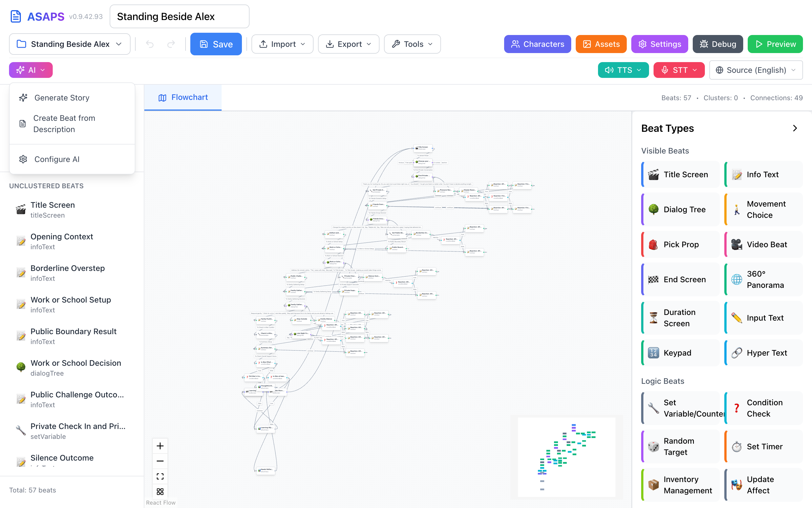
*The AI tools menu*

## Setting Up AI

1. Click **AI** in the header (bottom-left, purple gradient button)
2. Select **Configure AI** from the dropdown
3. Choose your provider:
   - **Claude** - Anthropic's AI (recommended; default model: **claude-sonnet-5**). The whole Claude 5 family works — type `claude-opus-5` or `claude-fable-5` into the Model field if you prefer; older Claude 4.x models keep working when named explicitly.
   - **OpenAI** - GPT models (default model: **gpt-5.6-sol**)
   - **Ollama** - Local models (free, no API key needed)
4. Enter your API key (for cloud providers)
5. Adjust settings (model, temperature, etc.)

### OpenAI Model Tiers (GPT-5.6 Family)

The OpenAI provider defaults to **gpt-5.6-sol**, the current flagship. The GPT-5.6 family has three tiers — type the one you want into the **Model** field:

| Model | Character |
|-------|-----------|
| **gpt-5.6-sol** | Flagship — strongest results, the default |
| **gpt-5.6-terra** | Balanced — roughly gpt-5.5-level performance at about half the price |
| **gpt-5.6-luna** | Fastest and cheapest |

Leave the field empty to use the default. Older models (gpt-5.5, GPT-4o) keep working if you name them explicitly.

### Which Model for Which Job?

One model setting serves every AI feature in ASAPS, but the features have
different demands — some run once while you wait, others run on every player
turn. Pick for the job you're doing most right now, and switch when the job
changes (the setting takes effect immediately; nothing needs restarting):

| What you're doing | What matters | Good fit |
|---|---|---|
| **Story generation, Ideator, Co-Designer** | One-shot draft quality — you wait once, then work with the result | Flagship: `claude-opus-5` / `gpt-5.6-sol`. Reasoning **Auto** or higher; **Pro** mode for hard material |
| **Runtime AI beats** (AI Conversation, AI Dialog Tree, AI Condition, AI Info Text) | Latency — a player is sitting in your story waiting for every turn | Fast tier: `claude-sonnet-5` / `gpt-5.6-terra` or `-luna`. Reasoning **None** or **Auto** |
| **Translation** | Instruction-following (markers, variables, JSON) plus literary register, across big batches | Flagship for the pass you ship; the balanced tier is fine for drafts |
| **Character helper, beat suggestions, transformations** | A structured proposal you review before accepting | The default tier is fine |

Two things worth knowing:

- **Runtime beats also run in exports.** Whatever model your exported story
  uses (embedded key or classroom relay), the latency argument goes double on
  a phone in the field — favor the fast tier for stories built around AI
  conversation.
- **Local models (Ollama) fit conversation best.** Small local models hold a
  persona in an AI Conversation surprisingly well, but they struggle with the
  strict JSON that story generation and translation require — expect retries
  or failures there. If your hardware runs a larger model, name it; otherwise
  use a cloud provider for generation and translation and go local for play.

### Reasoning Effort / Extended Thinking

The **Reasoning effort** dropdown (labelled *Extended thinking (Claude)* on Anthropic and *Reasoning effort (GPT-5)* on OpenAI) controls how much "thinking budget" the model is given before responding:

| Tier | Behaviour |
|------|-----------|
| **Auto (model default)** | Lets the model pick — usually the safe choice |
| **None** | No reasoning, fastest, cheapest |
| **Minimal** / **Low** / **Medium** / **High** | Progressively more thinking budget |
| **X-High** | Most thinking the OpenAI tiers expose; OpenAI providers cap here internally |
| **Max (Claude 4.5+ only)** | Anthropic-only top tier on Claude 4.5+ models. Selecting it on other providers silently falls back to X-High |

Claude extended thinking forces temperature to 1.0 when enabled and only works on the direct Anthropic endpoint — most Claude-compatible proxies do not support it. GPT-5.x reasoning uses `max_completion_tokens` and ignores temperature; the none–xhigh tiers apply to gpt-5.5 and the whole gpt-5.6 family (Sol/Terra/Luna), and `gpt-5.5` defaults to `none` when no tier is selected.

### Reasoning Mode: Standard vs Pro (OpenAI, GPT-5.6)

When the **OpenAI** provider is selected, the config dialog shows a **Reasoning mode (GPT-5.6)** select with two options:

- **Standard (default)** — the normal request path. What you've always had.
- **Pro — deepest reasoning (slow, expensive)** — routes requests through OpenAI's Responses API to unlock the deepest reasoning available for GPT-5.6 models.

Pro mode is deliberately conservative about when it activates: it **only takes effect with a gpt-5.6 model on the official OpenAI endpoint**. If you're using any other model, or a custom/local Base URL (Ollama, Kimi, a proxy), the setting is safely ignored and the standard path is used — nothing breaks, you just don't get Pro reasoning.

Expect much longer generation times and noticeably higher costs. Pro shines on **story generation with hard material** — dense systemic subjects, long complex branching — where you want the model to really chew on the structure. It's not recommended for runtime AI beats (AI Conversation, AI Condition, and friends), where the player is sitting there waiting.

## Ideate with Ideator

The **Ideator** is a conversational front door to story generation. Instead of cold-starting at a blank prompt box, you talk through the issue, theme, or experience you want to represent — and Ideator interviews you, shapes what it hears into a rich generation prompt, and hands it off to the story generator.

Use Ideator when:

- You know the *issue* you want to explore but haven't pinned down the story
- You're representing something complex (mental health, a policy debate, a relationship, an ethical dilemma) and a one-line prompt feels reductive
- You want a partner that pushes you to think about perspectives, stakes, and audience reflection before generating

### Opening Ideator

1. Click **AI** in the header
2. Select **Ideate with Ideator** from the top of the dropdown

Ideator opens in a **separate pop-out window**, distinct from the main builder. You can keep the builder visible alongside it. The pop-out has its own header ("Ideator — Shape the idea before generating the story") and a row of conversation-management controls on the right: **Sessions** (open past conversations), **Export** (download the current one as Markdown), **New** (save current and start fresh), and **Reset** (discard current).

> The generated story always lands as a **new project** in the main builder. Your currently-open project is never modified by Ideator. This is intentional: the conversation isn't anchored to whatever you happen to have open.

### How the conversation works

Ideator behaves like a thoughtful thesis advisor in conversation:

- Asks **one focused question per turn** (no question stacking)
- Starts by inviting you to describe the issue in your own words — not the plot
- Paraphrases what you said before moving on, so you know you were understood
- Offers two or three concrete alternatives when you get stuck, rather than putting words in your mouth
- Keeps responses short — two or three sentences is usually plenty
- Doesn't loop back on a dimension it already covered

Under the hood, Ideator is steered by the **IDN-for-complexity** framing from the project's theoretical foundation. Over the course of the conversation it will progressively draw out:

| Dimension | What it surfaces |
|-----------|------------------|
| **Plurality of perspectives** | Which stakeholders experience the issue differently — and which ones the audience should inhabit |
| **Systemic causation** | The feedback loops, pressures, and tradeoffs behind the issue (not a single villain) |
| **Agency → consequence chains** | Meaningful decision points and the short/long-term consequences each path could reveal |
| **Variability and replay** | Where the story should branch, what state should be tracked, what outcomes vary |
| **Audience as proto-citizen** | What you want the audience to question, feel, or reconsider — not just "learn" |

You don't have to cover these in order. Ideator follows what you give it, and you can ask *it* clarifying questions too.

### Optional: Brave Search for live research

If you set a **Brave Search API key** in the AI Config dialog (AI → Configure AI, near the bottom), Ideator can search the web mid-conversation to bring in current facts, stakeholder perspectives, policy background, or comparative cases. When it searches, you'll see a small purple **"Searched: '…' (N results)"** chip appear inline in the transcript, so the research path is always visible — useful both for trust and (if relevant) for thesis documentation.

A few practical notes:

- Brave is **optional**. Without a key, Ideator works fine in chat-only mode.
- Web search runs through **tool/function calling**, which works on Claude, OpenAI, Kimi / Moonshot, and OpenAI-compatible endpoints. Local-only Ollama variants without function-call support fall back to chat-only automatically.
- If you ask Ideator to look something up, it will run the search right away rather than redirecting you back into interview questions first.
- A free Brave Search key is available at `api.search.brave.com`.

### Signaling you're done

When Ideator believes it has enough context, it will do a brief recap — playing back what it gathered as a short bulleted list — and ask if you want to add one final detail. After your reply, a **Generate Prompt** button lights up in the composer.

You can also signal readiness at any time yourself: just tell Ideator you're done, and the button appears. Your signal overrides Ideator's.

### Reviewing the synthesized prompt

Clicking **Generate Prompt** swaps the chat view for a **Review your prompt** panel. This is the handoff form. Ideator distills the entire transcript into a single generation prompt and pre-fills the knobs that ASAPS's story generator needs:

- **Prompt** — 2–6 paragraphs of natural language covering the issue, perspectives, tensions, the kinds of choices the audience should face, the tone, and what you want them to reflect on. Fully editable.
- **Genre** (optional) — e.g. "drama", "speculative fiction", "documentary-style"
- **Length** — *Short* (single-sitting fragment), *Medium* (defined arc on one timescale), or *Long* (multi-month timescales, ensemble cast, parallel arcs). Auto-mapped from the conversation, not reflexively defaulted.
- **Branching complexity** — *Linear*, *Moderate* (4–6 decision points, 2–3 endings), or *Complex* (plural perspectives, replay value, 4+ meaningfully different endings)
- **Affect depth** — How heavily the story should deploy ASAPS's character affect system (mood, traits, goals, sentiment effects, dossier reflection):
  - *Sparse* — puzzles, quizzes, educational modules; characters are speakers only
  - *Standard* — emotionally salient moments but emotion isn't the foreground subject
  - *Rich* — mental-health stories, relationships at the foreground, interactive drama, character growth
  - *Auto* — let the model pick from the prompt

  Ideator picks this for you based on the conversation — "rich" for emotional drama, "sparse" for puzzles — so you usually don't have to think about it.
- **Include AI-powered beats** — Check this if the generated story should adapt at runtime (AI Dialog Trees, AI Info Text, etc.) rather than being fully pre-authored.

Edit anything. When you're happy, click **Send to Story Generator**.

If something feels off, click **Back to conversation** — the transcript is preserved and you can keep talking.

### What happens on submit

The synthesized request flows through the **same** AI story generation pipeline as the in-app Generate Story dialog (see below). The pop-out shows a progress strip with rotating phase labels (*"Outlining the story arc…"*, *"Drafting beat content…"*, etc.) and an elapsed-time counter. Short stories typically finish in **1–3 minutes**; long, complex, or reasoning-heavy generations (high/xhigh/max effort on GPT-5, Claude Opus, or Kimi K2) often run **5–10+ minutes**. You can leave the window open or come back to it — the finished story appears in the main builder when it's ready.

When it's done, the finished story appears in the main builder as a **brand-new project**. Your previously open project is untouched. You can close the Ideator pop-out, or keep it open to review the conversation that produced the story.

### Saving, resuming, and exporting sessions

Every conversation you have with Ideator is **auto-saved to this machine** as you go. There's no manual save button — the moment you send your first message, Ideator gives the session an ID and persists every subsequent turn (including web-search chips and the synthesized prompt, if you reach that point) to IndexedDB in the background. Closing the window is safe; nothing is lost.

- **Sessions** (history icon) — opens a panel listing every conversation saved on this machine, newest first. Each row shows when you last touched it, how many turns it has, a status badge (*In progress* / *Has draft prompt* / *Handed off*), and the first thing you typed as a preview. Use **Load** to drop a past session back into the active window, the **download** icon to export just that conversation as Markdown, or the **trash** icon to delete it permanently.
- **Export** (download icon) — downloads the current conversation as a Markdown file (`ideator-YYYY-MM-DD-HH-MM-<slug>.md`). The file includes metadata (created/updated timestamps, status), every turn formatted as a readable transcript, web-search chips as block-quotes, and the synthesized prompt + knobs if you've reached the preview. Useful for thesis documentation, sharing with a co-author, or just keeping a record outside the app.
- **New** — saves the current conversation in the session list and starts a fresh one with the opening question.
- **Reset** — discards the current transcript and starts over. The previous conversation **stays in Sessions** until you delete it from there.

Sessions live in your browser's IndexedDB for the app's origin — they are **not synced** across machines, and they are not bound to any project (Ideator's output creates a new project on handoff, so per-project scoping wouldn't match how the feature is used). If you want a conversation accessible elsewhere, export it as Markdown.

## AI Story Generation

Start with a concept, get a complete story structure:

1. Click **AI** in the header
2. Select **Generate Story** from the dropdown
3. Describe your story idea:
   ```
   A mystery set in a 1920s speakeasy where the player
   is a jazz musician who witnesses a murder
   ```
4. Select options:
   - **Genre** - Mystery, Romance, Adventure, etc.
   - **Length** - Short (10 beats), Medium (25), Long (50+)
   - **Complexity** - Linear, Moderate branching, Complex web
5. Click Generate

AI creates a complete story structure with beats, characters, and connections. You can then edit everything to your liking.

## AI Beat Suggestions

Stuck on what should happen next?

1. Select a beat in the flowchart
2. In the Inspector panel (right side), find the **AI Suggestions** section at the bottom
3. Click **Get Suggestions** -- AI analyzes your story context and offers options
4. Accept a suggestion or ask for alternatives

## Natural Language Beat Creation

Describe what you want in plain English:

1. Click **AI** in the header, then select **Create Beat from Description**
2. Type: "A tense conversation where the detective accuses the butler"
3. AI creates the appropriate beat type with content filled in

<a id="ai-character-development"></a>
## AI Character Development

Building a rich character by hand means trait sliders, mood pads, and sentiment rows. The **character development helper** turns that into a two-minute conversation: describe the person in plain language, answer a couple of optional questions, review the draft, accept. The result is a *real* character — everything the AI writes lands in the ordinary Character Editor, where every detail stays editable.

**Two doors into the same dialog:**

- **From the Character Manager** — click **Add Character**, then the **✨ Generate with AI** card in the template picker. You start from a blank brief, and the helper offers its follow-up questions by default.
- **From an AI Conversation beat** — click **✨ Develop character with AI…** right under the NPC field in the Inspector. The helper is pre-seeded from the beat's scenario and personality text, so it generates immediately (the questions stage stays one click away). When you accept, the character is linked back to the beat and its description fills the beat's **NPC Personality** field.

**The flow:**

1. **Describe the person.** A free-text brief — *"A 45-year-old client who recently lost custody of her son. Polite on the surface, deflects every direct question, blames the system."* No sliders, no jargon; write the way you'd describe them to a colleague.

2. **Optionally, ask for disposition variants.** Tick **Generate disposition variants** and pick from the suggested chips — **Cooperative**, **Hostile**, **Avoidant**, **Ambivalent** — or add your own (*"passive-aggressive"*, *"desperate to please"*). Each disposition becomes a [character variant](#character-affect); combined with the *Pick randomly each playthrough* policy, this is how you build a rehearsal character who "shows up differently every session."

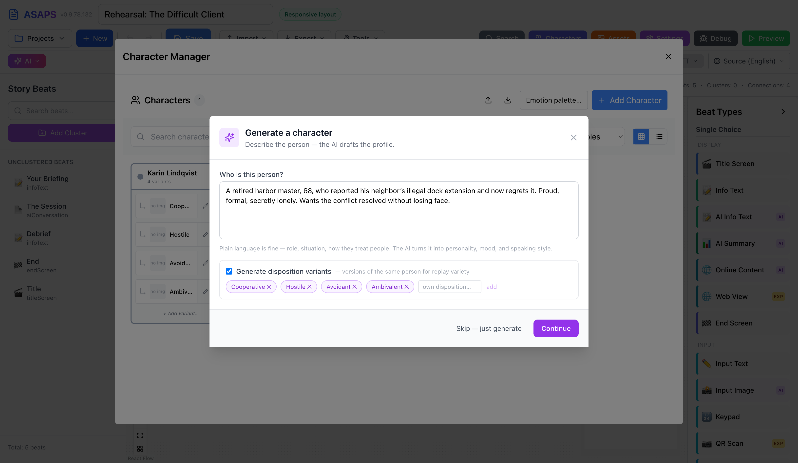
*The brief stage: describe the person the way you'd describe them to a colleague, tick **Generate disposition variants**, and pick or add disposition chips. **Skip — just generate** goes straight to the draft; **Continue** offers the follow-up questions first.*

3. **Optionally, refine with questions.** Click **Refine with questions first** (or **Continue**, from the Character Manager entry) and the AI asks 2–3 short, behavior-focused follow-ups — each with tappable suggested answers plus a free-text field. This stage is *always* skippable: leave any answer empty, or hit **Skip — just generate** and go straight to the draft.

4. **Review the preview cards.** The draft appears as cards — a base profile (the shared identity) plus one card per disposition variant, each showing the description, a compact Big Five readout, the starting mood, and an interpersonal **stance pad** you can drag directly on the card. Don't like a card? Type a direction into its *Adjust* field — *"more passive-aggressive"*, *"less articulate"* — and regenerate just that card. You refine with words, never with sliders. Untick any variant you don't want to keep.

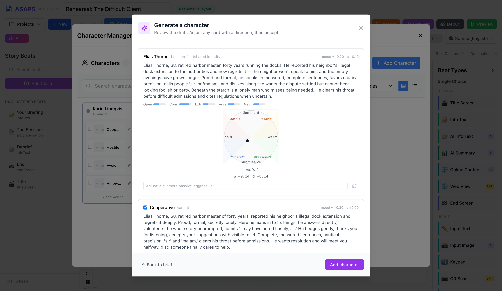
*The preview: a base profile (the shared identity) followed by one card per disposition. Every card carries the full behavioral description, a compact Big Five readout, the starting mood, a draggable stance pad, and an Adjust field for word-based refinement. Variant cards have an include checkbox.*

5. **Accept.** With two or more variants included, a **"Pick a disposition at random each playthrough"** checkbox (on by default) sets the [variant selection policy](#character-affect) for you. Click **Add character** — or **Apply to [name]**, if you launched the helper on an existing character, which enriches that character in place and appends the new variants.

Like all AI features, the helper needs an AI provider configured (**AI → Configure AI**). And if you'd rather see the end result before building your own: the bundled template **Rehearsal: The Difficult Client** is exactly this feature in action — one client, four dispositions, drawn at random.

## AI Dialog Generation (Runtime)

The AI Dialog Tree beat generates conversations on the fly during play:

- Interactors get personalized responses
- NPC "remembers" previous exchanges and references the player's name, location, and other context
- Conversations adapt to story state (variables, inventory, history)
- Exit routing is intelligent -- the AI explains its reasoning via a routing plan

Configure with personality prompts:
```
You are Marcus, a gruff bartender who knows everyone's secrets
but rarely shares them. Speak in short sentences. You're
suspicious of newcomers but respect those who buy good whiskey.
```

For real-time conversations where you want the player to type freely (instead of picking from pre-generated choices), use the **AI Conversation** beat instead. See [AI Conversation](#ai-conversation) in the beat reference above.

## AI Condition Evaluation

Instead of complex branching logic, let AI decide:

```
Evaluate whether the player has been:
- Cooperative → Send to "Ally Path"
- Suspicious → Send to "Neutral Path"
- Hostile → Send to "Enemy Path"
```

AI considers variables, choices made, and overall behavior.

## AI Story Summaries

Generate personalized recaps:

```
In your journey through the Forgotten Realm, you chose to
help the wounded stranger (earning the Healer's Token),
confronted the Shadow King directly rather than sneaking past,
and ultimately sacrificed the ancient artifact to save the village.
```

Three styles:
- **Narrative** - Prose paragraph
- **Bullet Points** - Key events listed
- **Reflection** - Thoughtful commentary on choices

## AI Info Text (Runtime)

Generate contextual, personalized text based on the player's current state:

**Use Cases:**
- Personalized greetings using player name variables
- Context-aware reactions to player inventory
- Dynamic descriptions that change based on previous choices

**Parameters:**
- `prompt`: Context for the AI (e.g., "A merchant's reply when the player can't afford the item")
- `fallbackText`: Text shown if AI is unavailable
- `buttonText`: Continue button label
- `includeVariables`: Include player variables in AI context
- `includeInventory`: Include player's inventory in AI context
- `includeHistory`: Include visited beats in AI context
- `maxSentences`: Maximum sentences to generate (default: 2)

**Example:**
```
Prompt: "Describe how the room changes based on the player's mood variable"
Fallback: "The room feels different today."
Include Variables: true
```

## AI Duration Screen (Runtime)

Like AI Info Text, but auto-advances based on reading speed:

**Use Cases:**
- Atmospheric transitions that adapt to player state
- Dynamic montages reflecting player choices
- Personalized scene-setting text

**Additional Parameters:**
- `wordsPerMinute`: Reading speed (default: 200)
- `minDuration`: Minimum display time in ms (default: 2000)
- `maxDuration`: Maximum display time in ms (default: 15000)

The duration is calculated automatically: (word count / WPM) × 60 × 1000 ms, clamped between min and max.

## Text Variations (Non-AI)

For random variety without AI, both **Info Text** and **Duration Screen** beats support `textVariations`:

```json
{
  "text": "You enter the room.",
  "textVariations": [
    "The room greets you with familiar shadows.",
    "Everything looks just as you left it."
  ]
}
```

At runtime, one text is randomly selected from the main text plus all variations.

## Rich Text Formatting

Text boxes in ASAPS Modern support a lightweight markdown syntax for basic formatting. This works in every prose surface the interactor reads — Info Text, Dialog Tree NPC lines, Duration Screen, end-screen messages, input prompts, and chat bubbles — in both fixed and responsive layout, including after a typewriter reveal finishes.

You don't have to remember the syntax: prose fields in the Inspector carry a small **B** / *I* / ~~S~~ bar — select text and click to wrap or unwrap it.

Two places deliberately stay plain: **button labels** (they're UI, not prose) and **Hyper Text bodies** (link words must match the text exactly, and markers would break the match). If you translate your story, the markers carry over — the words inside get translated, the marks stay.

**Supported Syntax:**

| Syntax | Result |
|--------|--------|
| `**bold**` or `__bold__` | **bold** text |
| `*italic*` or `_italic_` | *italic* text |
| `~~strikethrough~~` | ~~strikethrough~~ text |
| Line breaks (Enter key) | New paragraphs |
| `\n` (literal) | Line break |

**Example:**
```
**"Listen carefully,"** the old woman said, her voice barely a whisper.
*"The forest remembers everything."*

She paused, then added: "~~Especially~~ **especially** those who forget."
```

This renders with proper bold, italic, and strikethrough formatting in the preview and exported stories. HTML entities are safely escaped, so you cannot inject raw HTML.

---

# Part 7: Testing & Publishing

You've built something. Time to make sure it works and share it with the world.

## Preview Mode

The Preview Window is your primary tool for testing your interactive narrative. It provides a comprehensive testing environment with powerful debugging features.

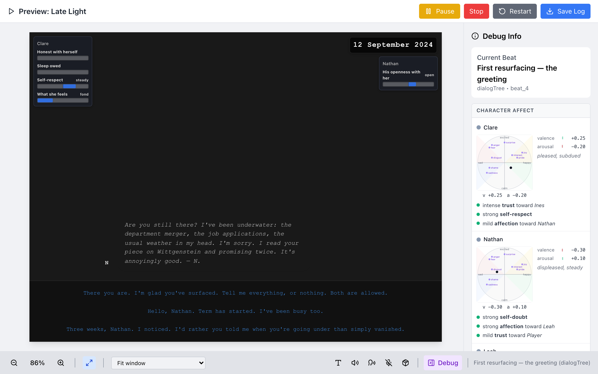
*The Preview panel*

### Starting a Preview

1. Click **Preview** in the header (or use the shortcut)
2. The preview window opens in a new panel
3. Click anywhere on the stage to begin, or use the controls

**Pro Tip:** You can preview from any beat in your story—just select a beat in the flowchart and open the Preview window. The preview automatically navigates to the selected beat.

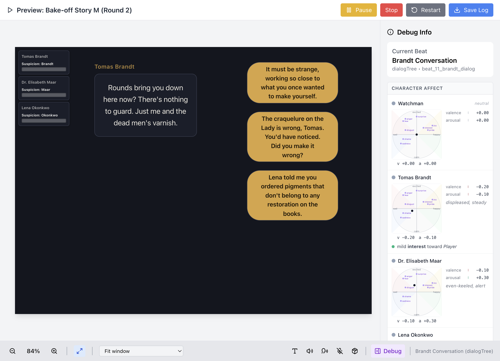
*Preview mode showing the experience in action*

### Preview Controls

The top toolbar provides essential controls:

| Control | Function |
|---------|----------|
| **Play/Pause** | Start, pause, or resume preview |
| **Stop** | End preview and return to editing |
| **Restart** | Start over from the beginning |
| **Step** | Advance one beat at a time |
| **Zoom** | Adjust display size |
| **Fit** | Auto-fit to window |
| **Viewport** | Switch the preview container to a device preset (Fit window, Desktop 1280×800, Tablet landscape/portrait, Phone landscape/portrait) — see below |
| **Text Animation** | Toggle typewriter effect on/off |
| **Mute** | Silence all audio |
| **Inventory** | Show/hide inventory panel (Ctrl/Cmd+I) |
| **Debug Panel** | Toggle debug information sidebar |

### Viewport Switcher (v0.9.59)

The **Viewport** dropdown next to the Fit button lets you preview your story at a fixed device preset without resizing the actual browser window. Six options ship out of the box:

- **Fit window** — no override; the stage scales to whatever window size you've given the preview pop-out (the default).
- **Desktop · 1280×800** — landscape desktop reference.
- **Tablet landscape · 1024×768** and **Tablet portrait · 768×1024**.
- **Phone landscape · 740×360** and **Phone portrait · 390×740**.

Picking a preset locks the preview container to that exact pixel size and orientation. The container stays stable across preset swaps so you can A/B between, say, Phone portrait and Tablet portrait without the renderer fully remounting. The active size is also shown as a small chip on the preview frame.

This is particularly useful for **responsive-mode projects**, where the same story renders differently depending on viewport width and orientation — flipping between presets is how you sanity-check that your slot intents land the way you want on a phone, a tablet, and a desktop. Fixed-canvas projects also respect the preset, but since their layout is pixel-baked, the viewport switcher just changes how much of the stage you see at once.

<a id="mock-sensors"></a>
### Testing Location Beats: the Mock Sensors Panel

Location-driven beats — GPS Location, Indoor Location, and the Set GPS Location logic beat — need sensor input that a desktop simply doesn't have. The **Mock Sensors** panel is how you test them without leaving your chair.

When your project has any location settings configured (**Settings → Location & XR** — a story origin, a mock location, or an indoor venue with beacons), the Preview window shows a purple **📍 Mock Sensors** button in its bottom-right corner. Click it to open the **Mock Sensors (XR)** panel:

- **Position** — latitude/longitude inputs plus N/S/E/W "walk" nudge buttons, so you can type a coordinate or stroll the simulated player around in small steps. GPS Location geofences react immediately, exactly as they would to a real fix. A **Snap to story origin** button jumps back to the project's configured origin.
- **Orientation** — three sliders (alpha/beta/gamma) for beats that care which way the device is facing.
- **Beacons (simulated distance)** — when the project has venue beacons configured, one distance slider per beacon. Every beacon starts at 99 m ("out of range"); slide one down to ~1 m to simulate walking up to it, and the matching Indoor Location zone fires. This is the *only* way to exercise Indoor Location beats without real Bluetooth hardware.

Since v0.9.85 the panel also appears for **indoor-only projects** — a venue with beacons but no GPS origin — which previously had no way in.

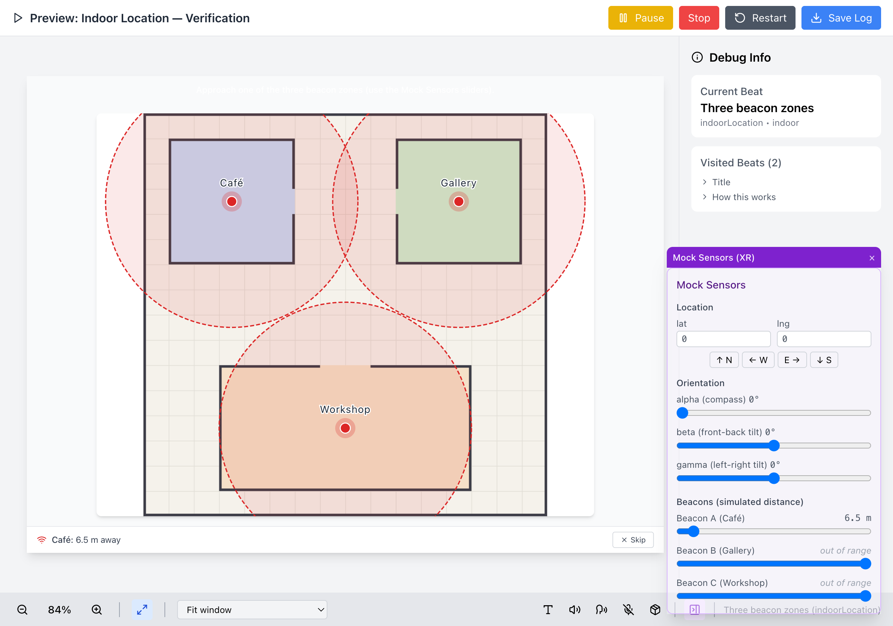

### Path-Based State Presets

When previewing from a beat other than the start, ASAPS Modern intelligently analyzes all paths to that beat and generates **state presets** representing different ways the interactor could have arrived there.

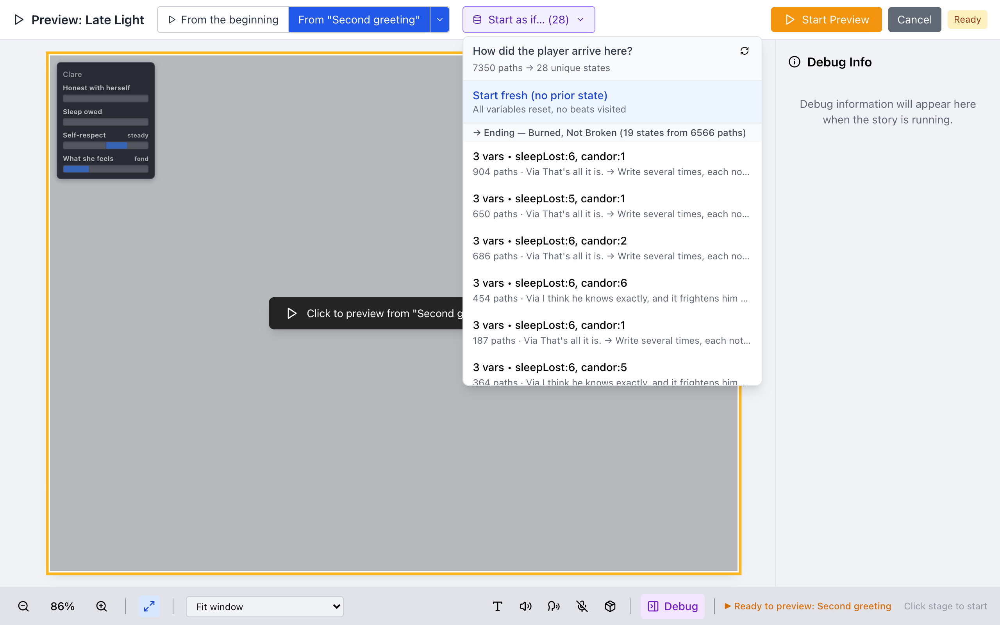
*The path presets menu showing different routes to the current beat*

**Using Path Presets:**

1. Select a beat in the flowchart and open the Preview window
2. Click the **Path Presets** dropdown in the toolbar
3. Browse presets grouped by ending/outcome:
   - Each preset shows the path taken (e.g., "Via Forest → Bridge")
   - State summary shows variables, counters, and inventory
   - Badge indicates if the path includes user input
4. Select a preset to load that state

**InputText Beats in Paths:**

When a path includes **inputText** beats (where the interactor types input), ASAPS Modern prompts you to enter values:

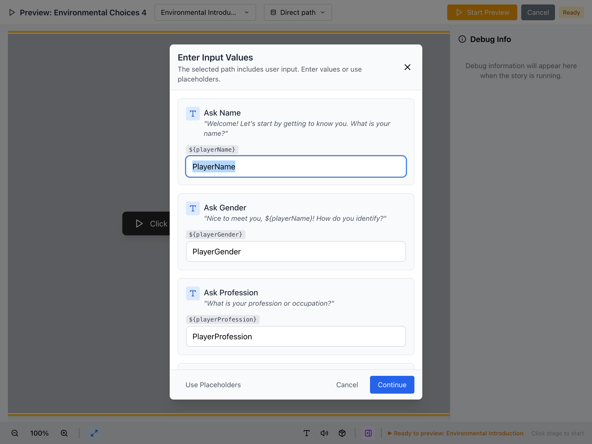
*Modal for entering values that would have been typed by the interactor*

- Each input shows the beat name and prompt
- Enter meaningful values (e.g., a character name)
- Or click "Use Placeholders" for auto-generated values
- Values are merged into the state before preview starts

This ensures variables like `playerName` or `playerGender` have realistic values when testing later parts of your story.

**Seeded beats in the debug panel.** A path preset injects the simulated path into the story's visited-beat history — that's what makes "has the player been to the crypt?" conditions behave as if the run really started at the beginning. To keep the record honest, the debug panel's **Visited Beats** list marks those injected beats with an amber **seeded** badge (and a *"seeded by start state"* count in the heading): they count as visited for conditions, but the player never actually saw them in this run. Beats you walk through after the mid-story start appear without the badge.

### Session Timeline

As the interactor plays through your story, ASAPS Modern records a timeline of significant events: beat transitions, player choices, AI-generated content, branching decisions, and exit reasons. This session log is particularly useful for debugging AI beats, where you can see the AI's routing plan, which directions triggered, and what variables were set during a conversation.

The timeline is accessible through the debug panel and is recorded automatically -- you do not need to enable it.

### Debug Panel

The debug panel (toggle with the bug icon) shows real-time state information:

**Current Beat:**
- Beat name and ID
- Beat type

**Variables:**
- All story variables and their current values
- Updated in real-time as the story progresses

**Counters:**
- Numeric counters with current values
- Shows both character-specific and global counters

**Inventory:**
- Items held by each character
- Quantity of stackable items

**Visited Beats (History):**
- List of visited beats, in order
- Useful for debugging conditions based on beat history
- When you start preview from a mid-story beat, path-injected beats carry an amber **seeded** badge — they satisfy visited-beat conditions but weren't actually played this run

**Active Timers:**
- Running timers with remaining time
- Timer names and target beats

### Manual State Editing

For advanced testing, you can manually edit the current state:

1. Open the Debug Panel
2. Click **Edit State**
3. Modify variables, counters, or inventory
4. Changes take effect immediately

This is useful for testing edge cases like "What if the player has negative gold?" or "What happens with 100 items in inventory?"

### State Presets (Saved)

Save commonly-used test states for quick access:

1. Set up your desired state (through play or manual editing)
2. Click **Save Preset** in the debug panel
3. Name your preset (e.g., "Has all keys", "Low health scenario")
4. Access saved presets from the preset menu

Perfect for regression testing—create presets for critical game states and verify they still work after changes.

## Debug Tools

Click the **Debug** button in the header to open the **Debug Tools** window. It opens in a separate browser/desktop window so you can keep your story canvas visible while you investigate. The window has three tabs:

### Reachability

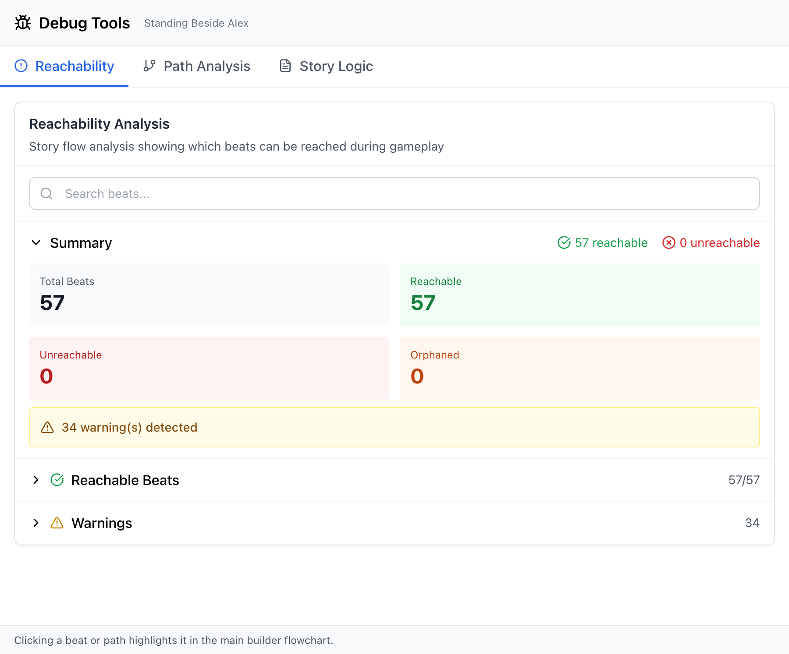
*The Reachability tab shows total beats, how many are reachable from start, how many are orphaned, and any warnings detected. Click a beat to highlight it on the main flowchart.*

Finds beats that can never be reached — orphaned content with no paths leading to it. The summary cards count Total, Reachable, Unreachable, and Orphaned beats. Expand the *Reachable Beats* and *Warnings* sections to drill into the specifics. Clicking a beat in the list highlights it in the main builder flowchart.

### Path Analysis

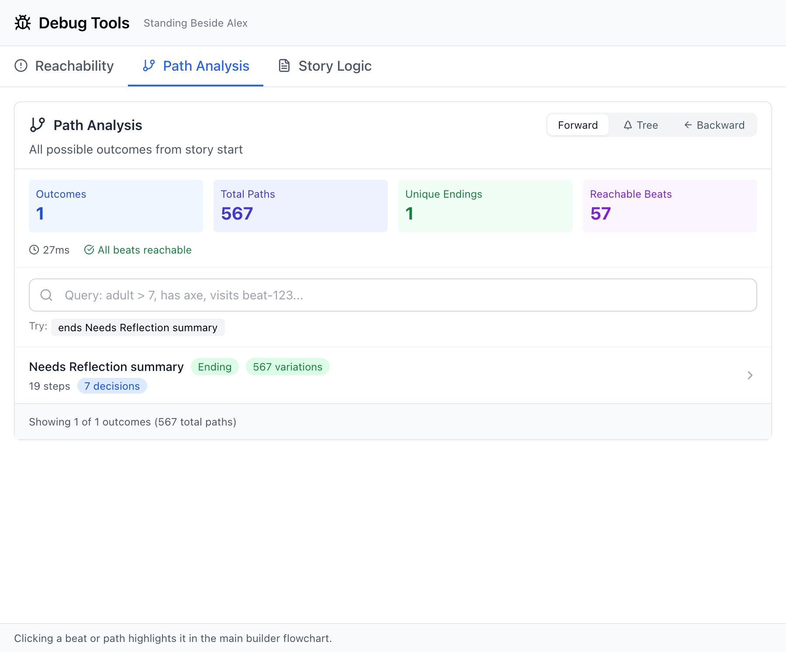
*The Path Analysis tab in Forward mode, showing every possible outcome from story start.*

Enumerates the possible journeys through your story. Three modes:
- **Forward** — all outcomes reachable from the start.
- **Tree** — the full branching tree as a hierarchy.
- **Backward** — given a target ending, which paths lead to it.

The summary shows *Outcomes*, *Total Paths*, *Unique Endings*, *Reachable Beats*, and how long the analysis took. Each outcome can be expanded to inspect the specific beat sequence and decision points. The query box at the top lets you filter by state ("`adult > 7`", "`has axe`", "`visits beat-123`") so you can ask, "show me only the paths where the player ends up with the axe."

### Story Logic

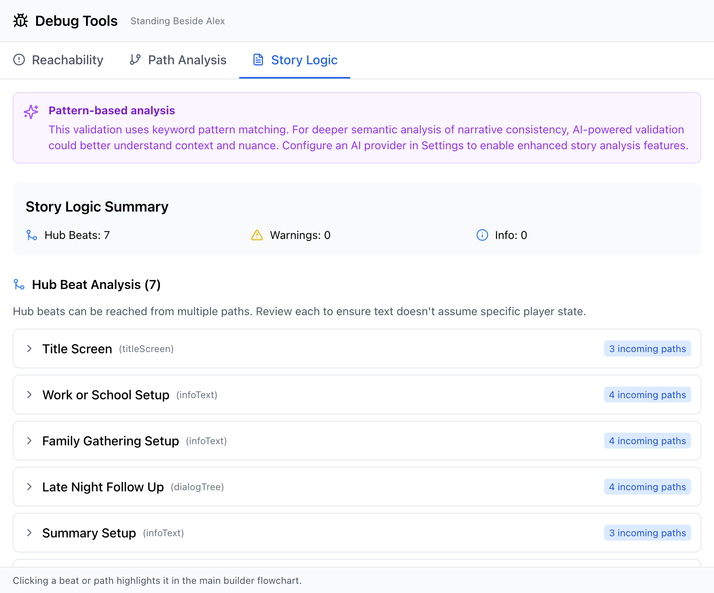
*The Story Logic tab, surfacing hub beats reachable from many paths.*

Pattern-based validation that runs on the project's structure:
- **Hub Beat Analysis** — beats reachable from multiple paths. Each hub gets a card with its incoming-path count and a reminder to check that the text doesn't assume a specific player state.
- **Warnings / Info** — undefined variables, missing connections, unused counters, and similar logic issues.

> Story Logic uses keyword pattern matching for now. AI-powered semantic analysis (where an LLM reads each hub beat in context and flags continuity issues) is on the roadmap — when an AI provider is configured, the panel offers richer warnings.

<a id="verification-kits"></a>
## Verification Example Kits

ASAPS ships a set of small, importable **verification kits** for the device-facing beats — the same fixtures we run before every release. They're QA checklists, not tutorial stories: each one walks a handful of stations with explicit on-screen PASS/fail outcomes, so you can confirm a beat works on *your* hardware in a few minutes.

| Kit | What it exercises |
|-----|-------------------|
| **GPS Location — Verification** | Set GPS Location in all four modes (capture, scatter uniform + walkable, preset) plus the point-set geofence binding, drivable entirely from the Mock Sensors panel |
| **GPS Field Test** | The live outdoor companion — location-agnostic (zero authored coordinates), for a real walk with a phone |
| **QR Scan — Verification** | Four scan stations plus a printable code sheet (`asaps://` jumps, variable/inventory codes, raw payload with an accept pattern) |
| **Web View — Verification** | Embed, postMessage exit, auto-exit URL pattern, and a blocked-site probe, with deployable test pages |
| **AR Scene — Verification** | Marker tracking with a printable marker page and the compiled `.mind` tracker already bundled — no external compile step |
| **Indoor Location — Verification** | A generated floor plan with a three-beacon venue, driven by the Mock Sensors beacon sliders — no Bluetooth hardware needed |

The kits live in the `examples/` folder of the ASAPS distribution (in the repository: `packages/builder/public/examples/`, with a README and per-kit pass/fail criteria in `docs/TESTING_EXPERIMENTAL_BEATS.md`). Import any kit via **Import → Project (ZIP)** and run it in Preview or an HTML export on the target device.

## Text-to-Speech (TTS)

ASAPS Modern can read your story aloud using text-to-speech. This is useful for testing how dialog flows, for accessibility, and for creating voice-driven experiences.

### Setting Up TTS

1. Click the **TTS** button in the header toolbar (top-right area, with a volume icon) to open the TTS dropdown
2. Click **Enable TTS** to turn on text-to-speech
3. Click **Configure Provider** to open the provider settings dialog
4. Choose a **TTS provider**:
   - **Web Speech** — Free, built into your browser. Quality varies by OS and browser.
   - **ElevenLabs** — High-quality cloud voices. Requires an API key from [elevenlabs.io](https://elevenlabs.io).
   - **OpenAI** — Cloud TTS via OpenAI. Requires an API key.
   - **Local TTS** — Run open-source TTS models on your own machine. Supports Kokoro (via mlx-audio), Coqui, Piper, and Chatterbox with built-in presets. No API key needed.
   - **Custom Server** — Connect to any OpenAI-compatible TTS endpoint.
5. Enter your API key if using a cloud provider
6. Select a **model** (for providers that offer multiple models)

**ElevenLabs Models:**
| Model | Description |
|-------|-------------|
| **Eleven v3** | Most expressive, highest quality (default) |
| **Multilingual v2** | Good quality, supports many languages |
| **Flash v2.5** | Fastest response time, lowest cost |
| **Turbo v2.5** | Fast with good quality |

ElevenLabs uses audio streaming for faster time-to-first-audio, so you hear speech begin almost immediately rather than waiting for the full audio to generate.

**Local TTS with Kokoro:**

The Local TTS provider comes with built-in presets for popular open-source TTS servers. The recommended setup is **Kokoro** via mlx-audio (runs on Apple Silicon Macs):

1. Select the **Local TTS** tab in the TTS configuration
2. Choose the **Kokoro** preset from the server presets dropdown
3. The base URL auto-fills to `http://localhost:8880/v1`
4. Start your local Kokoro server (see the mlx-audio documentation)
5. A curated list of Kokoro voices appears automatically -- male and female voices in American, British, and other accents

Other presets include Coqui TTS, Piper, and Chatterbox. You can also enter a custom base URL for any OpenAI-compatible TTS server.

### Assigning Character Voices

Each character in your story can have a distinct TTS voice:

1. Open the TTS menu from the header
2. Under **Character Voices**, you'll see all speakers in your story
3. Use the dropdown next to each name to assign a voice
4. Available voices depend on your chosen TTS provider

Built-in speakers like **Narrator** appear automatically. Your player character appears with "(Player)" next to their name. The player character is silent by default — assign a voice to enable speech for the player's text and clicked dialog choices.

### TTS Language Awareness

TTS automatically adapts to the active language when translations are in use:

- **In the Preview Window** -- When you switch the translation language, TTS immediately updates to speak in the new language. This happens on every preview data change, so you always hear the correct language.
- **In HTML exports** -- The project's source language is embedded in the export. When the exported story includes bundled translations and the interactor switches languages, TTS switches language accordingly.

This means you do not need to configure TTS language manually -- it follows your translation settings.

### TTS in Project Settings

Your chosen TTS provider type and model are saved with the project, so collaborators automatically use the same configuration. API keys are **not** saved in the project — they stay in your browser's local storage for security.

## Speech-to-Text (STT)

ASAPS Modern supports voice input for AI Conversation beats and other text entry scenarios. When STT is configured, a microphone button appears in the header and inside conversation beats.

### Setting Up STT

1. Click the **Mic** button in the header toolbar (next to the TTS button)
2. Configure a **STT provider**:
   - **Web Speech** — Free, built into your browser. Real-time streaming, but quality varies.
   - **Whisper (OpenAI)** — Cloud-based, high accuracy. Requires an OpenAI API key.
   - **Local Server** — Self-hosted Whisper server (any OpenAI-compatible endpoint).
   - **Vosk** — Offline streaming recognition via WebSocket.
   - **Whisper.cpp** — Local whisper.cpp server for accurate offline recognition (default port: 8178).
3. Select a recognition **language** (English, German, French, Spanish, and more)

### STT in AI Conversations

When an AI Conversation beat has **Enable Voice Input** turned on, a microphone button appears next to the text input. The interactor can click it to speak their response instead of typing. The transcribed text fills the input field, and the interactor can edit it before sending.

This creates a natural voice-driven conversation flow, especially when combined with TTS -- the NPC speaks, the player responds by voice, and the NPC replies.

## Saving Your Project

### Quick Save

- Click **Save** or press **Ctrl/Cmd+S**
- Saves to browser storage

### Where Your Projects Live (and Why Backups Matter)

In the **web app**, projects live in your browser's storage. That's what
makes saving instant and automatic — but browser storage belongs to the
browser: clearing site data removes your projects, and under storage
pressure a browser may clean up on its own. ASAPS defends this two ways:

- After your first save, ASAPS asks the browser to **protect its storage
  from automatic cleanup**. The Project Browser's footer shows the result —
  a storage line reading *"protected"* or *"not protected against cleanup —
  keep backups"*, along with how full your browser storage is.
- Project cards show a small amber **never backed up** / **backup outdated**
  badge when a project you've recently worked on exists only in this
  browser. **Export → Project (ZIP)** clears it — the exported file is your
  real backup, safe from anything that happens to the browser.

Neither of these replaces the habit: if a project matters, export it. In the
**desktop app**, projects can also live as folders on disk (File → Save As
Folder), where they're ordinary files — backed up by Time Machine or File
History like everything else you care about.

### Export Options

| Format | Description | Use Case |
|--------|-------------|----------|
| ASAPS Project (.zip) | Complete project + all assets | Backups, sharing with collaborators |
| ASAPS Template (.asapst) | Same zip, flagged as a template — anyone importing it gets their own fresh copy; the file itself is never edited | Distributing worked examples: classroom scenarios, reusable starting points |
| ASML 1.0 (.asml, XML) — **legacy** | XML narrative structure only. **Frozen serialization**: newer features (character variants and stances, affect, responsive slot layout, counter bindings, themes) are NOT written and won't come back on re-import | Compatibility with the original ASAPS only — the Project zip carries ASML 2.0 (JSON), the native format |
| HTML (.html) | Self-contained playable file | Distribution, embedding, sharing |

**Export as Template (.asapst).** Pick **Export → Export as Template (.asapst)** to turn the open project into a distributable template — like Word's `.dotx`. A lecturer can share a rehearsal scenario with a class this way: every student who imports (or double-clicks) the file gets their own independent copy to work in, and the master file stays pristine. See [Templates](#templates) in Part 1 for how templates behave on the receiving end.

### HTML Export

Export your story as a single standalone HTML file that anyone can open in a browser—no server needed.

1. Click **Export → Export as HTML**
2. Configure options:
   - **Title** - Page title
   - **Include splash screen** - Show a start screen before the story begins
   - **Embed assets** - Bundle images/audio directly into the HTML
3. Click Export

The resulting HTML file includes the full renderer, all story data, and embedded assets. Share it via email, upload it to a website, or distribute it however you like. Recipients just double-click to play.

**Advanced HTML Export Options:**
- **Mobile-responsive** - Automatic font scaling and layout adaptation on phones/tablets
- **Bundled translations** - Include multiple language versions with a language selector
- **TTS language** - The project's source language is automatically embedded; when translations are bundled, switching languages also switches TTS speech language
- **Save/resume** - Interactors can save progress and resume later (via browser storage)
- **AI translation on-the-fly** - Optionally embed an API key for runtime AI translation to any language

### Deployment & Troubleshooting

When you host an HTML export online (rather than just double-clicking a single-file export), a few infrastructure quirks occasionally show up:

- **Cloudflare Rocket Loader.** Exported HTML marks all script tags with `data-cfasync="false"` so Cloudflare's Rocket Loader leaves them alone. Stories hosted behind Cloudflare should work out of the box. If you've heavily customised your Cloudflare settings and the player still won't initialise, disabling Rocket Loader for the domain is the safe baseline.
- **Folder-mode (multi-file) exports.** If the player gets stuck on the loading spinner, it's almost always one of two things and the player will now tell you which:
  - *"Story download timed out after 30s"* — the server is slow or unreachable. Check that `story.asaps.zip` is actually deployed alongside `index.html`.
  - *"The server returned an HTML page instead of the zip"* — your host returned a 404 fallback or a directory listing instead of the `.zip`. Usually a path or MIME-type misconfiguration. Make sure `story.asaps.zip` is at the same URL path as `index.html` and that the server serves `.zip` files with `application/zip` (or at least `application/octet-stream`).
- **Single-file exports** sidestep both of these — there's no separate `.zip` to fetch — but produce larger HTML files. Use folder-mode when your story has heavy assets and you want fast initial loads.

### Export Steps

1. Click **Export** in the header to open the dropdown
2. Choose format: Project (ZIP), Template (.asapst), or HTML — or a legacy ASML 1.0 (XML) export from the bottom section (a confirm lists what the XML can't carry)
3. Configure options if prompted
4. Download the file

## Importing Projects

### Supported Formats

- **ASAPS Project (.zip)** - Full project restore
- **ASAPS Template (.asapst)** - Always instantiates a *fresh copy* as a new project — the template file itself is never opened or modified. Double-clicking a `.asapst` in the desktop app does the same. See [Templates](#templates).
- **ASML 1.0 (.asml, XML)** - Story structure from the original ASAPS (may need asset re-linking)
- **Twine/Twee** - Import from Twine (SugarCube format)

*Note: Ren'Py theme import is available in **Settings** via the "Import Ren'Py" button.*

### Import Steps

1. Click **Open** in the header to open the dropdown
2. For ASAPS's own files pick **Open Project File…** (`.asaps` / `.asapst` / zip); for conversions pick ASML 1.0 (XML) or Twine (HTML) under *Import from other formats*
3. Select the file
4. For asset-heavy imports, you'll be guided through asset mapping

**ASML 1.0 stays fully importable.** Freezing the XML *export* changes nothing here — old `.asml` files keep opening, forever. And to be precise about names: ASML didn't go away, it moved on. The JSON your project zip carries **is ASML 2.0** — same language, new serialization.

### Merging Two Stories (v0.9.71)

Importing replaces what's open — **merging combines**. Merge Story pulls another exported story *into* your currently open project, so you can stitch two narratives together: a colleague's chapter, a reusable puzzle sequence, last semester's class project.

1. Click **Import → Merge Story (.asaps)** in the header
2. Select the exported story (`.asaps.zip` / `.zip`)
3. Resolve any character collisions in the merge dialog (see below)
4. Click through — the incoming beats arrive in your project

**What lands where.** The incoming beats arrive as their own **cluster**, placed beside your existing graph as a disconnected group. Nothing is auto-wired into your flow — *you* connect the two stories afterwards, wherever the join makes narrative sense. Your project's settings and theme win; the incoming story adapts.

**Character collisions.** If both stories have a character with the same name, the merge dialog asks you to decide **per character**:

- **Same character — reuse** — the incoming references are rewired to your existing character. Pick this when it really is the same person in both stories.
- **Different character — keep both** — the incoming character is renamed with a suffix ("Elena" becomes "Elena 2") so both survive intact.

Undecided collisions default to keep-both — the merge never silently fuses two characters.

**Everything else is conflict-free by construction.** Beat, character, and asset IDs are remapped wherever they'd clash, and every reference inside the incoming content (connections, nested dialog trees, condition targets, asset references) is rewritten to match — your story prose is never touched. **Variables union by name**: if both stories use `trust`, they share it after the merge, which is often exactly what you want when the stories are meant to interlock.

---

# Part 8: Advanced Techniques

You've mastered the basics. Now let's explore the powerful features that separate good stories from great ones.

## Clusters: Organizing Complex Stories

As stories grow, organization becomes crucial.

### Creating Clusters

1. In the Beat List sidebar, click **Add Cluster**
2. Name it ("Act 1", "Dungeon Section", "Merchant Interactions")
3. Drag beats into the cluster

### Cluster Types

**Organizational Clusters** - Just folders for tidiness
**Spatial Clusters** - Represent physical locations
  - Can have map background images
  - Beats inside represent things in that location

### Cluster Features

- Expand/collapse in the Beat List
- Show as containers in Flowchart view
- Can have cluster-level background music
- Beats inherit cluster settings unless overridden

## Condition Beats

The Condition Beat provides branching logic — checking variables, counters, timers, fictional time, inventory, or any character's affect state, and routing to different targets based on the result.

### What You Can Check

The Condition Type dropdown groups the available checks into two families:

**Classic checks** (the original ASAPS condition vocabulary):
- **Variable** — true/false flags (`hasKey`, `metWizard`)
- **Counter** / **Counter Compare** — numeric comparisons (`gold > 50`, `reputation == respect`)
- **Inventory** — whether a character holds a named item, or how many copies
- **Timer** — whether a named timer has expired or has time left
- **Fictional Time** — compare the in-world clock to a target year/month/day/hour/minute

**Character affect** (added in v0.9.43, exposed under the *Character affect* optgroup):
- **Mood (axis ≷ value)** — branch on a character's valence or arousal, e.g. *"Alex's valence ≥ +0.3"*
- **Emotion intensity ≷ value** — branch on how strongly a single emotion is firing, e.g. *"Alex's fear > 0.4"*
- **Trait ≷ value** — branch on a Big Five trait (openness, conscientiousness, extraversion, agreeableness, neuroticism), respecting any active variant override, e.g. *"Alex's neuroticism ≥ 0.6"*
- **Sentiment toward target ≷ value** — branch on how one character feels about another (optionally summed across all emotions, or scoped to a single emotion like *trust*)
- **Goal status** — branch on whether a character's named goal is `open`, `met`, `failed`, or `abandoned`
- **Active variant** — branch on which authored variant of a character is currently in play (e.g. anxious-introvert vs. free-spirit)

**XR / sensors** (for location-aware stories, exposed under the *XR / sensors* optgroup):
- **GPS proximity (within / outside radius)** — is the player within (or outside) a radius of a target coordinate? (For geofencing a whole *named point set* from [Set GPS Location](#set-gps-location-beat), bind a GPS Location beat entry to the set instead — that's where dynamic points live.)
- **Indoor proximity (beacon RSSI)** — is the player near a configured venue beacon?
- **Permission granted** — has the player granted a device permission (location, camera, …)? Useful for routing around denied sensors gracefully.

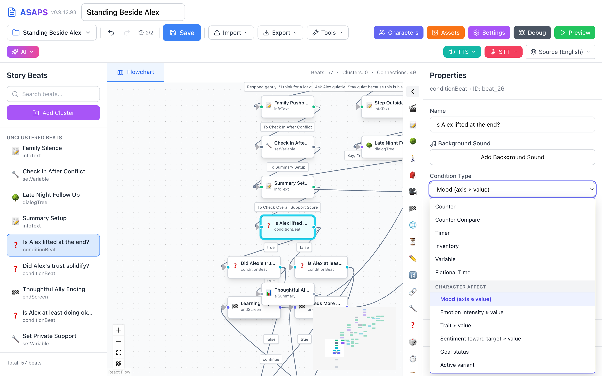
*The Condition Type dropdown. Classic checks at the top, the new Character affect group at the bottom. The runtime evaluates these the same way it evaluates "player has lantern" — it just checks a different slice of state.*

### Affect-Aware Forms

Each affect operator renders its own form so you can never enter a meaningless combination. The forms cascade — pick the character first and the goal / variant / trait dropdowns populate from that character's authored content, with a free-text fallback when none has been authored yet.

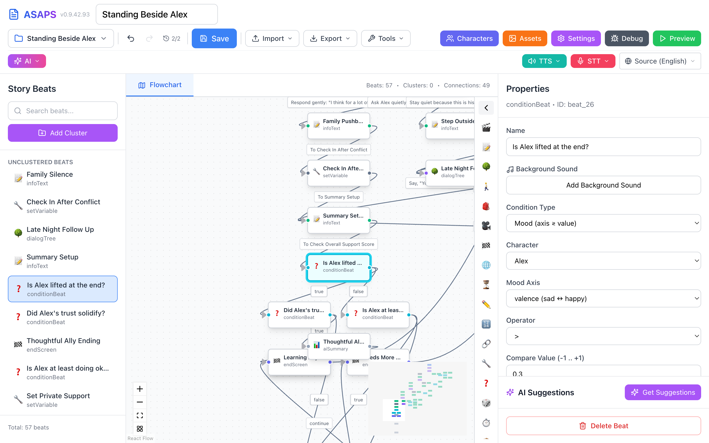
*Mood condition: pick the character, the axis (valence or arousal), the operator, and a value in the range -1 to +1.*


*Trait condition: the Trait Name dropdown lists exactly the traits this character has authored — including any traits a variant has overridden. The value is in the range 0 to 1.*

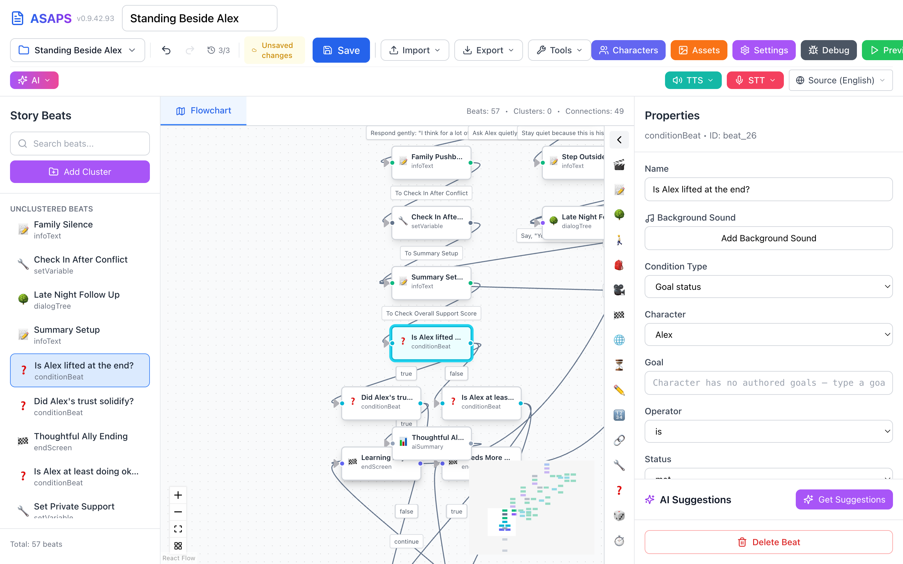
*Goal status condition: pick the character, then the goal id (cascading from the character's authored goals), then `==` / `!=` against `open`, `met`, `failed`, or `abandoned`. If the character has no authored goals yet the dropdown becomes a free-text input so you can scaffold the condition before authoring the goal.*

> **Why the affect-aware operators matter.** They let you wire reactivity that *responds to who Alex has become this run* rather than to flags you had to remember to set. A scene-end beat can ask "is Alex lifted right now?" without you having to manually maintain a `currentlyLifted` boolean. Combined with `Update Affect` beats earlier in the path, you get an emergent emotional shape that's much closer to how memory and feeling actually work in human relationships.

<a id="baseline-relative-comparisons"></a>
### Baseline-relative comparisons: literal vs. delta-from-initial vs. bookmark

A literal threshold like *"Alex's valence ≥ +0.3"* answers a useful question — *is Alex visibly happy right now?* — but it's the wrong question for an awful lot of stories. If Alex was authored with a starting valence of `-0.3` (anxious-introvert seed) and the player's choices have lifted him to `+0.1`, that's a meaningful improvement the story should *feel* — but a literal `≥ +0.3` check still reads false. He's better; he just isn't bright. Conversely, a perpetually-cheerful character might pass `≥ +0.3` from the moment the story starts, with no bearing on what the player has done.

The fix is a small dropdown that sits on every Mood, Emotion, and Sentiment condition:

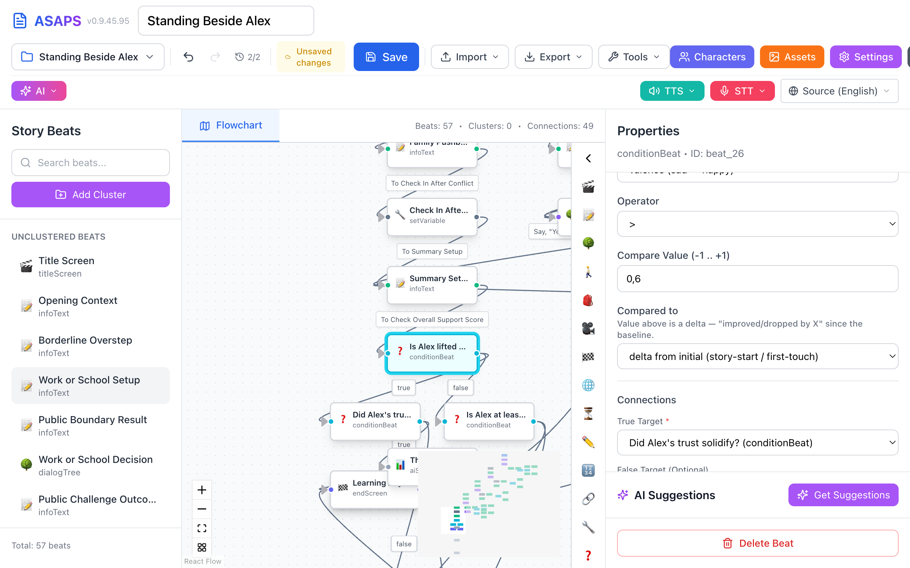
*The **Compared to** picker sits below the Compare Value field. With *delta from initial* selected, the value above is interpreted as a delta — "Alex's valence has improved by ≥ 0.3 since story start" — instead of an absolute threshold. The hint underneath the picker swaps to match: "Value above is a delta — improved/dropped by X since the baseline."*

The picker has three modes:

| Mode | What the value means | Use when |
|------|----------------------|----------|
| **literal value** *(default)* | The number is an absolute threshold — *valence ≥ +0.3*, *fear ≥ 0.4*, *trust toward player ≥ 0.5*. Same behaviour as before v0.9.45. | You want a point-in-time read of state. *"Alex is currently visibly happy."* *"Trust right now is high enough for the secret reveal."* |
| **delta from initial** *(story-start / first-touch)* | The number is a *change* from where the slot started. The runtime captures the initial value either at story-start (when characters carry authored seeds) or on first-touch (when the slot is first written). A character seeded with valence `-0.3` reads `initial = -0.3`, so *"valence ≥ +0.3 from initial"* fires when current valence reaches `0.0` — the natural meaning of "improved by 0.3". | You want to read change, not state — *"trust toward the player has grown since the story began"*, *"fear has eased"*, *"mood has lifted"*. Robust to off-neutral seeds. |
| **delta from a named bookmark** | The number is a *change* from a snapshot the story took earlier with the [Bookmark Affect State](#bookmark-affect-state-effect) effect. The picker reveals an extra **Bookmark name** input — fill in the same handle the bookmark effect uses (e.g. `reunion-scene`). | You want to gate on change *between two specific moments* — *"has trust grown since the reunion scene?"*, *"has fear softened since the act-one ending?"*. |

The same picker shows up in two surfaces, which mirror each other:

- **Inspector → Condition Beat → Mood / Emotion / Sentiment forms.** Full-width dropdown with the hint text underneath.
- **Inspector → Beat properties → Requirements → per-requirement card → Mood / Emotion / Sentiment.** A more compact version of the same control under the operator + value row, in the per-requirement card.

> **A worked example.** Alex's anxious-introvert variant seeds his valence at roughly `-0.3`. A summary-time condition that reads "Alex's valence ≥ +0.3 (literal)" will only fire when Alex has lifted *all the way* into bright territory — a high bar that punishes anxious Alex for ever having been anxious. The same condition rewritten as "Alex's valence ≥ +0.3 (delta from initial)" fires when Alex has merely *moved 0.3 in the right direction* — what the story almost certainly meant in the first place.

> **What's deliberately not supported.** There is no "X has been improving over the last N beats" running-trend mode. Conditions are point-in-time (literal) or two-point comparisons (delta from initial / bookmark). A running trend would mean storing per-slot history — expensive in the runtime, and rarely what authors actually want once they unpack the question. If you find yourself reaching for a trend, what you usually want is a bookmark on the prior scene and a delta-from-bookmark check.

### Condition templates

Picking the right operator, character, and value combination for an affect condition takes practice — what counts as "trust" in your project's palette? what threshold reads as "ashamed" rather than "passing thought"? do you actually want a literal check or a delta? The template library is a 28-preset answer to those cold-start questions, accessible via a blue-tinted **Apply a template** dropdown that shows up in two places:

- **Inspector → Condition Beat**, above the Condition Type select.
- **Inspector → Requirements → per-requirement card**, at the top of each card.

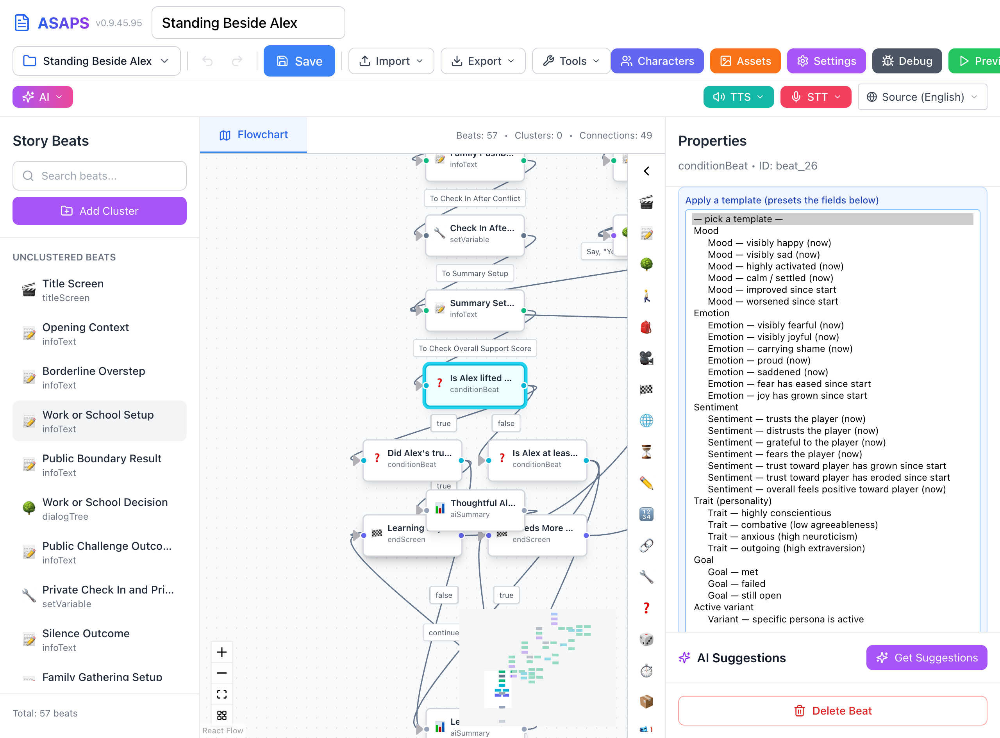
*The Apply-a-template dropdown, expanded. Templates are organised in optgroups by category — Mood, Emotion, Sentiment, Trait (personality), Goal, Active variant. Picking one writes every field of the condition at once: the type, the character target, the operator, the value, the baseline (for delta-flavoured templates), plus per-type fields like sentiment target and emotion name.*

Templates fall into two flavours per affect category:

- **Threshold flavour** — *"is X true right now?"* — uses the literal-value baseline with a sensible cutoff. Read as point-in-time questions: *"Mood — visibly happy (now)"*, *"Sentiment — trusts the player (now)"*, *"Emotion — visibly fearful (now)"*.
- **Delta-from-initial flavour** — *"has X changed since the story began?"* — uses the `delta from initial` baseline so the condition reads against where the character started, not against absolute zero. Read as change questions: *"Mood — improved since start"*, *"Sentiment — trust toward player has grown since start"*, *"Emotion — fear has eased since start"*.

A representative slice of the library:

| Category | Threshold flavour | Delta-from-initial flavour |
|----------|-------------------|---------------------------|
| **Mood** | Visibly happy / sad (now); highly activated / calm (now) | Improved since start; worsened since start |
| **Emotion** | Visibly fearful / joyful / proud / saddened / carrying shame (now) | Fear has eased since start; joy has grown since start |
| **Sentiment** | Trusts / distrusts / fears / is grateful to the player (now); overall feels positive toward player (now) | Trust toward player has grown since start; trust toward player has eroded since start |
| **Trait (personality)** | Highly conscientious; combative (low agreeableness); anxious (high neuroticism); outgoing (high extraversion) | — *(Big Five traits don't drift at runtime; only threshold makes sense)* |
| **Goal** | Goal — met; failed; still open *(each leaves `goalId` blank for you to fill in)* | — |
| **Active variant** | Specific persona is active *(leaves `variantId` blank)* | — |

A few things templates do quietly so you don't have to:

- **They infer the active character target.** A template applied inside a condition that already has a character picked keeps that character. Inside an empty Condition Beat, the target is whatever the `character` field currently holds (often empty, in which case you fill it in after).
- **They never seed bookmark names.** The library can't know what bookmarks your story has authored, so even though the third "Compared to" mode is available, no template starts in bookmark mode. To gate on a bookmark, pick a delta-from-initial template, then switch the **Compared to** picker to *delta from a named bookmark* and fill in the name.
- **They're starting points, not contracts.** The dropdown resets to the empty sentinel after each apply, so you can tweak, decide it didn't fit, and pick a different one — the second pick overwrites the first cleanly.

> **Why threshold *and* delta both ship.** They're answering different questions. Threshold ("trust ≥ 0.4") is right when the *level* matters — the player isn't going to be told a secret unless trust is genuinely high, regardless of where it started. Delta ("trust has grown by ≥ 0.3 since start") is right when the *journey* matters — the story rewards relationship-building, regardless of whether the destination is "warm" or "merely less cold". Most affect-aware narratives end up using both, on different beats.

<a id="bookmark-affect-state-effect"></a>
### Bookmark Affect State (effect)

The third "Compared to" mode — *delta from a named bookmark* — only works if the story has *taken* a bookmark earlier. That's what the **Bookmark Affect State** effect is for. Add it from the Effects section of any choice (Dialog Tree, Movement Choice, dialog node, Pick Prop) the same way you'd add a Nudge Mood or Fire Emotion row.

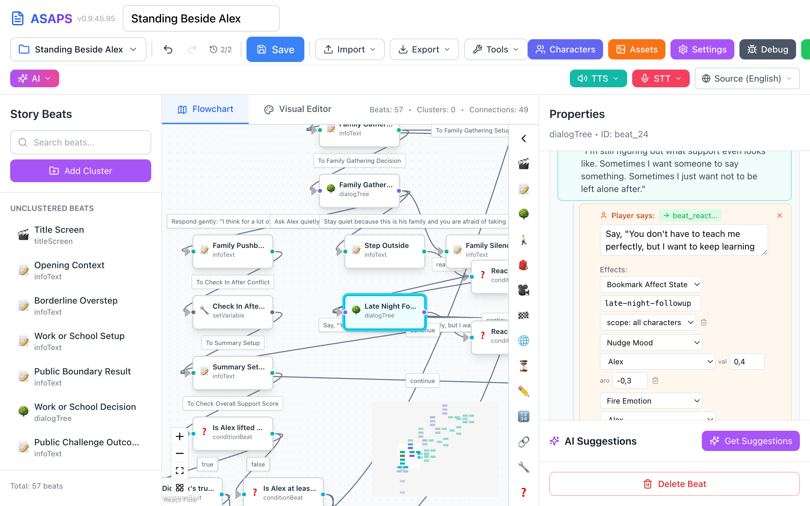
*Adding `Bookmark Affect State` to a choice on the **Late Night Follow Up** beat. The row asks for two things: a **bookmark-name** (the handle conditions will reference) and a **scope** (`all characters` snapshots the entire roster's mood / emotion / sentiment state under that name; `target only` snapshots a single character). With scope set to `all characters` the target field hides itself — there's nothing to point at, the snapshot covers everyone.*

The fields:

| Field | What it does |
|-------|--------------|
| **bookmark-name** | An author-chosen handle for this snapshot. Match this exact string in the **Bookmark name** input on the condition's *Compared to: bookmark* mode. Names are arbitrary text — `act-one-end`, `reunion-scene`, `alex-arc-midpoint` — pick something that reads well in your own head. |
| **scope: all characters** | Snapshots the mood, emotion intensities, and sentiments for every character in the project under this name. The single most useful default for "where was everyone, narratively, when this happened?" |
| **scope: target only** | Snapshots only the chosen target character. Smaller footprint, useful when only one character's arc is being measured. |

The live "what does this choice do?" summary (the italic blue-tinted block under the effects list) picks bookmarks up too: a choice that records `bookmark "reunion-scene"` will say so, in the tally line after the per-character affect read. So you can see at a glance which choices are recording baselines and which are reading from them.

> **A worked rhythm.** Place a *Bookmark Affect State* effect on the choice that ends an act — *act-one-end*, scope: all characters. In the act-two beat that immediately follows, place a Condition Beat (or per-beat requirement) that asks *"Sentiment — trust toward player has grown since start"*, then switch its **Compared to** picker to *delta from a named bookmark* and type `act-one-end`. Now the condition reads "trust has grown since the act-one ending" rather than "since the very beginning of the story" — exactly what an act break usually means dramatically.

### Compound Conditions

For complex logic requiring multiple checks, chain Condition Beats together — each beat handles one comparison, and you wire them into a decision tree:

```
[Check hasKey]
  → true: [Check gold > 50]
              → true: [Secret shop unlocked]
              → false: [Need more gold]
  → false: [Need the key first]
```

You can mix and match families freely: *"if Alex's mood is recovering AND the player has the journal, route to the reconciliation scene; otherwise route to the missed-opportunity scene."*

### Inventory Checks

You can check for item presence:
- Player HAS "Silver Key" ✓
- Player DOES NOT HAVE "Curse Mark" ✓

For quantity-based checks (e.g., "Gold > 100"), the inventory condition's **Quantity** mode lets you compare counts directly. The **AI Condition** beat is also available for fuzzier reasoning that doesn't reduce to a single numeric comparison.

### Per-Beat Requirements

The same condition vocabulary is also available on every regular beat under the **Requirements** section (collapsible at the bottom of the Inspector). A requirement is a guard that must hold when the player reaches that beat — if it doesn't, the engine redirects to the fallback beat you choose, and the path analyzer flags the situation as a soft-lock or a warning depending on the severity you set.

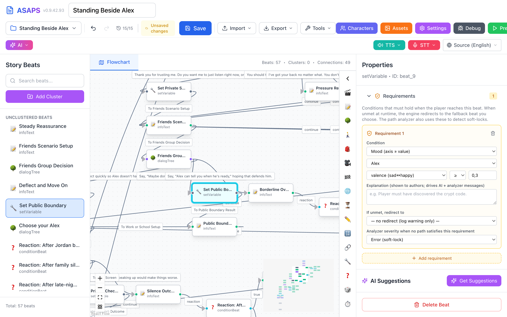
*A requirement on a regular beat: this beat will only run when Alex's valence is at least +0.3. If unmet at runtime, the engine redirects to the fallback (or just logs a warning if no fallback is set), and the path analyzer treats the unreachable case according to the chosen severity.*

Each requirement card carries the same blue-tinted **Apply a template** dropdown the Condition Beat does, plus the same **Compared to** picker on its mood / emotion / sentiment forms — so you can scaffold "trust has grown since start" or "fear has eased since the reunion bookmark" requirements with a single click and a small tweak:

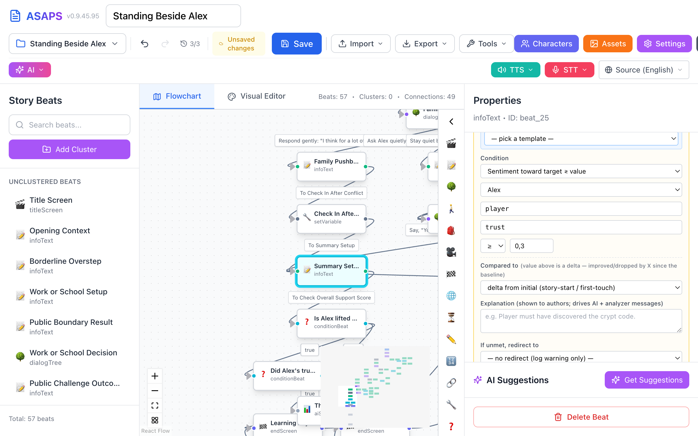
*A requirement on the **Summary Setup** beat, seeded by the *Sentiment — trust toward player has grown since start* template and pointed at Alex. The template wrote everything below the *Apply a template* row in one click; the only tweak the author has to make is filling in the character. Note the **Compared to** value of *delta from initial (story-start / first-touch)* — the requirement reads "Alex's trust toward the player has grown by at least 0.3 since the start of this run", which is what a "thoughtful-ally" summary beat almost certainly means dramatically.*

Use requirements when the gating concept *belongs to the destination beat* — "this private conversation only makes sense if Alex is in a state to talk" — rather than when it belongs to the choice that leads there. The runtime treats both the same way; the distinction is for you, the author, when you re-read your own story.

## Animations

Bring scenes to life with movement.

### Waypoint Animations

1. Select an element (character, prop)
2. Open **Animations** tab
3. Click **Add Waypoint**
4. Click on stage to add path points
5. Drag bezier handles for curves
6. Set duration and easing

### Animation Properties

| Property | Effect |
|----------|--------|
| Duration | How long the animation takes |
| Easing | Acceleration curve (linear, ease-in, bounce, etc.) |
| Loop | Whether to repeat |
| Auto-start | Begin on beat load vs. triggered |

### Sprite Animations

Use sprite sheets for frame-by-frame animation:
1. Upload a sprite sheet image
2. Configure frame dimensions
3. Set frame sequence and timing
4. Assign to character appearances

## Theming & Styling

### Global Settings

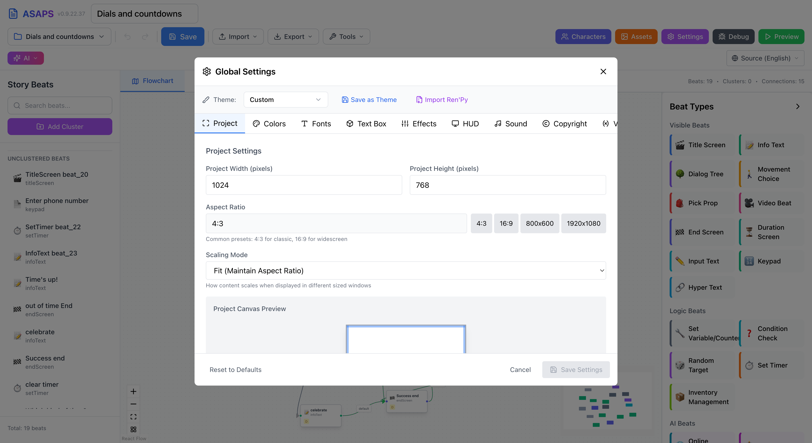
*The Settings panel*

**Settings → Project:**
- Stage dimensions and aspect ratio (4:3, 16:9, etc.)
- Scaling mode
- Mobile display settings (font scaling, safe zone preview)
- **Layout Mode** — *Responsive layout* (green) or *Fixed canvas* (amber). Switching runs the one-shot migrator with a preview; see [Responsive vs Fixed Layout](#responsive-vs-fixed-layout).
- **Orientation** — *Flexible*, *Portrait only*, or *Landscape only*. Affects how the player handles device rotation (a locked project shows a "rotate your device" prompt when held the wrong way).

**Settings → Colors:**
- Button colors
- Text box colors
- Background color

**Settings → Fonts:**
- Default fonts for titles, body, buttons
- Font sizes
- Line height

**Settings → Text Box:**
- Text box appearance: corners, padding, borders, position
- **Background Opacity** — slider (0–100%) controlling how transparent the text-box background is
- **Box Visibility** — *Show All Boxes*, *Hide Text/Dialog Boxes* (text renders directly on the stage, no box behind it), or *Hide All Boxes* (buttons also render as bare labels). Great for stories where the artwork should carry the frame and text floats over it.

Since v0.9.71, both Box Visibility and opacity apply **everywhere**: the Visual Editor, the Preview Window, exported stories, and responsive (slot-mode) layouts all honor them consistently. What you set here is what your interactors get.

**Settings → Effects:**
- Text animations (typewriter, fade)
- Hotspot visibility (Hotspot Area Visibility, Label Display)
- <a id="speaker-display"></a>**Speaker Display** (sub-section) — controls how speaker names and portrait graphics appear during playback:
  - **Show speaker names** — Master toggle for displaying character names during dialog
  - **Show speaker portraits** — Master toggle for character portrait images in text boxes
  - **Name style** — How the speaker name appears:
    - *Label* — Name shown above the text box
    - *Inline* — Name shown bold at the start of the text inside the box
    - *Off* — Name hidden
  - **Name position** — Left or right alignment for the speaker name
  - **Name color** — Custom color for the speaker name text
  - **Portrait position** — Where the portrait image appears:
    - *Inside left / Inside right* — Small portrait inside the text box
    - *Above left / Above right* — Larger portrait above the text box
  - **Portrait size** — Size in pixels (default: 48px inside, 80px above)

  Individual beats can override these global settings. This lets you hide the speaker name for narration beats while showing it for dialog, for example.

**Settings → HUD:**
- Timer / Time Display overlay (timer name, default text, position)
- Fictional Time overlay
- Countdown Meter overlay
Each overlay has its own *Enabled* toggle and renders on the running stage when on.

**Settings → Sound:**
- Background music and volume settings
- Background music respects browser autoplay policies -- if the browser blocks automatic playback (common on first page load), playback starts automatically on the interactor's first click, keypress, or tap

**Settings → Copyright:**
- Author name, copyright year, and license text embedded in exports and the credits page.

**Settings → Variables:**
- Define global variables for tracking story state

**Settings → Translation:**
- Source language and translation management

**Settings → Debug:**
- Testing options: start beat override, variable display

### Text Effects

- **Typewriter** - Letters appear one by one
- **Fade** - Text fades in
- **None** - Instant display

Adjust speed in Settings.

### Theme Presets

Load complete visual styles:
- **Visual Novel** - Traditional VN aesthetic
- **Twine** - Hypertext fiction style
- **Point-and-Click** - Adventure game look

### Custom Themes

Create and save your own themes, including:
- All color settings
- Typography choices
- UI element styling
- Bundled fonts

## Timers, Countdowns & Fictional Time

ASAPS Modern has two distinct time systems: **real-time timers** that count down in seconds, and **fictional time** that tracks an in-story date and clock.

### Real-Time Timers

1. Add a **Set Timer** beat before your choice
2. Configure duration and target (what happens when time runs out)
3. The following Dialog Tree will show a countdown
4. If time expires, story jumps to the timer's target

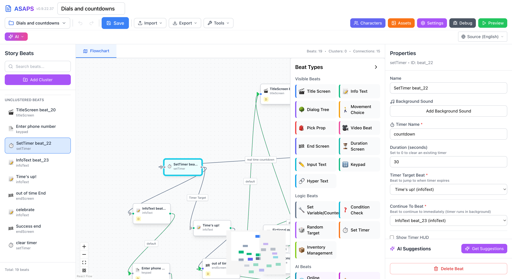
*A SetTimer beat creating a 30-second countdown*

**Key Settings:**
- **Timer Name** - Identifier (e.g., "countdown")
- **Duration** - Seconds until expiry
- **Timer Target Beat** - Where to go when time runs out
- **Countdown To Beat** - Which beat shows the countdown bar (optional)
- **Show Timer HUD** - Display a persistent countdown overlay

**Clearing Timers:** Set duration to 0 to clear a running timer. Useful after the interactor completes a challenge before time runs out.

### Timer HUD

The Timer HUD is a persistent overlay that appears in a corner of the stage. Configure it in **Settings → HUD → Timer / Time Display**. Toggle **Enabled** and the configuration unfolds:

- **Timer Name** — Which named timer to track (leave empty to follow the first active timer)
- **Show "00:00" when no timer active** — Whether to display a placeholder zero-time when nothing is counting down
- **Default Text** — What to show when no timer is running (e.g., *"9:00 AM"*, *"Day 1"*, *"2h left"*). Individual beats can override this in the Inspector's Advanced section.
- **Position** — Top Left, Top Right, Bottom Left, or Bottom Right
- **Style** — Digital clock font or plain text
- **Font size**, **text color**, **background color**, **background opacity**, **border radius**, **padding**
- **Show label** + **Label text** — Optional label rendered above the time display

The HUD's display logic is layered: an active timer countdown takes priority, then per-beat time text, then the default text. Two sibling overlays — **Fictional Time** and **Countdown Meter** — sit alongside it on the same Settings page and can be enabled independently.

### Fictional Time System

Fictional time tracks an in-story date and time that's independent of real-world time. Use it for day/night cycles, appointment deadlines, or "three days later" transitions.

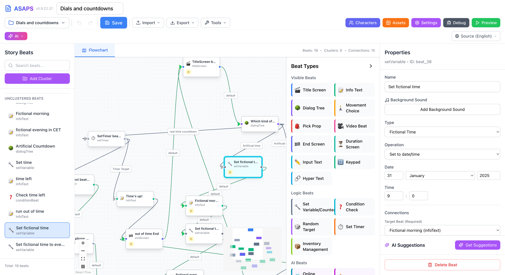
*Setting the fictional time to January 31, 2025 at 9:00*

**Setting Fictional Time:** Use a **Set Variable** beat with type set to **Fictional Time**:

- **Operation** - *Set to datetime* (absolute), *Advance* (add time), *Subtract* (go back)
- **Date** - Day, month, year
- **Time** - Hour and minute

**Checking Fictional Time:** Use a **Condition Beat** with the fictional time variable:

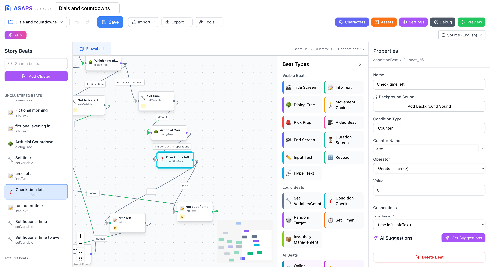
*A condition beat checking whether fictional time is past a threshold*

- Compare with operators: equals, greater than, less than
- Branch your story based on what "time" it is in the narrative

**Displaying Fictional Time:** When the Timer HUD is enabled and fictional time is set, the HUD automatically displays the formatted time (e.g., "9:00 AM" or "Jan 31, 2025 9:00"). This appears even when no real-time countdown is active.

**Fictional-time HUD in the Visual Editor (v0.9.59).** When all three switches line up — **Settings → HUD → Timer / Time Display** *Enabled*, **Settings → HUD → Fictional Time** *Enabled*, and that section's **Show in Timer HUD** option turned on — the Visual Editor's slot/spatial preview now renders the chip too, in the configured corner and at the configured `displayFormat` (e.g., a green *"1 January 2024, 9:00 AM"* chip at top-right). So you can see WHERE the chip will sit and HOW the initial time renders without leaving the editor. The chip stays hidden in the VE when any of those switches is off.

**Example: Day/Night Cycle**
```
[Set fictional time to 8:00 AM]
    ↓
[Morning scene - "The sun rises over the village"]
    ↓
[Advance time by 6 hours]
    ↓
[Check: time > 2:00 PM?]
  → true: "Afternoon market" (shops are open)
  → false: "Morning errands" (shops still closed)
```

### Timer Strategies

- **Urgency** - Force quick decisions under time pressure
- **Narrative time** - Track in-story hours/days with fictional time
- **Deadlines** - Combine real timers with fictional time for "you have until midnight"

## Random Elements

### Random Encounters

Use **Random Target** beats to add variety:
```
[Enter Forest]
    ↓
[Random Target]
  → 40% "Peaceful path"
  → 30% "Wolf encounter"
  → 20% "Find treasure"
  → 10% "Mysterious stranger"
```

Interactors get different experiences on replay.

## Inventory Management

### Transfer Items

Move items between characters:
```
[Trade Scene]
Player gives "Gold" (50) to Merchant
Merchant gives "Magic Sword" to Player
```

---

# Part 9: Version Control & Collaboration

Once your story grows past a certain size you'll want history, backups, and (eventually) co-authors. ASAPS has built-in Git support that talks directly to GitHub, so the trip from "I want to back this up" to "my collaborator just pushed an edit" doesn't require leaving the app.

This part of the guide is for the **Desktop app** working on **directory-format projects** (saved as a folder, not a single `.zip`). Web-builder projects don't currently support version control.

## Why Bother With Version Control?

Three good reasons:

- **History** — see what changed and when, and roll back mistakes without ceremony.
- **Backup** — your work lives on GitHub as well as your laptop. Spilled coffee, missing laptop, doesn't matter.
- **Collaboration** — co-authors edit the same project, and ASAPS handles the merging.

If you've never used Git before, that's fine — the on-screen prompts walk you through setup the first time. You don't need to learn the command line.

## Quick Start: Three Paths In

The **File menu** has the three entry points:

| Menu item | What it does |
|-----------|--------------|
| **File → New Project on GitHub…** | Creates a fresh project folder on disk, sets up Git, and publishes a brand-new repository to GitHub — all in one dialog. Best for "I'm starting something new and I want it backed up from day one." |
| **File → Open Project from GitHub…** | Clones an existing GitHub repository into a local folder and opens it. This is the path collaborators take when joining a project someone else created. |
| **File → Open Project Folder (VCS)…** | Opens an existing folder on your disk that's already a directory-format project (and usually already a Git repo). ASAPS auto-detects the repo and turns on the VCS panel. |

Whichever path you pick, if it's your first time using GitHub from ASAPS the app will hand you off to a guided onboarding flow before doing the actual work.

## First-Time Setup: The Onboarding Flow

ASAPS uses two command-line tools under the hood: **`git`** (the version control system itself) and **`gh`** (the official GitHub CLI, which handles authentication and creating repos). Both are free, well-maintained, and probably already installed if you've done any developer work — but if not, ASAPS will detect that and show install instructions.

### Step 1: Install the tools (if needed)

If `git` or `gh` is missing, you'll see a panel listing the status of each (✓ or ✗) and a copy-paste command appropriate for your operating system:

| OS | Suggested install command |
|----|---------------------------|
| **macOS** | `brew install git gh` |
| **Windows** | `winget install --id Git.Git -e ; winget install --id GitHub.cli -e` |
| **Linux** | `sudo apt install git gh` |

Each command has a **Copy** button so you can paste straight into a terminal. There are also direct links to the official installers if you'd rather download them by hand. After installing, click **Re-check** in ASAPS to refresh the detection.

### Step 2: Sign in to GitHub

Once `gh` is installed, click **Sign in with GitHub**. ASAPS runs `gh auth login --web` for you, which opens a browser window with a one-time code. Paste the code into the browser, authorise ASAPS, and come back. The signing-in process streams its output into a log box on screen so you can see exactly where it's at; if anything goes sideways, hit **Cancel sign-in** to abort and try again.

The credentials live in `gh`'s system-wide credential store — ASAPS doesn't keep a copy.

### Step 3: Connect to a remote (or skip)

If you're using **New Project on GitHub** or **Open Project from GitHub**, ASAPS handles this step automatically. If you've opened an existing project folder that isn't yet on GitHub, you can either:

- **Create a new GitHub repo** — pick a name and visibility (private by default — going public→private *after* pushing is a bad time), and ASAPS runs `gh repo create … --source=. --remote=origin --push`.
- **Connect to an existing empty repo** — paste a GitHub URL you've already created at `github.com/new` and ASAPS sets it as the remote and pushes.

ASAPS automatically handles a footgun that catches first-time users: if `git` doesn't have your name and email configured locally, the first commit fails with a cryptic error. Before committing, ASAPS reads your GitHub identity via `gh api user` and writes `user.name` / `user.email` into **the project's local repo** only — never into your global git config. If you've already configured git globally, that takes precedence.

## Creating a Brand-New Project on GitHub

**File → New Project on GitHub…** is the most direct route from "I have an idea" to "my project is on GitHub":

1. Pick a **parent folder** on disk — somewhere ASAPS can create a new sub-folder for the project.
2. Type a **project name**. This is also the GitHub repository name and the local folder name. ASAPS sanitises it (spaces become hyphens, special characters drop out) so it's a valid GitHub repo name.
3. Choose **Private** (recommended — only you and people you invite can see it) or **Public** (visible to the world). You can change this on GitHub.com later, but only with caveats — keep it private unless you're sure.
4. Click **Create and push**. ASAPS:
   - Creates the folder
   - Writes an empty ASAPS directory-format scaffold into it
   - Runs `git init` and makes the initial commit
   - Runs `gh repo create <username>/<name> --source=. --push` so the repo exists on GitHub with your initial commit already pushed

When that's done, ASAPS opens the project and you can start authoring. Every save is automatically tracked by Git, ready to be committed and pushed.

## Joining a Project Someone Else Created (Collaboration)

The everyday team workflow looks like this:

1. **Author A** creates the project via *File → New Project on GitHub…* and invites collaborators on **github.com** (Settings → Collaborators on the repo page).
2. **Author B** accepts the invite by email, copies the repository URL from GitHub, and uses *File → Open Project from GitHub…* in ASAPS. After cloning, the project opens and the VCS panel becomes available.
3. From here, both authors edit, commit, and push. The VCS panel's **Incoming** tab shows when one author has pushed work the other hasn't pulled yet.

The first time a collaborator joins, they go through the same install + auth onboarding as the project's creator did — install `git`/`gh`, sign in with GitHub, then clone.

## The VCS Panel

Once a project is under version control, the **VCS panel** lives at the bottom of the window. Toggle it with **Ctrl/Cmd+Shift+G** or via *Version Control → Toggle VCS Panel*. It has four tabs:

### Pending Changes

Everything you've changed since your last commit. Each modified file appears with a coloured indicator (added / modified / deleted) and you can:

- **Stage** an individual file (the green check) or **Stage All** at once.
- **Unstage** anything you don't want to commit yet.
- **Revert** to discard local changes (with a confirmation — this can't be undone).
- Click a file to open a diff in the right pane and see exactly what changed.

Below the file list, type a **commit message** and click **Commit** (or **Commit and Push** to send to GitHub in one step). If nothing's staged when you click Commit, ASAPS auto-stages everything currently changed for you — saves a click for the common "I want to commit everything" case.

### Incoming

This tab is where you fetch and push:

| Button | What it does |
|--------|--------------|
| **Fetch** | Checks GitHub for changes other collaborators have pushed. Doesn't apply them yet — just tells you what's there. |
| **Pull** | Fetches and applies remote changes, creating a merge commit if your local work and the remote work both moved on. |
| **Pull (Rebase)** | Fetches and replays your local commits on top of the remote ones — a tidier history with no merge commits. |
| **Push** | Sends your local commits up to GitHub. The button label shows how many commits are queued (e.g., "Push (3)"). |

The header shows **↑ ahead** (your local commits not yet pushed) and **↓ behind** (remote commits you haven't pulled) so you can see at a glance who's where.

### History

The full commit log for the project. Click any commit to see which files it touched and the diff for each. Useful for "who changed this and why?" investigations.

### Branches

View the current branch and switch between any branches that already exist. Note: ASAPS doesn't currently let you **create** new branches from inside the app — see [What's not (yet) supported](#vcs-not-supported) below.

## Beat-Level Status Indicators

Each beat on the canvas shows a small coloured dot in the top corner that mirrors its Git status:

| Colour | Meaning |
|--------|---------|
| Green | New (added since last commit, untracked) |
| Orange | Modified since last commit |
| Red | Has a merge conflict |
| Purple | Being edited by another collaborator (advisory) |

So you can see at a glance which parts of your story have unsaved-to-Git changes without opening the VCS panel.

## Merge Conflicts

When you and a collaborator edit the same beat in incompatible ways, pulling produces a **merge conflict**. ASAPS handles this gracefully:

1. The conflicting beat shows a **red dot** on the canvas.
2. The VCS panel highlights the conflicting file and offers two buttons: **Keep Mine** or **Accept Theirs**.
3. If a rebase is mid-flight with multiple conflicts, ASAPS walks you through them one at a time.

Merge conflicts in beats happen less often than you'd think because each beat is its own JSON file in the directory format — two collaborators can edit different beats freely without ever conflicting.

## Advisory Editing Locks

Even with per-beat files, two people editing the *same* beat at the same time will eventually conflict. ASAPS helps you avoid that by tracking who's currently editing what — **advisorily**, no actual locking:

- When you select a beat in the Inspector, ASAPS writes a small entry into `.asaps-editing.json` in the project root.
- That file rides along with normal commits/pushes/pulls.
- Collaborators see a **purple dot** on beats you're currently editing, and the Inspector banner says something like *"Alice is currently editing this beat"*.
- Locks expire automatically after **2 hours**, so a crashed app or forgotten session doesn't leave a permanent ghost lock.

Treat purple dots as a friendly "consider working on something else" hint rather than a hard barrier.

## Common Hiccups & How to Fix Them

### "I made changes but the VCS panel doesn't show anything to commit"

Open the **Pending Changes** tab. If your changes are there but unstaged, click **Stage All** (or the green check next to individual files), write a commit message, and click **Commit**. If they're already staged, just commit. If the panel really shows nothing, double-check you saved (Cmd/Ctrl+S) — Git only sees what's been written to disk.

### "Push rejected — the remote has commits I don't"

This means a collaborator pushed something while you were working. Switch to the **Incoming** tab, click **Pull** (or **Pull (Rebase)** if you prefer cleaner history), resolve any merge conflicts that pop up, and then come back and **Push** again.

### "My project is in iCloud / Dropbox / OneDrive — is that OK?"

It works, but synced folders sometimes interfere with Git in subtle ways (lock files, partial writes, two clients trying to apply the same changes). If you hit weird errors that don't make sense, try moving the project somewhere outside the synced folder — `~/Documents/GitHub/` is a popular choice. The version control history stays intact through GitHub, so moving the local copy is safe.

### "I cloned a repo but the assets are missing"

If the repo was created on a system with **Git LFS** enabled, the asset binaries may be stored as LFS pointers rather than real files. ASAPS explicitly disables LFS, so cloning an LFS-tracked repo will give you placeholder pointer files instead of the actual images/audio. Workaround: have the original author do a one-time `git lfs migrate import --everything` + `git push --force` to convert the binaries back to plain blobs. This is rare in practice — newer ASAPS projects don't use LFS at all.

<a id="vcs-not-supported"></a>
## What's Not (Yet) Supported

A few Git features that authors sometimes look for and don't find:

- **SSH-based remotes** — ASAPS uses HTTPS through `gh`'s credential helper. Repos with `git@github.com:...` URLs aren't directly supported; convert to the `https://github.com/...` form.
- **Creating branches inside ASAPS** — you can switch between existing branches, but creating new ones currently requires using `git` or `gh` in a terminal. (Branch authoring inside the app is on the roadmap.)
- **Multi-remote setups** — ASAPS assumes a single `origin`. If you've added other remotes manually, they won't appear in the UI but they won't break anything either.
- **Git LFS** — explicitly disabled. Asset binaries are committed as plain Git blobs.
- **GitLab, Bitbucket, self-hosted Git** — only GitHub is wired into the onboarding flow. You can manually `git init` and add a non-GitHub remote in a terminal, but the in-app authentication and "create repo" flows are GitHub-specific.

If any of these are blocking you, file an issue on the ASAPS repo — these are the features most likely to land first as the version-control story matures.

---

# Part 10: Search, Translation & Productivity

## Undo & Redo

ASAPS Modern maintains a full undo/redo history for beat operations:

- **Ctrl/Cmd+Z** - Undo the last operation
- **Ctrl/Cmd+Shift+Z** - Redo
- The **History dropdown** (next to undo/redo buttons) shows recent operations

Supported operations: edit beat properties, add beats, delete beats, move beats. The undo stack persists for the current session.

## Search & Replace

Find and modify content across your entire project:

1. Press **Ctrl/Cmd+F** or click **Tools → Search**
2. The Search panel appears at the bottom

**Features:**
- Search across beat names, text content, dialog choices, and properties
- **Replace** individual matches or replace all
- **Case-sensitive** toggle
- **Regex** support for pattern matching
- Results grouped by beat with context preview
- Click a result to select that beat in the canvas

**Use Cases:**
- Rename a character across all dialog
- Find all beats mentioning a specific location
- Replace placeholder text throughout the story

## Multi-Language Translation

Create localized versions of your story with AI-assisted translation:

1. Click the **language selector** (top right, shows "Source (English)")
2. Add target languages
3. Switch to a target language to enter translations

**How Translation Mode Works:**
- The Inspector shows translatable fields with the source text as reference
- AI can auto-translate all strings for a beat or the entire project
- Translations are stored alongside the story data
- **Staleness detection** highlights translations that may be outdated when the source text changes

**Everything the player sees translates (v0.9.71+).** Translation coverage isn't limited to your authored beat text — since v0.9.71 *all* player-facing text follows the active language, in the Preview Window and in exports alike. That includes the pieces that used to be easy to miss: the inventory HUD title and hints, the AI loading messages ("Thinking…", "…is getting ready to speak"), runtime UI chrome like Continue/Play Again/Credits fallbacks and input placeholders, Multi Choice choice labels, and an AI Conversation's scripted opening line. One deliberate exception: the Input Image beat's **AI Analysis Prompt** stays in the source language, because it's an instruction to the AI rather than player-facing text.

**VCS-Aware:** Translations persist through git operations (push, pull, merge) and are saved in the directory project format.

## Transformation Commands

Bulk operations accessible from the **Tools** dropdown in the header:

- **Transformations** - Bulk transformation commands (also accessible via Ctrl/Cmd+Shift+K)
- **Merge DialogTrees** - Combine multiple DialogTree beats into a nested conversation

The **Auto-Arrange** button is available directly on the flowchart canvas (bottom-left controls). The **Debug** button in the header provides reachability analysis, path analysis, and logic validation.

## Desktop App Features

The ASAPS Desktop app (built with Electron) provides additional capabilities:

- **Directory projects** - Stories saved as folders of JSON files (better for version control)
- **Native file dialogs** - Save/open using OS file picker
- **Git integration** - Full VCS support (see Part 9)
- **Local file access** - Direct read/write without browser limitations

---

# Appendix A: Beat Reference

Quick reference for all beat types.

## Visible Beats

| Beat | Purpose | Key Settings |
|------|---------|--------------|
| Title Screen | Story opening | title, subtitle, author, button text |
| Info Text | Narration | text, button text, textVariations (optional array for random selection) |
| Explanation | Label the on-screen HUDs | text, button text, per-HUD callout captions (timer, countdown, counters, inventory, mood — blank uses built-in wording); only draws callouts for HUDs actually on screen |
| Dialog Tree | Choices | prompt, choices (each with text, target, condition), NPC auto-exit target, presentation mode, markVisited, choice effects |
| Movement Choice | Navigation | description, destinations |
| Pick Prop | Item selection | prompt, props, display mode |
| Duration Screen | Timed display | text, duration, show timer, textVariations (optional) |
| Video Beat | Video playback | video asset, autoplay, controls, skip, captions (cue rows: start/end/text, auto-translated into per-language subtitles), captionsEnabled, videoTranslations (per-language video override) |
| Input Text | Text entry | prompt, placeholder, validation, save target |
| Input Image | Photo submission + AI vision analysis | prompt, analysisPrompt (AI instruction, stays in source language), saveTo, imageSource (camera/upload/both), buttonText, cancelButtonText, fallbackValue (stored on skip/failure/timeout), timeout, speaker |
| Keypad | Numeric input | prompt, layout (phone/numeric/pin), correct code, max attempts, min/max digits, mask input, save to |
| QR Scan | Real-world QR code scan | prompt, saveTo, interpretAsapsUri, facing (rear/front), matchPatterns (regex), helperText, cancelButtonText, speaker (also: built-in `asaps://` QR generator panel) |
| Web View | Embed external URL | url, prompt, exitUrlPattern (regex), passContext (variable names to inject as URL hash), saveTo (from postMessage), doneButtonText, speaker |
| AR Scene | AR with image-marker tracking | prompt, trackingMode (marker), markerAssetId (`.mind` file), anchors[] (id, label, assetId, offsetX/Y, scale, onTap as beat id or `asaps://` URI), cancelButtonText, fallbackTarget, speaker |
| Hyper Text | Clickable text | text with links, link targets |
| 360 Panorama | Panoramic view | panorama image, hotspots (pitch/yaw), starting orientation, field of view |
| GPS Location | Map + geofenced locations | mode (display / trigger-on-arrival / trigger-on-departure), location entries (name, lat/lng, radius, target, effects), radius (m), instructional text, button/skip text, timeout, map style, show player marker; entries also support a project-file-level `pointName` binding to a Set GPS Location point set |
| Indoor Location | Floor plan + beacon zones | mode (display / trigger-on-arrival / trigger-on-departure), target beacon UUID (from Settings → Location & XR → Indoor venue), radius (m), instructional text, button/skip text, timeout |
| End Screen | Story ending | message, show restart, show credits, reset (with granular sub-options: variables, counters, inventory, timers, fictional time, visited tracking, history), restart text, credits text, credits page title, credits page body, credits close text |
| Online Content | Live web data | mode (API/AI), query, template |

## Logic Beats

| Beat | Purpose | Key Settings |
|------|---------|--------------|
| Set Variable/Counter | Change state | variable name, value (true/false, or `=`-prefixed arithmetic expression), counter operations, or fictional time |
| Set GPS Location | Write a named GPS point set into story state | mode (capture / explicit / scatter / preset), point set name, point radius (m), lat/lng, fallback lat/lng, scatter: count + radius + center source + placement (uniform / walkable via OpenStreetMap), preset: map point curator |
| Condition Check | Branching | condition type (counter, counterCompare, timer, inventory, variable, fictionalTime, mood, emotion, trait, sentiment, goal, characterVariant, gpsProximity, indoorProximity, permissionGranted), per-type fields, true target, false target. (Per-beat *Requirements* — see [Per-Beat Requirements](#condition-beats) — additionally support a `visitedBeat` check.) |
| Random Target | Randomization | targets with optional weights |
| Set Timer | Timed events | timer name, duration, expiration target |
| Inventory Management | Item management | action (add/remove/transfer), item, quantity, character |
| Update Affect | Mood / sentiment / emotion drift, bookmarks, reflections, goal & variant flips | `effects[]` — multi-row Effect array, same shape and editor as a choice's effects (templates, palette auto-complete, live summary, bookmark snapshots). Legacy single-row fields still load and run for older projects. |

## AI Runtime Beats

| Beat | Purpose | Key Settings |
|------|---------|--------------|
| AI Info Text | Dynamic narrative text | prompt, fallbackText, buttonText, includeVariables, includeInventory, includeHistory, maxSentences |
| AI Duration Screen | Dynamic timed text | prompt, fallbackText, wordsPerMinute, minDuration, maxDuration, context options |
| AI Condition | AI branching | prompt, categories, fallback |
| AI Dialog Tree | AI pre-generated conversation | scenario, npcName, npcPersonality, exitTargets (with npcExitMessage), maxTurns, presentationMode, prefetch support |
| AI Conversation | Real-time AI conversation | presentation (chat / dialog — set in the Visual Editor's Conversation Settings), scenario, npcName, npcPersonality, directions (trigger + action), maxTurns, fallbackExitTarget, enableVoiceInput, openingLine |
| AI Summary | Journey recap | style, length, include options |

---

# Appendix B: Keyboard Shortcuts

| Shortcut | Action |
|----------|--------|
| Ctrl/Cmd + S | Save project |
| Ctrl/Cmd + Z | Undo |
| Ctrl/Cmd + Shift + Z | Redo |
| Ctrl/Cmd + F | Search & Replace |
| Ctrl/Cmd + Shift + P | Open Preview window |
| Ctrl/Cmd + Shift + K | Open Transformations panel |
| Ctrl/Cmd + I | Toggle inventory (in preview) |
| Delete | Delete selected beat |
| Escape | Deselect / Close panel |
| Shift + Click | Multi-select elements (Visual Editor) |

---

# Appendix C: Glossary

**ASML** - Advanced Stories Markup Language. The language for storing narrative systems: **ASML 2.0** is the native JSON serialization inside every project zip; **ASML 1.0** is the original XML, still importable but frozen for export.

**Beat** - A potential moment in your narrative system. The atomic unit of IDN.

**Character** - An entity in your system with potential appearances, stats, and inventory.

**Cluster** - A group of beats organized together, either for tidiness or to represent a location.

**Connection** - A link between beats defining possible transitions in the experience.

**Counter** - A numeric quantity scoped to a character (gold, health, reputation). Either *authored* — you move it with effects — or *bound*, reading a feeling instead. See [Counters that read affect](#counter-binding).

**Bound counter (derived counter)** - A counter whose value is not stored but read live from a character's sentiment, emotion level, or mood. It renders as an ordinary meter but is read-only: write surfaces disable it with the reason, while conditions read it normally.

**Counter band** - A named range on a counter — a threshold plus a phrase — rendered instead of the number when the counter's value format is set to *words*. `−60 → "wary"`, `20 → "trusting"`. Player-facing, so band labels translate.

**Meter Frame** - The HUD panel that draws a character's visible counters as bars, docked either beside the character or in a screen corner. Carries a header with the character's name and colour dot.

**Flowchart** - The visual graph showing beats and their connections.

**Hotspot** - An invisible clickable area on the visual stage.

**IDN** - Interactive Digital Narrative. A narrative expression implemented as a dynamic computational system that changes due to input from interactors.

**Inspector** - The panel showing properties of the selected element.

**Instantiation** - What happens when an interactor engages with a protostory—a specific narrative emerges from the possibilities.

**Interactor** - The participant who engages with an IDN. Not a passive reader or viewer, but an active participant whose choices shape the experience.

**Logic Beat** - A beat that processes behind the scenes without displaying to the interactor.

**Narrative System Builder** - The creator of an IDN. Unlike traditional authors who produce fixed artifacts, system builders create dynamic systems containing multiple potential narratives.

**Protostory** - The narrative system you create—containing all the potential narratives that could emerge through interaction. Distinguished from a fixed "story."

**State** - The collective memory of your system: variables, counters, inventory, history.

**System Builder** - See "Narrative System Builder."

**Variable** - A true/false flag that tracks conditions (hasKey, metWizard).

**Visible Beat** - A beat that displays content to the interactor.

**Visual Editor** - The WYSIWYG interface for designing beat appearances.

**AI Conversation** - A beat type that enables real-time, free-form AI-powered conversations steered by author-defined directions.

**Conversation Direction** - A trigger + action rule that steers an AI Conversation. Triggers detect what the player says; actions control how the AI responds or where the story goes next.

**Choice Effects** - Variable, counter, inventory, or affect changes (nudge mood, fire emotion, add sentiment, set goal status, set character variant, add reflection) that trigger immediately when a dialog or movement choice is selected. Authored in the **Effects:** section of any choice via the **+ Add Effect** button or, for affect-stack bundles, the **+ apply template…** dropdown. See [Easier authoring: labels, palette suggestions, templates, and a live summary](#effects-easier-authoring).

**Effect Template** - A preset, intent-shaped bundle of affect-stack effects (mood, emotion, sentiment, reflection, counter changes) that the choice editor appends in one click. Eight defaults ship: *Empathetic — full support*, *Empathetic — partial / well-meaning*, *Pushy / dismissive*, *Silent / felt-abandoned*, *Boundary respecting*, *Validating / "I see you"*, *Defensive overreach*, *Quiet recovery*. Templates infer the target character from existing rows and only emit counter increments for counters that exist in the project.

**Condition Template** - A preset, intent-shaped condition shape (type, character, operator, value, baseline, plus per-type fields like sentiment target or emotion name) that the Inspector seeds in one click. 28 defaults ship across six categories (Mood, Emotion, Sentiment, Trait, Goal, Active variant); most categories ship in two flavours — threshold *(now)* and delta-from-initial *(since start)*. Available in both the Condition Beat editor and per-beat requirement cards. See [Condition templates](#condition-templates).

**Baseline (condition)** - The reference point a Mood / Emotion / Sentiment condition compares against. Three modes: **literal** (compare the slot's current value to a fixed threshold), **delta from initial** (compare the slot's current value to the value at story-start or first-touch — robust to off-neutral seeds), **delta from a named bookmark** (compare against a snapshot recorded earlier with the *Bookmark Affect State* effect). Set via the **Compared to** picker on the condition form. See [Baseline-relative comparisons](#baseline-relative-comparisons).

**Initial value (affect)** - The mood / emotion / sentiment value the runtime captures the first time a condition with `baseline: 'initial'` reads the slot, or — for characters with authored seeds — at story-start. Used as the reference point for *delta from initial* baselines, so a character seeded with valence `-0.3` reads `initial = -0.3` rather than `0`, and *"valence has improved by 0.3"* fires when current valence reaches `0.0`.

**Bookmark / Affect bookmark** - An author-named snapshot of mood / emotion / sentiment state taken at a specific point in the story via the *Bookmark Affect State* effect. Conditions reference it by name through the *delta from a named bookmark* baseline mode — `delta vs. "reunion-scene"`. Bookmarks can scope to all characters or to a single target. See [Bookmark Affect State (effect)](#bookmark-affect-state-effect).

**Affect Summary** - The small italic blue-tinted block (prefixed with `→`) shown below the effect rows in the Choice Effects editor. Synthesises the cumulative effect of the choice in plain language ("Alex: feels happier; joy spikes; trust toward the player grows (+0.50) · +2 supportScore"), updating live as the author tweaks values. Hidden when no effects or every delta is below noise.

**Personality Archetype** - One of ten research-grounded Big Five presets (Balanced, Narcissist, Anxious introvert, Conscientious leader, Free spirit, Recluse, Hothead, Peacekeeper, Stoic, Trickster) that can be loaded onto a character to seed traits and, in some cases, self-directed sentiments.

**Big Five** - The five static personality traits (Openness, Conscientiousness, Extraversion, Agreeableness, Neuroticism) authored on a character in `[0, 1]`. Modulates emotion deltas at runtime; never gates choices on its own.

**Mood (Valence, Arousal)** - A character's two-dimensional affect, plotted on Russell's circumplex. Valence runs sad ↔ happy; arousal runs calm ↔ excited. Both axes are continuous in `[-1, 1]`.

**Mood Pad** - The 2D interactive disc used to set a character's initial mood. Available in the Affect tab (large) and as a runtime HUD overlay (small).

**Sentiment** - A directed feeling — a (holder, target, emotion, strength) tuple. *Trust toward player +0.5*, *fear toward wolf +0.7*. Self-directed sentiments (where holder = target) render as *self-shame*, *self-pride*, etc.

**Emotion Palette** - The project-wide list of emotions characters can feel. Defaults to the Ekman 6 (joy, anger, fear, sadness, surprise, disgust) plus pride, shame, and interest. Each emotion has valence and arousal weights and a decay rate.

**Goal** - An authored objective on a character (id, name, optional description, optional priority). The runtime tracks status; goals flipped to `met` or `failed` auto-fire pride/joy or shame/sadness scaled by priority (GAMYGDALA-style).

**Variant** - An alternate persona overlay on a character that shares the character's stable id but carries its own personality, mood, sentiments, dossier policy, portrait, and (optional) display name. Switched at runtime via the `setCharacterVariant` effect, or drawn at random each playthrough when the character's story-start policy is *Pick randomly each playthrough*.

**Variant Selection Policy** - The per-character "At story start" setting (shown when a character has 2+ variants): *Use default variant* applies the variant marked default; *Pick randomly each playthrough* draws a fresh variant on every story start and preview restart. An authored `setCharacterVariant` effect always overrides the policy.

**Interpersonal Stance / Stance Pad** - A character's or variant's way of meeting other people, plotted on a 2D "Leary's Rose" pad: warmth (cold ↔ warm) × dominance (submissive ↔ dominant), with corner labels *hostile*, *leading*, *withdrawn*, *cooperative*. The pad is a lens on Big Five extraversion and agreeableness — dragging the dot updates both. Appears on the base Personality card, on each variant card, and on the AI character helper's preview cards.

**Project Template (.asapst)** - A project exported as a distributable template (like Word's `.dotx`). Importing or double-clicking one always instantiates a fresh copy as a new project; the template file itself is never edited. Bundled templates appear in the template gallery and the Project Browser's template row.

**Dossier Policy** - How the LLM sees a character in AI beats. *Mode A (re-anchor)* rebuilds the dossier from structured state every turn. *Mode B (accumulate reflections)* appends short narrative notes the character has made about themselves over the session.

**Reflection** - A short narrative note in a character's voice, paired with a salience score in `[0, 1]`, appended to a Mode B character's memory. Seeded via the `addReflection` choice effect or the runtime API.

**Mood HUD** - An optional small 2D mood-pad overlay that mounts on the running stage to show a character's mood updating in real time during play.

**NPC Auto-Exit** - A Dialog Tree feature where a dialog node automatically advances to a target beat after the NPC speaks, without showing choices to the player.

**Session Timeline** - An automatic log of significant events during story playback, including beat transitions, player choices, AI outputs, and branching decisions.

**Markdown-Lite** - Lightweight text formatting supported in text boxes: `**bold**`, `*italic*`, `~~strikethrough~~`, and line breaks.

**Layout Mode** - Project-level setting (v0.9.59+) that decides whether the project uses *Responsive layout* (slot/spatial flow, reflows to any viewport, default for new projects) or *Fixed canvas* (pixel positions on a 1024×768-ish stage, the historical ASAPS behaviour). Set in the New Project wizard or **Settings → Project → Layout Mode**; the colored pill in the header reflects the active mode. Switching modes on an existing project runs a one-shot migrator with a preview.

**Orientation Policy** - Project-level setting (v0.9.59+) that constrains responsive projects to *Flexible*, *Landscape only*, or *Portrait only*. Locking shows a "rotate your device" overlay when the player holds the device the wrong way; layout stays width-responsive either way. Only meaningful for Responsive-layout projects; collapses to a non-choice when Layout Mode is Fixed canvas.

**Asset Variant** - Optional override on an image asset (v0.9.59+) that swaps in an alternate image when the viewport matches given orientation and/or device-class constraints (iOS asset-catalog style scoring). Authored in the Asset Manager's image-details panel; resolved at render time by `SpatialFlowView`. Falls back to the base asset when no variant matches.

**Hotspot Portrait Override** - Optional second rect on a spatial hotspot (v0.9.59+) that the runtime uses when the stage is portrait-oriented. Authored by switching the Visual Editor preview to a portrait viewport preset and dragging the hotspot — drags in portrait mode write to `hotspot.portrait`, drags in landscape write the canonical rect. Falls back to landscape values when no portrait override exists.

**Action Slot Button Pin** - Per-button override (v0.9.59+) that lifts one of the action-slot buttons (*Continue*, *Restart*, *Credits*) out of the shared flex row and pins it to one of five stage corners (or back into the row). Authored from the **Pin** row in the slot-intent toolbar; each pinned button gets its own gap slider.

**asaps:// URI** - The URI scheme ASAPS uses to encode story-level intent in any string-carrying channel — QR codes, AR anchor targets, deep links, postMessage payloads. Grammar: `asaps://beat/<id>`, `asaps://variable/<name>/<value>`, `asaps://inventory/add/<item>`, `asaps://inventory/remove/<item>`, `asaps://event/<name>`. See [The asaps:// URI Scheme](#asaps-uri-scheme).

**QR Scan Beat** - Visible beat that opens the device camera and waits for the player to scan a QR code. If the code is an `asaps://` URI and *Interpret asaps:// URIs* is on, the URI is applied directly; otherwise the decoded string saves to a variable. The Inspector includes a built-in QR generator panel that composes `asaps://` URIs and renders printable PNGs.

**Web View Beat** - Visible beat that embeds an external URL via iframe (web/PW) or `<webview>` (Electron). Player exits via Done button, an auto-exit URL regex match, or a `postMessage({asaps:'result', value:...})` from the embedded page. Story variables can be injected into the URL as a hash fragment via the **Pass variables** field.

**AR Scene Beat** - Visible beat that runs an augmented-reality scene with image-marker tracking (via MindAR, lazy-loaded from CDN). The player aims the camera at a printed marker; tappable anchors attached to the marker route through their `onTap` value (a beat id or `asaps://` URI). Phase 1 supports image-marker tracking only; world / face tracking are reserved.

**GPS Point Set** - A named collection of geographic points written into story state by the *Set GPS Location* logic beat (captured, explicit, scattered, or author-curated on a map). A GPS Location beat entry can geofence the whole set by name at play time. Persists through save/resume.

**Mock Sensors Panel** - The **📍 Mock Sensors** overlay in the Preview window (bottom-right, shown when the project has location settings — a GPS origin, mock location, or indoor venue). Simulates GPS position (typed coordinates + walk-nudge buttons), device orientation, and — when venue beacons are configured — per-beacon distances via sliders, so location beats can be tested without leaving the desk.

**Verification Kit** - A small importable example project that exercises one device-facing beat end-to-end with explicit on-screen pass/fail stations. Kits ship for GPS, QR Scan, Web View, AR Scene, and Indoor Location in the `examples/` folder of the distribution.

**Project Browser** - The project list surface opened via **📁 Projects → Browse all projects…** (web build: in-editor modal; Electron: dedicated start window). Also auto-opens once on the first cold load of each browser/Electron session so authors can pick where to start before diving into the editor. Shows a *Currently editing* (modal) or *Last project* (start window) banner for the loaded project, a **Start a new project** row with four create paths (Empty project / Build from a prompt / Co-write with AI / Import), and the searchable / sortable list of every project saved on this machine. Cards are compact: title, dot-separated badges (beat count · layout mode · character count, with fields dropping out when empty and an italic "empty project" fallback for never-edited entries), optional description, modified date. Also accepts drag-and-drop `.asaps` zip imports anywhere on its surface, and dismisses on successful import.

**Speaker Portrait** - A small face/head image assigned to a character that appears in or above the text box during dialog. Configured in the Character Editor's Visual tab.

**STT (Speech-to-Text)** - Voice input that converts spoken words to text. Used in AI Conversation beats and other input scenarios. Supports Web Speech, Whisper (OpenAI), local Whisper servers, Vosk, and whisper.cpp.

**TTS (Text-to-Speech)** - The system that reads story text aloud using synthesized voices. Supports multiple providers including ElevenLabs, OpenAI, Web Speech, Local TTS (Kokoro, Coqui, Piper), and custom servers.

**Fictional Time** - An in-story date/time value independent of real-world time. Used for day/night cycles, deadlines, and time-based branching.

**Timer HUD** - A heads-up display overlay showing either a real-time countdown or fictional time in a corner of the screen.

**VCS** - Version Control System. Git integration for tracking changes and collaborating.

**Waypoint** - A point along an animation path.

---

# Appendix D: FAQ

### How do I undo a mistake?
Press Ctrl/Cmd+Z or click the Undo button in the header. ASAPS Modern maintains full undo history.

### What's the maximum project size?
There's no hard limit, but very large projects (500+ beats) may perform slower. Use clusters to stay organized.

### Can I use copyrighted images/music?
Only if you have the rights! Use royalty-free assets or create your own. Several free asset libraries exist online.

### My audio/video won't play. Why?
Check file format compatibility. MP3 and MP4 have the broadest support. Also verify the asset is properly linked.

### How do I back up my work?
Export regularly as ASAPS Project (.zip). These files contain everything needed to restore your project.

### Can I import from Twine?
Yes! Use Import → Import Twine (HTML). SugarCube format is supported, though complex macros may need manual adjustment.

### Do AI features require an API key?
AI features can work with cloud services (Claude or OpenAI) which require an API key and may incur costs. However, you can also use **local LLMs via Ollama** for free -- story generation may not work as well with smaller local models, but it's usable for many features.

### What is the difference between AI Dialog Tree and AI Conversation?
**AI Dialog Tree** pre-generates a complete branching conversation tree before the player sees it. The player picks from AI-generated choices. **AI Conversation** generates each NPC response in real time based on what the player types. Use AI Dialog Tree for structured conversations with clear branches; use AI Conversation for open-ended, free-form dialog.

### Can I use voice input and output together?
Yes! Configure TTS for voice output and STT for voice input. In AI Conversation beats with voice input enabled, the NPC speaks via TTS, the player responds by voice (STT), and the cycle continues naturally. This works with both cloud and local providers.

### How do I share my story with others?
Use **Export → Export as HTML** to create a standalone playable file. Recipients just open it in any browser—no ASAPS installation needed.

### How do I share a project for others to *build on* (e.g., with students)?
Use **Export → Export as Template (.asapst)**. Unlike a normal project zip, importing a `.asapst` always creates the recipient's own fresh copy — the template file is never edited, so everyone starts from the same clean scenario. Perfect for classroom exercises and reusable starting points. See [Templates](#templates).

### How do I collaborate with a team?
The fastest path: one author uses **File → New Project on GitHub…** to create the project and publish it to GitHub in one step, then invites collaborators on github.com. Each collaborator uses **File → Open Project from GitHub…** to clone the repo and start working. Commit, push, and pull all happen from the **VCS panel** at the bottom of the app. Advisory editing locks (purple dots on beats someone else is editing) help you avoid stepping on each other's toes. See [Part 9: Version Control & Collaboration](#part-9-version-control--collaboration) for the full walkthrough.

### Can I translate my story to other languages?
Yes! Use the language selector (top right) to add target languages. You can translate manually or use AI-assisted translation. Translations are saved with the project.

### What browsers are supported?
Modern versions of Chrome, Firefox, Safari, and Edge all work. Chrome is recommended for best performance. The Desktop app (Electron) provides additional features like Git integration and directory projects.

### Should my trust bar be a counter I set, or one that reads the character's feelings?
Both are first-class; it depends on what you want to be in charge of. Choose an **authored counter** when the number is the mechanic and you want exact control — a reputation score, a quest tally, anything where "+10 here, −15 there" *is* the design. Choose a **bound counter** when the number is a *readout* of a relationship, and you'd rather describe how the character reacts than tabulate every increment — then their personality does the scaling for you, and the meter reports the result. You can mix both on the same character in the same frame. See [Counters that read affect](#counter-binding).

### My bound meter isn't moving. What did I miss?
Almost always one of three things. **One:** no effect is moving the underlying feeling — bound meters don't respond to *Change Counter*, they respond to **Add Sentiment**, **Fire Emotion** or **Nudge Mood** effects on your choices. **Two:** the binding points somewhere nothing happens — check that the sentiment's **Feeling** name and **Toward** target exactly match what your effects are changing. **Three:** you're looking at the Visual Editor, where bound counters always read zero because no story is running; open the Preview Window instead.

### Why does my trust meter sit half-empty when the character feels nothing?
It doesn't — it sits at *zero*, and zero is where you put it. On a `Min: 0` range zero is the left edge, so an empty bar is correct. On a `Min: -100` range zero is the centre, so a neutral character shows a bar of no width at the midpoint. If you wanted neutral to look "half full", that's the one reading ASAPS deliberately doesn't offer, because a half-filled bar reads as a partial score rather than as *nothing yet*. See [The one rule: the bar starts at zero](#counter-projection).

### Should I pick Responsive or Static (fixed canvas) for my new project?
**Responsive** is the default and the right pick for most new projects — especially anything you might run on phones or tablets. Text, buttons, and images flow and adapt to any screen: you guide the layout, and the player's device decides exact placement. The Preview Window's viewport switcher (Fit / Desktop / Tablet / Phone) lets you sanity-check device sizes without leaving the editor. **Static (fixed canvas)** gives you full pixel control on a 1024×768-ish stage — what you see in the editor is exactly what the player sees. Pick it for precise, hand-crafted compositions like visual-novel-style layouts, or if you're porting a pre-v0.9.58 project and don't want to migrate. Both modes are fully supported — this is a choice of authoring style, not old-vs-new. And it's not final: switch later via the header pill or **Settings → Project → Layout Mode** (a one-shot migrator converts your beats, with a preview). See [Responsive vs Fixed Layout](#responsive-vs-fixed-layout) for the full breakdown.

---

## Still Have Questions?

- Check the [README](../README.md) for technical details
- Report issues at [GitHub Issues](https://github.com/sumo961/ASAPS_New)
- Sample projects ship as ZIP files in the project library — open one and use **Import → Import Project (ZIP)** to learn techniques. The canonical demonstration of the affect stack (variants, choice effects, mood-gated endings) is **Standing Beside Alex**.

---

*Now go build something that creates opportunities for others to explore. The narratives that emerge will surprise you.*

---

© 2024–2026 ASAPS Modern Team

---

## Further Reading

For a deeper understanding of interactive digital narrative theory and design:

**Koenitz, H. (2023). *Understanding Interactive Digital Narrative: Immersive Expressions for a Complex Time.* Routledge.**

This book provides the theoretical foundation for the concepts discussed in this guide, including the SPP (System, Process, Product) model, the distinction between system builders and traditional authors, and specific design principles for IDN.
