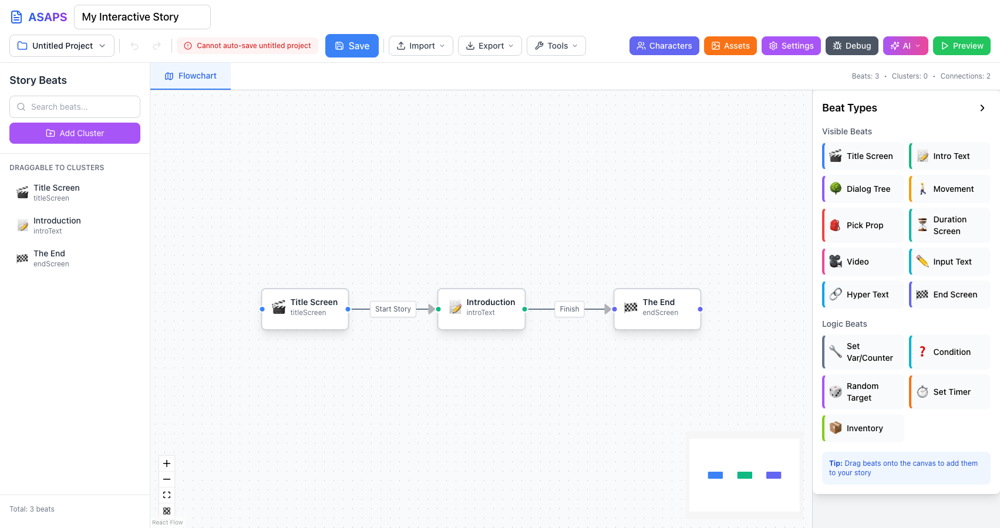
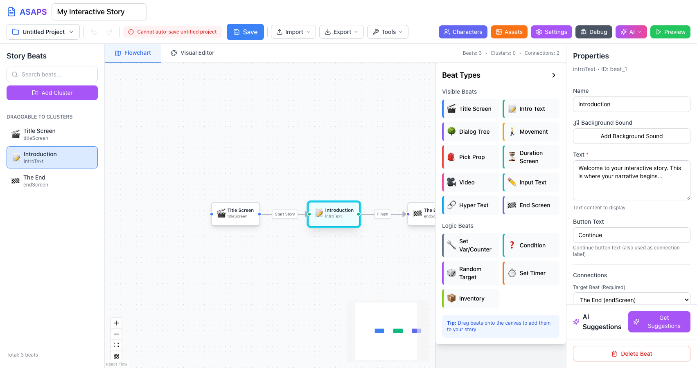
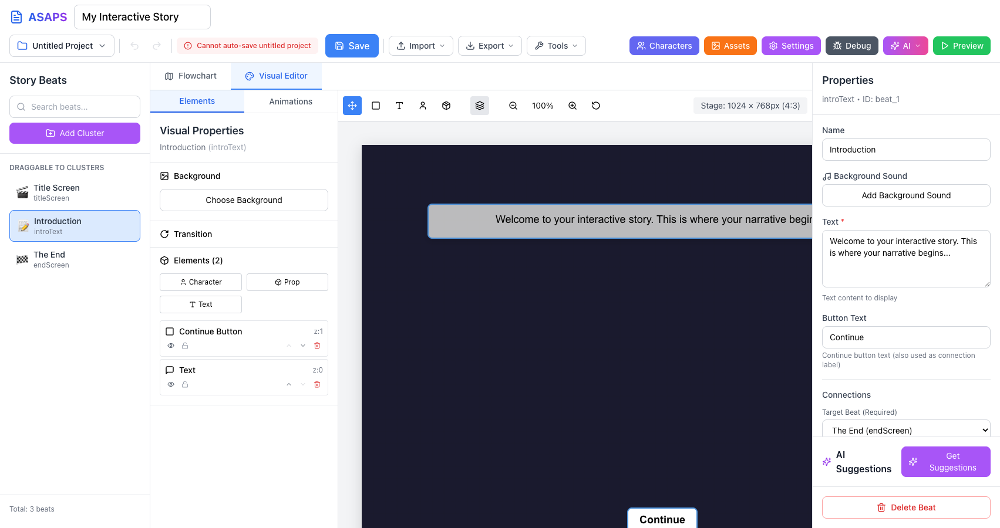
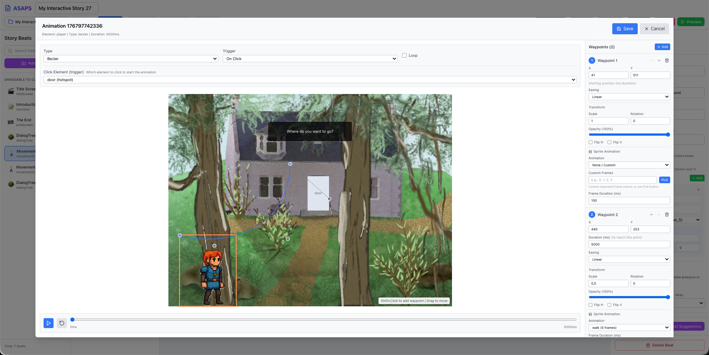
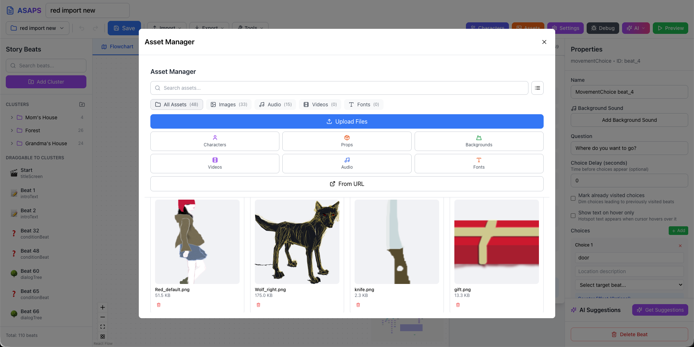
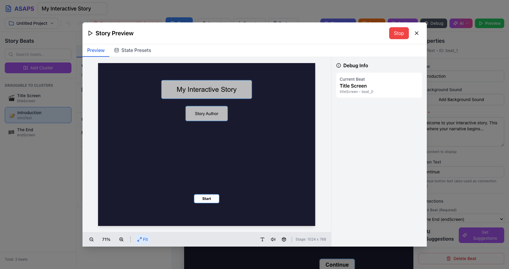
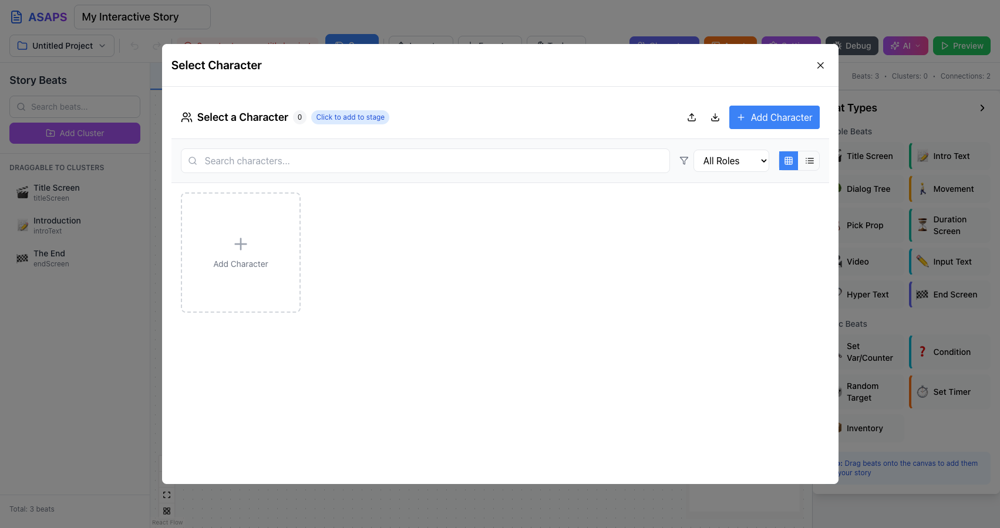
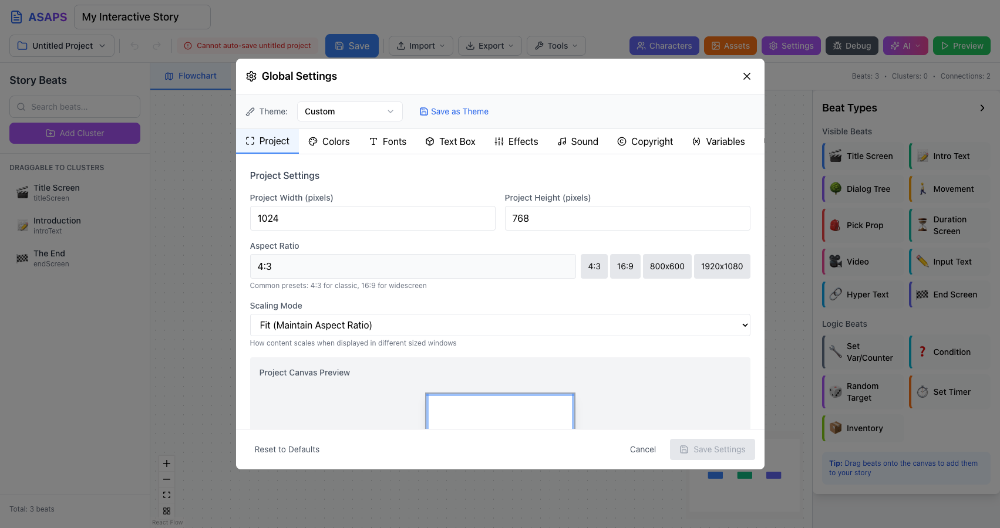

# ASAPS Modern - Getting Started Guide

Welcome to ASAPS Modern, the Advanced Story Authoring and Presentation System. This tutorial will walk you through creating your first interactive story.

## Table of Contents

1. [Overview](#overview)
2. [Understanding the Interface](#understanding-the-interface)
3. [Your First Story](#your-first-story)
4. [Working with Beats](#working-with-beats)
5. [The Visual Editor](#the-visual-editor)
6. [Animations](#animations)
7. [Managing Assets](#managing-assets)
8. [Previewing Your Story](#previewing-your-story)
9. [Characters and Variables](#characters-and-variables)
10. [Settings](#settings)
11. [Saving and Exporting](#saving-and-exporting)
12. [Next Steps](#next-steps)

---

## Overview

ASAPS Modern is a visual tool for creating interactive narratives - stories where the reader makes choices that affect the outcome. Think of it like creating a "choose your own adventure" book, but with multimedia support including images, sounds, animations, and video.

### Key Concepts

- **Beats**: The building blocks of your story. Each beat represents a moment in your narrative - a scene, a dialogue, a choice point, etc.
- **Connections**: Links between beats that define how the story flows from one moment to the next.
- **Visual Editor**: A WYSIWYG stage where you position characters, backgrounds, and props visually.
- **Preview**: Test your story in real-time to see exactly what readers will experience.

---

## Understanding the Interface



The ASAPS Builder interface is divided into several key areas:

### Header Bar (Top)

- **Story Title**: Click to edit your story's name
- **Project Menu**: Save, load, and manage projects
- **Undo/Redo**: Revert or restore changes
- **Import/Export**: Load existing stories or save to various formats
- **Tools**: Access specialized tools for story management
- **Characters**: Define characters with appearances, meters, and inventories
- **Assets**: Manage images, sounds, and other media
- **Settings**: Configure story-wide options (stage size, fonts, etc.)
- **Debug**: Development tools for troubleshooting
- **AI**: AI-assisted story creation features
- **Preview**: Test your story

### Left Sidebar - Story Beats

This panel shows all the beats (scenes) in your story:

- **Search**: Filter beats by name
- **Add Cluster**: Organize beats into logical groups
- **Beat List**: All your story's beats, draggable for reordering

### Center Area - Canvas Views

Toggle between two views:

1. **Flowchart**: A graph showing how beats connect (story flow)
2. **Visual Editor**: The stage where you design how each beat looks

### Right Sidebar - Inspector

When you select a beat, this panel shows:

- Beat properties (name, type, content)
- Beat-specific settings
- Connections to other beats
- Advanced options

### Beat Palette (Bottom Right)

Drag beat types from here onto the flowchart to add new scenes:

**Visible Beats** (what the reader sees):
- Title Screen - Opening title card
- Intro Text - Narrative text with a continue button
- Dialog Tree - Multiple choice conversations
- Movement - Character movement choices
- Pick Prop - Select an item from the scene
- Duration Screen - Timed display
- Video - Video playback
- Input Text - Free text entry
- Hyper Text - Inline clickable text
- End Screen - Story conclusion

**Logic Beats** (behind the scenes):
- Set Var/Counter - Set story variables
- Condition - Branch based on conditions
- Random Target - Random story branches
- Set Timer - Timed events
- Inventory - Add/remove items

---

## Your First Story

When you launch ASAPS Modern, a basic story template is created with three beats:

1. **Title Screen** - The opening of your story
2. **Introduction** - Where your narrative begins
3. **The End** - The conclusion

Let's modify this template to create a simple interactive story.

### Step 1: Edit the Title Screen

1. Click on the "Title Screen" beat in the flowchart
2. In the Inspector panel on the right, you'll see:
   - **Name**: The beat's internal name
   - **Title**: The title displayed to readers
   - **Subtitle**: Optional subtitle
   - **Author**: Your name
   - **Button Text**: What the "start" button says

3. Change the title to something like "The Forest Path"
4. Add your name as the author

### Step 2: Edit the Introduction

1. Click on the "Introduction" beat
2. In the Inspector, edit the **Text** field to write your opening:

```
You stand at the edge of an ancient forest.
Sunlight filters through the leaves, casting
dancing shadows on the path ahead.

Two trails diverge before you - one leading
into darkness, the other toward distant light.
```

3. Change the **Button Text** to "Look closer..."

### Step 3: Add Choices with a Dialog Tree

Now let's add a choice for the reader:

1. Find "Dialog Tree" in the Beat Palette (bottom right)
2. Drag it onto the flowchart canvas
3. A new beat appears - click to select it
4. In the Inspector, set:
   - **Name**: "Forest Choice"
   - **Text**: "Which path will you take?"

5. Under **Dialog Elements**, add two choices:
   - "Take the dark path"
   - "Follow the light"

### Step 4: Connect Your Beats

1. In the Introduction beat's Inspector, find **Connections**
2. Change the **Target Beat** from "The End" to "Forest Choice"
3. Now your story flows: Title → Introduction → Forest Choice

### Step 5: Add Multiple Endings

1. Drag two more "End Screen" beats onto the canvas
2. Name them "Dark Ending" and "Light Ending"
3. In the "Forest Choice" beat, connect each choice to its ending:
   - "Take the dark path" → Dark Ending
   - "Follow the light" → Light Ending

4. Edit each ending's text to complete the story

---

## Working with Beats



### Beat Properties

Every beat has common properties:

- **Name**: Internal identifier (shown in flowchart)
- **Background Sound**: Optional ambient audio
- **Connections**: Where the story goes next

### Beat-Specific Properties

Each beat type has unique settings:

**Intro Text / End Screen:**
- Text content to display
- Button text for navigation

**Dialog Tree:**
- Main text/prompt
- Multiple dialog elements (choices)
- Each choice can have conditions and targets

**Condition Beat:**
- Variable to check
- Comparison operator
- Value to compare against
- True/False target beats

### Connections

Connections define story flow:

1. **Simple**: One target beat (linear progression)
2. **Conditional**: Different targets based on variables
3. **Multiple**: Several choices leading to different beats

To create a connection:
1. Select the source beat
2. In Connections, choose the target beat from the dropdown
3. For Dialog Trees, each choice has its own target

---

## The Visual Editor



The Visual Editor lets you design what each beat looks like on screen.

### Accessing the Visual Editor

1. Select a beat in the flowchart
2. Click the "Visual Editor" tab (next to "Flowchart")

### The Stage

The central area represents what readers will see:

- Default size: 1024 x 768 pixels (4:3 aspect ratio)
- Configure in Settings for different ratios

### Visual Properties Panel (Left)

When in Visual Editor mode:

- **Background**: Set scene background image/color
- **Transition**: How this beat animates in
- **Elements**: List of items on stage

### Toolbar

- **Select Tool**: Click and drag elements
- **Add Hotspot**: Create clickable areas
- **Add Text**: Place text elements
- **Add Character**: Place a character on stage
- **Add Prop**: Add items/objects
- **Toggle Grid**: Show alignment grid
- **Zoom**: Adjust view scale

### Working with Elements

**Adding a Background:**
1. Click "Choose Background" in Visual Properties
2. Select from Assets or upload a new image
3. The image fills the stage

**Adding Characters:**
1. Click "Add Character" in toolbar
2. Select a character from your Characters list
3. Position by dragging on stage
4. Resize using corner handles

**Adding Text:**
1. Click "Add Text"
2. Click on stage to place
3. Edit text content and styling in Inspector

**Element Layering:**
- Elements stack in z-order
- Use "Move Up" / "Move Down" buttons to reorder
- Higher z-index = appears on top

---

## Animations



The Animation system lets you bring your scenes to life with movement and transitions.

### Accessing the Animation Editor

1. Select an element on the Visual Editor stage
2. Click the "Animations" tab in the properties panel
3. The animation editor opens with timeline and path controls

### Animation Types

**Waypoint Animations:**
- Create movement paths for characters and props
- Add multiple waypoints by clicking on the stage
- Bezier curve handles for smooth, natural motion
- Preview the path in real-time

**Transform Animations:**
- Scale: Grow or shrink elements over time
- Rotation: Spin elements
- Opacity: Fade in/out effects
- Position: Move elements without waypoints

**Sprite Animations:**
- Cycle through multiple images (sprite sheets)
- Control frame rate and looping
- Great for character expressions or effects

### Creating a Waypoint Animation

1. Select an element (character or prop)
2. In the Animations tab, click "Add Waypoint"
3. Click on the stage to place waypoints
4. Drag the bezier handles to curve the path
5. Set duration and easing for each segment
6. Toggle "Preview" to see the animation play

### Animation Properties

- **Duration**: How long the animation takes (milliseconds)
- **Easing**: Acceleration curve (linear, ease-in, ease-out, bounce)
- **Loop**: Whether the animation repeats
- **Auto-start**: Begin when beat loads vs. triggered by action

---

## Managing Assets



Assets are the media files that bring your story to life - images, sounds, videos, and fonts.

### Opening the Asset Manager

Click "Assets" in the header bar to open the Asset Manager panel.

### Asset Categories

**Images:**
- Backgrounds, character sprites, props, UI elements
- Supported formats: PNG, JPG, GIF, SVG, WebP
- Thumbnails show preview of each image

**Audio:**
- Background music, sound effects, voice-over
- Supported formats: MP3, WAV, OGG
- Preview playback in the manager

**Videos:**
- Cutscenes, tutorials, animated backgrounds
- Supported formats: MP4, WebM
- Used with Video beats

**Fonts:**
- Custom typography for your story
- TTF and WOFF formats
- Apply in Settings or per-element

### Adding Assets

1. Click the "Upload" button (or drag files into the panel)
2. Select files from your computer
3. Assets are automatically categorized by type
4. Rename assets by clicking their name

### Using Assets

- **Backgrounds**: Select in Visual Properties panel
- **Characters**: Upload appearances in Character Manager
- **Props**: Add via Visual Editor toolbar
- **Sounds**: Assign to beats as background audio
- **Fonts**: Configure in global Settings

### Asset Organization

- Search bar filters assets by name
- Sort by name, date, or type
- Delete unused assets to reduce project size
- Assets are embedded when exporting projects

---

## Previewing Your Story



### Starting Preview

1. Click "Preview" button in the header
2. The Preview panel opens
3. Click "Start Preview" to begin

### Preview Controls

- **Start from...**: Choose which beat to start from (useful for testing specific sections)
- **Stop**: End the preview
- **Zoom**: Adjust preview size
- **Fit**: Auto-fit to window
- **Text Animation**: Toggle text reveal animation
- **Mute Sound**: Silence audio
- **Show Inventory**: Display character inventory (Ctrl/Cmd+I)

### Debug Info

While previewing, the Debug Info panel shows:

- Current beat name and ID
- Variables and their values
- Counters and their values
- Navigation history

### State Presets

Save and load story states to test specific scenarios:

1. Click "State Presets"
2. Set variables to specific values
3. Start preview with those conditions

---

## Characters and Variables



### Character Manager

Access via the "Characters" button in the header.

**Creating a Character:**
1. Click "Add Character"
2. Set basic info:
   - Name (internal ID)
   - Display Name (shown to readers)
   - Role (Player, NPC, Narrator)

**Character Appearances:**
- Add multiple looks (happy, sad, angry, etc.)
- Upload images for each appearance
- Reference in beats to show different expressions

**Character Meters:**
- Track numeric values (health, energy, trust)
- Display as visual bars during story
- Use in conditions to affect story flow

**Character Inventory:**
- Define what items characters can hold
- Initial items set at story start
- Add/remove items via Inventory beats
- Display visual inventory during preview

### Variables vs Counters

**Variables** (Boolean - true/false):
- Track story flags
- Example: `hasKey`, `metWizard`, `doorUnlocked`
- Set with "Set Var/Counter" beat
- Check with "Condition" beat

**Counters** (Numeric):
- Track quantities
- Example: `gold`, `health`, `reputation`
- Increment, decrement, or set specific values
- Can be displayed as character meters

---

## Settings



Access global story settings via the "Settings" button in the header.

### Stage Settings

- **Stage Size**: Set the presentation dimensions (default: 1024 x 768)
- **Aspect Ratio Presets**: 4:3, 16:9, 16:10, or custom
- **Background Color**: Default stage background when no image is set

### Typography

- **Default Font**: Primary font for all text
- **Title Font**: Font for headings and titles
- **Font Size**: Base text size
- **Line Height**: Spacing between lines

### Audio Settings

- **Master Volume**: Overall audio level
- **Music Volume**: Background music level
- **SFX Volume**: Sound effects level
- **Auto-play Audio**: Start sounds automatically

### Display Options

- **Text Animation**: Typewriter effect speed
- **Transition Duration**: Default beat transition time
- **Show Timer Bar**: Display countdown for timed beats
- **Inventory Shortcut**: Ctrl/Cmd+I to show inventory

### Project Metadata

- **Story Title**: Displayed in title bar
- **Author**: Creator credit
- **Description**: Story summary
- **Version**: Project version number

---

## Saving and Exporting

### Saving Your Project

**Quick Save:**
- Click "Save" or press Ctrl/Cmd+S
- Projects save to browser storage

**Save to File:**
1. Click "Export"
2. Choose "ASAPS Project (.zip)"
3. Downloads a portable project file

### Export Formats

**ASAPS Project (.zip)**
- Complete project with all assets
- Can be re-imported later
- Share with other ASAPS users

**ASML (.asml)**
- XML format for the story structure
- Useful for version control
- Does not include media assets

**HTML Export**
- Standalone playable story
- Includes all assets embedded
- Share on any web server

### Import Options

**From File:**
- ASAPS Project (.zip)
- ASML files (.asml)
- Twine stories (Harlowe or SugarCube format)

**From Examples:**
- Load built-in example stories
- Great for learning

---

## Next Steps

### Learning More

1. **Explore Beat Types**: Try each beat type to understand its purpose
2. **Study Examples**: Import example stories to see how they're built
3. **Experiment**: Create small test stories to try new features

### Best Practices

1. **Plan Your Story**: Sketch out the flow before building
2. **Use Clusters**: Organize related beats into groups
3. **Test Often**: Preview frequently as you build
4. **Save Regularly**: Export backups of your work

### Advanced Features

Once comfortable with basics, explore:

- **Conditional Connections**: Branch based on variables
- **Timers**: Time-limited choices
- **Random Targets**: Add unpredictability
- **Animations**: Animate elements with the Animations tab
- **AI Suggestions**: Get AI help with story content

### Getting Help

- Check the [README](../../README.md) for technical details
- Visit the [GitHub repository](https://github.com/sumo961/ASAPS_New) for updates
- Report issues via GitHub Issues

---

Happy storytelling!
